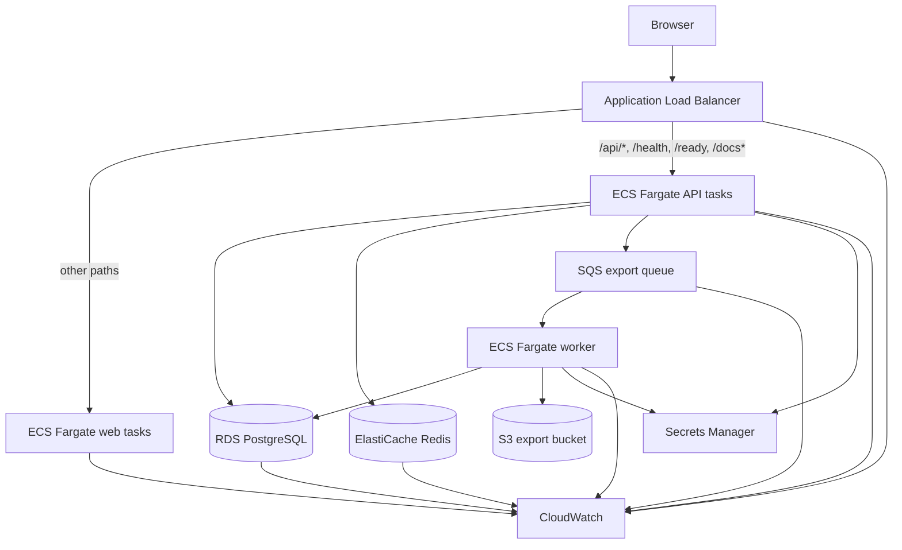

# CloudTask — Full Application and AWS Architecture Specification

## 1. Document purpose

This document is an implementation contract for an AI coding agent such as Claude. Build the application exactly as described unless a requirement is technically impossible. When a choice is unspecified, prefer the simplest secure, testable implementation appropriate for a short-lived AWS learning environment.

The project is intentionally designed to exercise realistic AWS services:

- Amazon VPC networking
- Public and private subnets
- Internet Gateway and NAT Gateway
- Application Load Balancer
- Amazon ECS on AWS Fargate
- Amazon ECR
- Amazon RDS for PostgreSQL
- Amazon ElastiCache for Redis
- Amazon SQS and a background worker
- AWS Secrets Manager
- Amazon CloudWatch logs, metrics, dashboards, and alarms
- AWS IAM roles and least-privilege policies
- Terraform infrastructure as code

## 2. Product summary

**Product name:** CloudTask

CloudTask is a small multi-user task-management application. Users can create projects and tasks, assign priorities, update statuses, and request an asynchronous CSV export. The export request is placed on SQS, processed by a worker, and stored in S3. Redis is used for short-lived caching and rate limiting.

This project must be deployable to AWS and must also run locally with Docker Compose.

## 3. Learning objectives

The implementation must demonstrate:

1. A browser calling a public API through an Application Load Balancer.
2. ECS Fargate tasks running in private subnets.
3. RDS and ElastiCache running in private subnets without public access.
4. A worker consuming SQS messages independently of the API.
5. Secrets injected into ECS from Secrets Manager.
6. Container images built and stored in ECR.
7. Logs and operational metrics visible in CloudWatch.
8. Health checks, rolling deployments, scaling, failure recovery, and cleanup.
9. Consistent tagging of every taggable resource.
10. Complete infrastructure creation and destruction through Terraform.

## 4. Scope

### 4.1 In scope

- Email/password authentication using JWT access tokens.
- User registration and login.
- Projects CRUD.
- Tasks CRUD.
- Task filtering and pagination.
- Asynchronous CSV export using SQS and a worker.
- Export file storage in S3.
- Redis cache for project summaries.
- Redis-backed API rate limiting.
- REST API documentation using OpenAPI/Swagger.
- Structured JSON logging.
- Health and readiness endpoints.
- Dockerized local development.
- Terraform deployment to AWS.
- GitHub Actions CI; AWS deployment may be manual initially.

### 4.2 Out of scope

- Social login.
- Billing or subscription management.
- Multi-tenant organizations.
- Real-time WebSocket updates.
- Kubernetes.
- Cross-region disaster recovery.
- Production-grade email delivery.
- A custom domain in the first version.

## 5. Required technology stack

### 5.1 Monorepo

Use `pnpm` workspaces and Turborepo.

```text
cloudtask/
├── apps/
│   ├── web/                 # Next.js frontend
│   ├── api/                 # NestJS HTTP API
│   └── worker/              # NestJS standalone SQS worker
├── packages/
│   ├── contracts/           # Shared Zod schemas and TypeScript types
│   ├── eslint-config/
│   └── tsconfig/
├── infrastructure/
│   └── terraform/
│       ├── modules/
│       └── environments/dev/
├── scripts/
├── docker-compose.yml
├── pnpm-workspace.yaml
└── README.md
```

### 5.2 Frontend

- Next.js latest stable version with App Router
- TypeScript strict mode
- React Query/TanStack Query
- React Hook Form
- Zod
- Tailwind CSS
- Playwright for end-to-end tests
- Vitest or Jest for unit tests

### 5.3 API and worker

- NestJS latest stable version
- TypeScript strict mode
- TypeORM
- PostgreSQL
- Redis client using `ioredis`
- AWS SDK for JavaScript v3
- SQS long polling
- S3 for export files
- Jest for tests
- Pino structured logging
- Swagger/OpenAPI

### 5.4 Infrastructure

- Terraform 1.8 or later
- AWS provider latest compatible stable release
- Docker
- GitHub Actions

Do not use AWS CDK, CloudFormation, Serverless Framework, or AWS Copilot for the primary implementation.

## 6. Functional requirements

### 6.1 Authentication

#### Registration

`POST /auth/register`

Request:

```json
{
  "email": "user@example.com",
  "password": "StrongPassword123!",
  "displayName": "Example User"
}
```

Rules:

- Email must be normalized to lowercase.
- Email must be unique.
- Password must be at least 10 characters.
- Password must be hashed using Argon2id.
- Never log passwords or password hashes.

#### Login

`POST /auth/login`

Returns:

```json
{
  "accessToken": "jwt",
  "expiresIn": 3600,
  "user": {
    "id": "uuid",
    "email": "user@example.com",
    "displayName": "Example User"
  }
}
```

JWT requirements:

- HS256 is acceptable for this learning project.
- Signing secret must be stored in Secrets Manager in AWS.
- Access token lifetime: 1 hour.
- Every protected query must be scoped to the authenticated user.

### 6.2 Projects

Project fields:

- `id`: UUID
- `ownerId`: UUID
- `name`: varchar(120)
- `description`: text nullable
- `createdAt`: timestamptz
- `updatedAt`: timestamptz

Endpoints:

- `POST /projects`
- `GET /projects`
- `GET /projects/:id`
- `PATCH /projects/:id`
- `DELETE /projects/:id`

A user must never access another user's project.

### 6.3 Tasks

Task fields:

- `id`: UUID
- `projectId`: UUID
- `ownerId`: UUID
- `title`: varchar(200)
- `description`: text nullable
- `status`: varchar; allowed values `todo`, `in_progress`, `done`
- `priority`: varchar; allowed values `low`, `medium`, `high`
- `dueDate`: date nullable
- `createdAt`: timestamptz
- `updatedAt`: timestamptz

Do not use PostgreSQL enum types. Enforce values at application level and with CHECK constraints where practical.

Endpoints:

- `POST /projects/:projectId/tasks`
- `GET /projects/:projectId/tasks`
- `GET /tasks/:id`
- `PATCH /tasks/:id`
- `DELETE /tasks/:id`

List filters:

- status
- priority
- due date range
- search by title
- page and limit

Default page size: 20. Maximum page size: 100.

### 6.4 Project summary and Redis cache

`GET /projects/:id/summary`

Response:

```json
{
  "projectId": "uuid",
  "total": 12,
  "todo": 5,
  "inProgress": 4,
  "done": 3,
  "generatedAt": "ISO-8601 timestamp"
}
```

Cache behavior:

- Redis key: `project-summary:{userId}:{projectId}`
- TTL: 60 seconds
- Invalidate the key after task create, update, or delete.
- If Redis is unavailable, log a warning and compute from PostgreSQL. The API must remain functional.

### 6.5 CSV export through SQS

#### Request export

`POST /projects/:id/exports`

The API must:

1. Verify ownership.
2. Create an `exports` database record with status `queued`.
3. Send a message to SQS.
4. Return HTTP 202.

Response:

```json
{
  "exportId": "uuid",
  "status": "queued"
}
```

SQS message:

```json
{
  "schemaVersion": 1,
  "exportId": "uuid",
  "projectId": "uuid",
  "userId": "uuid",
  "requestedAt": "ISO-8601 timestamp"
}
```

Worker behavior:

1. Poll SQS using long polling.
2. Mark export `processing`.
3. Query tasks for the user and project.
4. Generate a UTF-8 CSV file.
5. Upload it to S3 at `exports/{userId}/{exportId}.csv`.
6. Mark export `completed` with bucket/key metadata.
7. Delete the SQS message only after successful database persistence.
8. On failure, update best-effort failure metadata and allow SQS retry.
9. Use a dead-letter queue after 3 receives.

Idempotency:

- `exports.id` is the idempotency key.
- If an export is already `completed`, a repeated message must not create another file.
- Use a database transaction or conditional status update to claim processing.

#### Export status

`GET /exports/:id`

Possible statuses:

- `queued`
- `processing`
- `completed`
- `failed`

For a completed export, return a short-lived S3 presigned download URL valid for 5 minutes.

### 6.6 Rate limiting

- Limit login attempts to 10 per 5 minutes per IP.
- Limit authenticated API calls to 120 per minute per user.
- Use Redis when available.
- Do not fail all requests if Redis is unavailable; use a conservative in-memory fallback for a single API task.

### 6.7 Frontend pages

Required routes:

- `/register`
- `/login`
- `/projects`
- `/projects/new`
- `/projects/[projectId]`
- `/projects/[projectId]/edit`

Project details page must include:

- Project name and description
- Summary cards
- Task table/list
- Filters
- Create task form
- Edit and delete actions
- Export CSV button
- Export status polling and download link

UI requirements:

- Responsive desktop and mobile layout.
- Clear loading, empty, error, and success states.
- Confirmation before destructive actions.
- No secret or internal AWS information exposed to the browser.

### 6.8 Failure-injection endpoint (dev only)

For controlled failure drills (observability and alarm testing), provide an explicitly dev-only endpoint:

`POST /api/v1/debug/fail?type=500`

Rules:

- Enabled only when `ENABLE_FAILURE_ENDPOINTS=true`; the route must not be registered otherwise.
- Protected by authentication.
- Never enabled in production.
- Returns the requested error class (for example `type=500`) so ALB 5xx metrics and alarms can be exercised.

## 7. Database design

Use migrations; never rely on TypeORM `synchronize: true` outside tests.

### Tables

#### users

- id UUID primary key
- email varchar(320) not null
- password_hash text not null
- display_name varchar(120) not null
- created_at timestamptz not null
- updated_at timestamptz not null
- unique index on lower(email)

#### projects

- id UUID primary key
- owner_id UUID not null references users(id)
- name varchar(120) not null
- description text nullable
- created_at timestamptz not null
- updated_at timestamptz not null
- index `(owner_id, created_at desc)`

#### tasks

- id UUID primary key
- project_id UUID not null references projects(id) on delete cascade
- owner_id UUID not null references users(id)
- title varchar(200) not null
- description text nullable
- status varchar(30) not null
- priority varchar(20) not null
- due_date date nullable
- created_at timestamptz not null
- updated_at timestamptz not null
- indexes:
  - `(project_id, created_at desc)`
  - `(owner_id, status)`
  - `(owner_id, priority)`

#### exports

- id UUID primary key
- project_id UUID not null references projects(id) on delete cascade
- user_id UUID not null references users(id)
- status varchar(30) not null
- s3_bucket varchar(255) nullable
- s3_key text nullable
- error_code varchar(100) nullable
- error_message text nullable
- attempt_count integer not null default 0
- requested_at timestamptz not null
- started_at timestamptz nullable
- completed_at timestamptz nullable
- updated_at timestamptz not null
- index `(user_id, requested_at desc)`

## 8. API conventions

- Prefix all routes with `/api/v1`, except operational endpoints.
- Health: `GET /health`
- Readiness: `GET /ready`
- OpenAPI: `/docs`
- JSON only, except CSV download from S3.
- Use RFC 7807-style problem details for errors.

Example:

```json
{
  "type": "https://cloudtask.example/problems/not-found",
  "title": "Resource not found",
  "status": 404,
  "detail": "Project was not found",
  "instance": "/api/v1/projects/123",
  "requestId": "uuid"
}
```

Request IDs:

- Accept `x-request-id` if valid; otherwise generate a UUID.
- Return it in the response header.
- Include it in every log line.
- Include SQS message ID and export ID in worker logs.

## 9. Health and readiness

### `/health`

- Returns 200 when the process is running.
- Must not depend on PostgreSQL or Redis.
- Used by ALB health checks.

### `/ready`

- Verifies PostgreSQL connectivity.
- Reports Redis connectivity as degraded rather than fatal.
- API returns 503 if PostgreSQL is unavailable.

Example:

```json
{
  "status": "degraded",
  "checks": {
    "postgres": "up",
    "redis": "down"
  }
}
```

## 10. Logging and observability

### Application logs

Use newline-delimited JSON sent to stdout.

Required fields:

- level
- timestamp
- service (`api`, `worker`, or `web`)
- environment
- requestId or correlationId
- message
- error name and stack when applicable

Never log:

- Passwords
- JWTs
- Authorization headers
- Database passwords
- Secrets Manager values

### CloudWatch log groups

- `/cloudtask/dev/web`
- `/cloudtask/dev/api`
- `/cloudtask/dev/worker`

Retention: 7 days for the learning environment.

### Custom metrics

Emit Embedded Metric Format or PutMetricData for:

- `ExportsCompleted`
- `ExportsFailed`
- `ExportProcessingDurationMs`

Namespace: `CloudTask/Dev`

### CloudWatch dashboard

Display:

- ALB request count
- ALB target 5xx count
- ALB target response time
- ECS API CPU and memory
- ECS worker CPU and memory
- Running task counts
- SQS visible messages
- SQS age of oldest message
- RDS CPU and database connections
- ElastiCache CPU and current connections
- Export custom metrics

### Alarms

Create alarms for:

- ALB target 5xx > 5 in 5 minutes
- API running task count < 1 for 2 periods
- SQS oldest message age > 300 seconds
- DLQ visible messages >= 1
- RDS CPU > 80% for 10 minutes

SNS email notification is optional. Create the topic and expose its ARN; subscription can be added manually.

## 11. AWS architecture

The browser reaches everything through a single Application Load Balancer, which routes by path to the web and API target groups (see Section 18).



## 12. Network topology

Use two Availability Zones.

Example CIDR:

- VPC: `10.20.0.0/16`
- Public subnet A: `10.20.0.0/24`
- Public subnet B: `10.20.1.0/24`
- Private app subnet A: `10.20.10.0/24`
- Private app subnet B: `10.20.11.0/24`
- Private data subnet A: `10.20.20.0/24`
- Private data subnet B: `10.20.21.0/24`

Resources:

- ALB in public subnets.
- NAT Gateway in public subnet A for the default learning profile.
- ECS API and worker in private app subnets.
- RDS and ElastiCache in private data subnets.
- Internet Gateway attached to VPC.
- Public route table routes `0.0.0.0/0` to Internet Gateway.
- Private app route table routes `0.0.0.0/0` to NAT Gateway.
- Data subnets have no default internet route.

Cost-saving profile:

Terraform must support `enable_nat_gateway = false`. In that mode, ECS may run in public subnets with public IPs for temporary experimentation, while RDS and Redis remain private. Document that this reduces cost but is not the preferred production layout.

## 13. Security groups

### ALB security group

Inbound:

- TCP 80 from `0.0.0.0/0`
- TCP 443 only when HTTPS is configured

Outbound:

- API container port to API security group
- Web container port to Web security group

### Web security group

Inbound:

- Application port only from ALB security group

Outbound:

- HTTPS 443 for AWS APIs and image pulls through NAT

The web service reaches the API through the ALB, so it needs no database or Redis egress.

### API security group

Inbound:

- Application port only from ALB security group

Outbound:

- PostgreSQL 5432 to RDS security group
- Redis 6379 to Redis security group
- HTTPS 443 for AWS APIs and image pulls through NAT

### Worker security group

Inbound:

- None

Outbound:

- PostgreSQL 5432 to RDS security group
- HTTPS 443 for SQS, S3, ECR, Secrets Manager, and CloudWatch

### RDS security group

Inbound:

- TCP 5432 from API and worker security groups only

### Redis security group

Inbound:

- TCP 6379 from API security group only

Do not use CIDR-wide ingress between application components when security-group references can be used.

## 14. AWS resources

Terraform must create at minimum:

### Networking

- VPC
- Six subnets
- Internet Gateway
- Route tables and associations
- Elastic IP for NAT Gateway
- NAT Gateway, controlled by variable
- Security groups

### Container platform

- ECS cluster
- Web task definition and service
- API task definition and service
- Worker task definition and service
- Web, API, and worker ECR repositories
- ECS task execution IAM role
- Separate API task role
- Separate worker task role
- CloudWatch log groups

Default task sizes:

- Web: 0.25 vCPU, 0.5 GB memory, desired count 1
- API: 0.25 vCPU, 0.5 GB memory, desired count 1
- Worker: 0.25 vCPU, 0.5 GB memory, desired count 1

### Load balancing

- Internet-facing ALB
- HTTP listener
- Two target groups with target type `ip` (see the path-based routing in Section 18):
  - API target group — health check path `/health`
  - Web target group — health check path `/`
- Listener rules: `/api/*`, `/health`, `/ready`, `/docs*` route to the API target group; all other paths route to the web target group

HTTPS should be an optional extension using ACM and Route 53.

### Data

- RDS PostgreSQL, small burstable instance suitable for learning (example: `db.t4g.micro`)
- 20 GB general-purpose SSD
- Single-AZ by default
- Publicly accessible false
- Automated backup retention 1 day
- Deletion protection false in dev
- Final snapshot skipped only in dev
- ElastiCache Redis single-node cache suitable for learning (example: `cache.t4g.micro`)
- Encryption in transit enabled; the API sets `REDIS_TLS_ENABLED=true`

### Messaging and storage

- SQS standard queue
- SQS dead-letter queue
- Redrive policy with maxReceiveCount 3
- S3 bucket for exports
- S3 public access fully blocked
- S3 server-side encryption
- S3 lifecycle deletion after 7 days in dev

### Secrets

Store a single application secret named `cloudtask/dev/application` containing a JSON object with:

- `DATABASE_URL` (full connection string)
- `JWT_SECRET` (JWT signing secret)

The API and worker map both keys from this one secret. If RDS is configured to generate a master-user password, that RDS-managed secret is a separate, AWS-owned secret and is not the application secret above.

Do not store non-secret configuration in Secrets Manager.

### Monitoring

- CloudWatch dashboard
- CloudWatch alarms
- SNS topic

## 15. IAM requirements

### ECS execution role

Allow only what ECS needs for:

- Pulling ECR images
- Writing CloudWatch logs
- Reading referenced Secrets Manager secrets

### API task role

Allow:

- `sqs:SendMessage` to the export queue only
- Minimal read access needed for presigned S3 download generation, if generated by API
- CloudWatch custom metric publishing, if API publishes metrics

### Worker task role

Allow:

- Receive/delete/change visibility/get attributes on export queue
- Put/get object under the export bucket prefix
- CloudWatch custom metric publishing

Do not use `AdministratorAccess`, wildcard resource permissions, static access keys, or IAM users for ECS workloads.

## 16. Tagging contract

Apply these tags to every taggable resource:

```hcl
Project     = "cloudtask"
Environment = "dev"
Owner       = "jubaer"
ManagedBy   = "terraform"
Purpose     = "aws-learning"
CostCenter  = "personal-learning"
ExpiresOn   = "YYYY-MM-DD"
```

`ManagedBy` records how the resource was actually provisioned. For the Terraform deployment it is `terraform`; a resource created by hand (for example in the manual console runbook) must instead be tagged `manual-console` so the tag remains truthful.

Rules:

- Terraform provider `default_tags` must apply common tags automatically.
- Add a specific `Name` tag to networking and human-visible resources.
- Set `ExpiresOn` to the planned deletion date.
- README must remind the operator to activate relevant cost-allocation tags in Billing.
- Every created resource must carry the mandatory tag set.

## 17. Configuration contract

API environment variables:

```text
NODE_ENV
PORT                         # default 3000
DATABASE_URL                 # secret
REDIS_HOST
REDIS_PORT
REDIS_TLS_ENABLED
JWT_SECRET                   # secret
AWS_REGION
EXPORT_QUEUE_URL
EXPORT_BUCKET_NAME
LOG_LEVEL
CORS_ORIGINS
ENABLE_FAILURE_ENDPOINTS     # dev only; default false
```

Worker environment variables:

```text
NODE_ENV
DATABASE_URL                 # secret
AWS_REGION
EXPORT_QUEUE_URL
EXPORT_BUCKET_NAME
SQS_WAIT_TIME_SECONDS        # default 20
SQS_VISIBILITY_TIMEOUT_SECONDS
LOG_LEVEL
```

Frontend environment variables:

```text
NODE_ENV
PORT                         # default 3000
NEXT_PUBLIC_API_BASE_URL
```

All three services (web, API, worker where applicable) listen on `PORT`, which defaults to `3000`; the ECS container port and the ALB target groups use the same `3000`.

`DATABASE_URL` is the canonical database configuration for both the API and the worker. Do not use discrete `DB_HOST`/`DB_PORT`/`DB_NAME`/`DB_USER`/`DB_PASSWORD` variables; the full connection string stored in Secrets Manager (Section 14) is the single source. Redis configuration (`REDIS_HOST`, `REDIS_PORT`, `REDIS_TLS_ENABLED`) applies to the API only — the worker does not connect to Redis.

Validate configuration during application startup using Zod. Exit with a clear error when required values are missing.

## 18. Docker requirements

Create optimized multi-stage Dockerfiles.

### API image

- Non-root runtime user
- Production dependencies only
- Health endpoint available
- Graceful SIGTERM handling
- Start command runs compiled JavaScript

### Worker image

- Non-root runtime user
- Graceful shutdown stops polling and finishes or safely abandons the current message
- Start command runs compiled JavaScript

### Web image

Choose one:

1. Deploy Next.js as a standalone container, or
2. Export a static frontend to S3/CloudFront if no server-only feature is required.

For the first implementation, use the Next.js standalone container so the monorepo and deployment workflow stay consistent. A second ALB target group is optional; the simplest acceptable design is one web service and one API service with path-based routing:

- `/api/*`, `/health`, `/ready`, `/docs*` -> API target group
- all other paths -> web target group

If this approach is used, create separate ECS services for web, API, and worker. The worker has no load balancer.

## 19. Terraform module structure

```text
infrastructure/terraform/
├── modules/
│   ├── networking/
│   ├── security/
│   ├── ecr/
│   ├── ecs-cluster/
│   ├── ecs-service/
│   ├── alb/
│   ├── rds/
│   ├── redis/
│   ├── sqs/
│   ├── s3/
│   ├── secrets/
│   └── monitoring/
└── environments/dev/
    ├── backend.tf
    ├── providers.tf
    ├── main.tf
    ├── variables.tf
    ├── outputs.tf
    ├── terraform.tfvars.example
    └── versions.tf
```

Required variables:

- aws_region (example: `ap-southeast-1`)
- project_name
- environment
- owner
- expires_on
- enable_nat_gateway
- api_image_tag
- worker_image_tag
- web_image_tag
- database_instance_class
- redis_node_type
- desired_count values

Required outputs:

- application_url
- alb_dns_name
- ecr repository URLs
- ECS cluster name
- ECS service names
- RDS endpoint, marked sensitive where appropriate
- Redis endpoint
- SQS queue URL
- DLQ URL
- S3 bucket name
- CloudWatch dashboard name
- NAT Gateway ID when enabled

## 20. Terraform state

For the first local learning deployment, local state is acceptable but must be excluded from Git.

Provide an optional bootstrap directory that creates:

- S3 bucket for Terraform state
- S3 versioning
- Encryption
- Public access block

Use S3 native lockfile support when supported by the selected Terraform/AWS provider combination, or document the current recommended locking mechanism. Never hardcode credentials.

## 21. CI requirements

GitHub Actions workflows:

### Pull request CI

- Install dependencies with frozen lockfile
- Lint
- Type check
- Unit tests
- Build all applications
- Run API integration tests using PostgreSQL and Redis service containers
- Run Terraform fmt and validate
- Run Trivy image or filesystem scan

### Main branch image build

- Authenticate to AWS using GitHub OIDC, not long-lived access keys
- Build API, worker, and web images
- Push immutable tags using Git SHA
- Optionally update ECS through Terraform or a separate manual release job

The initial runbook may use local AWS CLI credentials and manual image pushes; the repository must still contain the OIDC-based target workflow.

## 22. Testing requirements

### Unit tests

- Authentication service
- Project ownership checks
- Task filters
- Cache fallback behavior
- Export idempotency logic
- Worker retry behavior

### API integration tests

- Register and login
- Unauthorized requests rejected
- Cross-user access rejected
- Projects CRUD
- Tasks CRUD and filtering
- Export request creates database record and sends queue message

### Worker integration tests

- Processes one export message
- Produces correct CSV
- Upload adapter called
- Database status becomes completed
- Duplicate message is idempotent
- Failure leaves message retryable

### End-to-end tests

- Register
- Login
- Create project
- Create tasks
- Update task status
- Request export
- Poll until completion
- Download CSV

### Infrastructure checks

- `terraform fmt -check`
- `terraform validate`
- `tflint`
- `tfsec` or Trivy Terraform scan

## 23. Failure-handling requirements

### PostgreSQL unavailable

- `/health` remains 200.
- `/ready` returns 503.
- Business endpoints return controlled 503 errors.
- ECS should not restart only because one query failed.

### Redis unavailable

- API continues without cache.
- Rate limiting falls back locally.
- `/ready` reports degraded.

### SQS unavailable or permission denied

- Export request must not claim success.
- Database export record becomes failed or remains safely retryable.
- Return a controlled 503 response.

### Worker crash after S3 upload but before SQS delete

- Redelivered message must detect completed export and delete safely without duplicating work.

### Bad container image

- ECS rolling deployment must keep the previously healthy task running when minimum healthy percent permits.
- Deployment events and stopped-task reasons must be visible.

## 24. Deployment strategy

- ECS rolling update.
- `deployment_minimum_healthy_percent = 100` where affordable.
- `deployment_maximum_percent = 200`.
- Enable ECS deployment circuit breaker with rollback.
- Container health checks are optional; ALB health checks are required for web/API.
- Graceful shutdown period must be less than ECS stop timeout.

## 25. Definition of done

The project is complete when:

1. `docker compose up` starts PostgreSQL, Redis, API, worker, and web locally.
2. All linting, type checks, and tests pass.
3. Terraform creates the AWS environment successfully.
4. Images are pushed to ECR.
5. Browser can open the ALB URL and use the application.
6. An export traverses API -> SQS -> worker -> S3 successfully.
7. Logs and dashboard metrics are visible in CloudWatch.
8. Documented failure experiments produce expected observable symptoms.
9. `terraform destroy` removes the environment.
10. A post-destroy inventory check finds no NAT Gateway, ALB, ECS task, RDS instance, ElastiCache cluster, or unattached public IPv4 left from the project.

## 26. Instructions to Claude

When implementing this specification:

1. Start with a numbered implementation plan.
2. Create the monorepo skeleton before business logic.
3. Implement vertical slices: auth, projects, tasks, exports.
4. Add tests with each slice.
5. Keep infrastructure modular but avoid needless abstraction.
6. Never silently simplify security boundaries.
7. Never hardcode AWS account IDs, regions, passwords, ARNs, endpoints, or image tags.
8. Use placeholders and Terraform outputs.
9. Include exact commands in README files.
10. Include cleanup instructions prominently.
11. Ensure every AWS resource carries the mandatory tag set.
12. Prefer Terraform over console clicks for reproducibility.
13. Report any deviation from this specification in a `DEVIATIONS.md` file.

