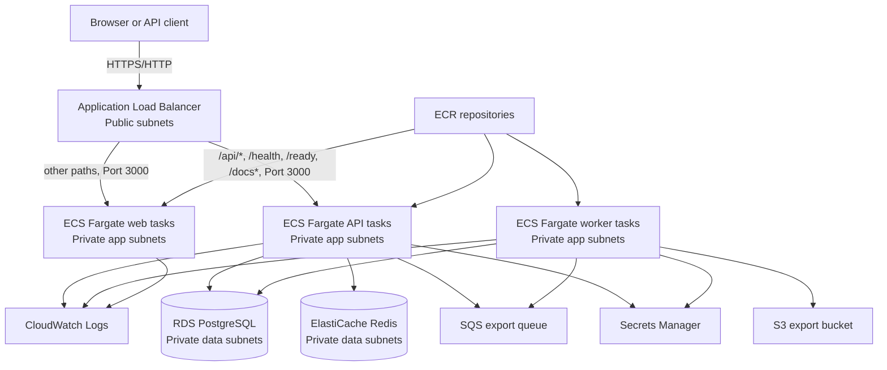

# CloudTask Manual AWS Console Deployment, Failure-Testing, Troubleshooting, and Cleanup Runbook

## 1. Purpose

This runbook deploys the CloudTask application from `application-spec.md` by creating every AWS resource manually through the AWS Management Console.

It intentionally does **not** use Terraform, CloudFormation, CDK, Copilot, or other infrastructure-as-code tools. The objective is to understand how the AWS services connect and how to diagnose failures.

This runbook builds the **same architecture the specification defines** — six subnets across three tiers, six security groups, separate API and worker task roles, and a web/API/worker service split — by hand instead of with Terraform. Only the creation method differs.

The lab sequence is:

1. Prepare and test the application locally.
2. Create the AWS network manually.
3. Create PostgreSQL, Redis, S3, SQS, ECR, ECS, and the load balancer.
4. Deploy the web, API, and worker containers.
5. Validate the application.
6. Introduce controlled failures.
7. Troubleshoot and restore the system.
8. Delete every costly resource.

---

## 2. Proposed AWS architecture



### How services connect

The application must use managed AWS endpoints rather than hard-coded IP addresses:

- RDS: database DNS endpoint and port 5432
- ElastiCache: Redis primary/configuration endpoint and port 6379 (used by the **API only**; the worker does not use Redis)
- S3: bucket name through the AWS SDK (written by the **worker**)
- SQS: queue URL through the AWS SDK
- ECS tasks: reached through the ALB target groups (web and API)
- ECR: image repository URI
- Secrets Manager: secret ARN or secret name

---

## 3. Cost warning

This lab can create billable resources. The most important resources to delete are:

- NAT Gateway
- Public IPv4 addresses and Elastic IPs
- Application Load Balancer
- ECS Fargate tasks and services
- RDS database instance and retained backups/snapshots
- ElastiCache Redis cluster
- Interface VPC endpoints, if created
- CloudWatch log storage
- ECR image storage
- S3 objects and versions

Usually free as standalone objects, although traffic or related resources may cost money:

- VPC
- Subnets
- Route tables
- Security groups
- Network ACLs
- Internet Gateway
- IAM roles and policies

Keep the environment for one lab session only unless you intentionally accept ongoing charges.

---

## 4. Mandatory tags

Add these tags to every taggable resource during its creation:

```text
Project=cloudtask
Environment=dev
Owner=jubaer
ManagedBy=manual-console
Purpose=aws-learning
CostCenter=personal-learning
ExpiresOn=<YYYY-MM-DD>
```

`ManagedBy=manual-console` is the one intentional difference from the specification's tagging contract (which uses `ManagedBy=terraform`), because this runbook creates resources by hand rather than through Terraform. Every other tag value matches the specification exactly.

### Tagging rule

This enforces the specification's §16 tagging contract. **Do not click Create until you have opened the Tags section and added the mandatory tags.**

Some AWS resources do not support tags during their first creation screen. In that case:

1. Create the resource.
2. Open it immediately.
3. Add the tags before proceeding to the next resource.

Use names beginning with `cloudtask-dev-` so resources are easy to find.

---

# Part A — Before opening AWS

## 5. Account and region preparation

### Step 5.1 — choose one region

Select one AWS Region and use it for the whole lab. Example:

```text
ap-southeast-1
```

Check the Region selector in the top-right corner before creating every regional resource.

**Note:** Record the selected Region in your notes; creating resources in the wrong Region is a common mistake.

### Step 5.2 — account safety

1. Enable MFA for the root account.
2. Do not use the root account for the lab.
3. Use an IAM Identity Center user or a dedicated IAM user/role.
4. Do not put long-lived AWS access keys in source code.
5. Do not commit `.env` files.

### Step 5.3 — create a budget

Open **Billing and Cost Management → Budgets**.

1. Choose **Create budget**.
2. Select a cost budget.
3. Enter a small monthly budget appropriate for your account.
4. Add email alerts at useful thresholds.
5. Save the budget.

A budget usually alerts you; it does not automatically delete or stop resources.

### Step 5.4 — enable Resource Explorer

Open **AWS Resource Explorer**.

1. Enable Resource Explorer.
2. Create an index in the lab Region.
3. Optionally configure an aggregator index.
4. Later search for:

```text
tag:Project=cloudtask
```

Use Resource Explorer as an inventory aid, not as the only cleanup check.

---

## 6. Local application preparation

### Step 6.1 — verify required tools

```bash
node --version
pnpm --version
docker --version
aws --version
```

### Step 6.2 — initialize the repository

```bash
git clone <repository-url> cloudtask
cd cloudtask
pnpm install
cp .env.example .env
```

### Step 6.3 — run locally

```bash
docker compose up --build
```

Expected local services:

- Next.js web application
- NestJS API
- NestJS SQS-compatible worker
- PostgreSQL
- Redis

### Step 6.4 — run database migrations

Use the command defined by the implementation, for example:

```bash
pnpm --filter api migration:run
```

### Step 6.5 — run tests

```bash
pnpm lint
pnpm typecheck
pnpm test
pnpm test:integration
pnpm test:e2e
```

### Step 6.6 — local functional test

Verify that you can:

1. Register and log in.
2. Create a project.
3. Create and update tasks.
4. Filter tasks.
5. Request a CSV export.
6. Process the export with the worker.
7. Download the generated file.

Do not begin AWS deployment until this flow works locally.

---

# Part B — Create the AWS network manually

## 7. Create the VPC

Open **VPC → Your VPCs → Create VPC**.

Create:

```text
Name: cloudtask-dev-vpc
IPv4 CIDR: 10.20.0.0/16
IPv6: No IPv6 for this lab
Tenancy: Default
```

Enable:

- DNS resolution
- DNS hostnames

### Verify

Open the VPC and confirm:

- State is `Available`.
- DNS resolution is enabled.
- DNS hostnames are enabled.

---

## 8. Create subnets

Use two Availability Zones. The specification defines **six subnets in three tiers**: public (ALB), private app (ECS tasks), and private data (RDS and Redis). Create all six with these exact CIDRs:

| Name | Tier | CIDR | Availability Zone |
|---|---|---:|---|
| `cloudtask-dev-public-a` | Public | `10.20.0.0/24` | AZ A |
| `cloudtask-dev-public-b` | Public | `10.20.1.0/24` | AZ B |
| `cloudtask-dev-app-a` | Private app | `10.20.10.0/24` | AZ A |
| `cloudtask-dev-app-b` | Private app | `10.20.11.0/24` | AZ B |
| `cloudtask-dev-data-a` | Private data | `10.20.20.0/24` | AZ A |
| `cloudtask-dev-data-b` | Private data | `10.20.21.0/24` | AZ B |

For every subnet:

1. Open **VPC → Subnets → Create subnet**.
2. Select `cloudtask-dev-vpc`.
3. Enter the name, Availability Zone, and CIDR.
4. Add all mandatory tags.
5. Create the subnet.

For public subnets only:

1. Select the subnet.
2. Choose **Actions → Edit subnet settings**.
3. Enable automatic public IPv4 assignment if required for the selected design.

Keep the private app and private data subnets with automatic public IPv4 assignment **disabled**.

---

## 9. Create and attach an Internet Gateway

Open **VPC → Internet Gateways → Create internet gateway**.

```text
Name: cloudtask-dev-igw
```

1. Add all mandatory tags.
2. Create it.
3. Select it.
4. Choose **Actions → Attach to a VPC**.
5. Attach it to `cloudtask-dev-vpc`.

The Internet Gateway itself normally has no hourly charge, but public IPv4 addresses and data transfer may be billable.

---

## 10. Create route tables

The specification uses **three route tables** — public (to the Internet Gateway), private app (to the NAT Gateway), and private data (VPC-local only, no internet route).

### Step 10.1 — public route table

Open **VPC → Route tables → Create route table**.

```text
Name: cloudtask-dev-public-rt
VPC: cloudtask-dev-vpc
```

1. Add mandatory tags.
2. Create it.
3. Open **Routes → Edit routes**.
4. Add:

```text
Destination: 0.0.0.0/0
Target: cloudtask-dev-igw
```

5. Save.
6. Open **Subnet associations → Edit subnet associations**.
7. Associate both public subnets (`cloudtask-dev-public-a`, `cloudtask-dev-public-b`).

### Step 10.2 — private app route table

Create:

```text
Name: cloudtask-dev-app-rt
VPC: cloudtask-dev-vpc
```

Associate both private app subnets (`cloudtask-dev-app-a`, `cloudtask-dev-app-b`).

The `0.0.0.0/0 → NAT Gateway` route is added in §11 after the NAT Gateway exists.

### Step 10.3 — private data route table

Create:

```text
Name: cloudtask-dev-data-rt
VPC: cloudtask-dev-vpc
```

Associate both private data subnets (`cloudtask-dev-data-a`, `cloudtask-dev-data-b`).

Do **not** add any `0.0.0.0/0` route to this table. The data subnets must have no default internet route; RDS and Redis reach nothing outside the VPC.

---

## 11. Choose private-subnet outbound access

Fargate tasks in the **private app** subnets need a way to reach services such as ECR, CloudWatch Logs, Secrets Manager, S3, and SQS. The private data subnets deliberately do not.

### Recommended learning option: one NAT Gateway

This is simple but billable.

1. Open **VPC → Elastic IPs → Allocate Elastic IP address**.
2. Add all mandatory tags after allocation.
3. Open **VPC → NAT Gateways → Create NAT gateway**.
4. Name: `cloudtask-dev-nat-a`.
5. Select `cloudtask-dev-public-a`.
6. Connectivity type: Public.
7. Select the allocated Elastic IP.
8. Add all mandatory tags.
9. Create it.
10. Wait until its state is `Available`.
11. Edit `cloudtask-dev-app-rt` (the **private app** route table only).
12. Add:

```text
Destination: 0.0.0.0/0
Target: cloudtask-dev-nat-a
```

Do not add this route to `cloudtask-dev-data-rt`.

One NAT Gateway is acceptable for a temporary learning environment, although it is not highly available across Availability Zones.

**Critical cost reminder:** The NAT Gateway begins incurring charges while provisioned. Record its creation time and delete it during cleanup.

### Lower-NAT alternative

You can instead create the required VPC endpoints, but multiple interface endpoints may also incur hourly charges. For a first manual lab, use one NAT Gateway and remove it the same day.

---

# Part C — Security groups

The specification defines **six security groups** (ALB, web, API, worker, RDS, Redis). Create all six. Do not collapse the API and worker into one shared group — the worker has no inbound access and does not talk to Redis.

## 12. Create the ALB security group

Open **EC2 → Security Groups → Create security group**.

```text
Name: cloudtask-dev-alb-sg
Description: Public access to CloudTask ALB
VPC: cloudtask-dev-vpc
```

Inbound rules:

```text
HTTP  TCP 80   Source 0.0.0.0/0
```

Add HTTPS 443 only when you have an ACM certificate and HTTPS listener.

Outbound:

```text
TCP 3000 to cloudtask-dev-api-sg
TCP 3000 to cloudtask-dev-web-sg
```

Reference the API and web security groups rather than opening `0.0.0.0/0`. (Create this rule after those groups exist, or create the groups first and return here.)

---

## 13. Create the web security group

```text
Name: cloudtask-dev-web-sg
VPC: cloudtask-dev-vpc
```

Inbound rule:

```text
Custom TCP 3000
Source: cloudtask-dev-alb-sg
```

Do not allow port 3000 from the entire internet.

Outbound:

```text
HTTPS 443 to 0.0.0.0/0   (AWS APIs and image pulls through NAT)
```

The web container serves the Next.js frontend and calls the API through the ALB, so it needs no database or Redis egress.

---

## 14. Create the API security group

```text
Name: cloudtask-dev-api-sg
VPC: cloudtask-dev-vpc
```

Inbound rule:

```text
Custom TCP 3000
Source: cloudtask-dev-alb-sg
```

Do not allow port 3000 from the entire internet.

Outbound:

```text
PostgreSQL TCP 5432 to cloudtask-dev-rds-sg
Redis      TCP 6379 to cloudtask-dev-redis-sg
HTTPS      TCP 443  to 0.0.0.0/0   (AWS APIs and image pulls through NAT)
```

---

## 15. Create the worker security group

```text
Name: cloudtask-dev-worker-sg
VPC: cloudtask-dev-vpc
```

Inbound rule:

```text
None
```

The worker has no load balancer and accepts no inbound traffic.

Outbound:

```text
PostgreSQL TCP 5432 to cloudtask-dev-rds-sg
HTTPS      TCP 443  to 0.0.0.0/0   (SQS, S3, ECR, Secrets Manager, CloudWatch through NAT)
```

The worker does **not** reach Redis. Do not add a 6379 egress rule.

---

## 16. Create the RDS security group

```text
Name: cloudtask-dev-rds-sg
VPC: cloudtask-dev-vpc
```

Inbound:

```text
PostgreSQL TCP 5432  Source cloudtask-dev-api-sg
PostgreSQL TCP 5432  Source cloudtask-dev-worker-sg
```

Do not use `0.0.0.0/0`.

---

## 17. Create the Redis security group

```text
Name: cloudtask-dev-redis-sg
VPC: cloudtask-dev-vpc
```

Inbound:

```text
Custom TCP 6379  Source cloudtask-dev-api-sg
```

Only the API reaches Redis. Do not add the worker security group, and do not expose Redis publicly.

---

# Part D — Data and messaging services

## 18. Create an RDS DB subnet group

Open **RDS → Subnet groups → Create DB subnet group**.

```text
Name: cloudtask-dev-db-subnets
Description: Private data subnets for CloudTask PostgreSQL
VPC: cloudtask-dev-vpc
```

Select both Availability Zones and the two **private data** subnets (`cloudtask-dev-data-a`, `cloudtask-dev-data-b`).

---

## 19. Create RDS PostgreSQL

Open **RDS → Databases → Create database**.

Use settings appropriate for a temporary lab, matching the specification's data-tier requirements:

```text
Creation method: Standard create
Engine: PostgreSQL
Template: Free tier if eligible; otherwise Dev/Test
DB identifier: cloudtask-dev-postgres
Master username: cloudtask_admin
Credentials: Self-managed or Secrets Manager
Instance class: db.t4g.micro (smallest suitable burstable class in your Region)
Storage: 20 GB general-purpose (gp) SSD
Public access: No
VPC: cloudtask-dev-vpc
DB subnet group: cloudtask-dev-db-subnets
Security group: cloudtask-dev-rds-sg
Initial database name: cloudtask
Backup retention: 1 day
Deletion protection: Off for this disposable lab
Multi-AZ: No for this temporary learning lab
```

Use a strong generated password and store it securely. Prefer Secrets Manager if the application will read it at runtime.

### Record after creation

Record:

```text
RDS endpoint
Port
Database name
Username
Secret ARN or password storage location
```

Do not record the password in Git or the runbook.

### Verify

Wait for the status to become `Available`.

---

## 20. Create an ElastiCache subnet group

Open **ElastiCache → Subnet groups → Create subnet group**.

```text
Name: cloudtask-dev-redis-subnets
VPC: cloudtask-dev-vpc
Subnets: cloudtask-dev-data-a, cloudtask-dev-data-b
```

---

## 21. Create ElastiCache Redis

Open **ElastiCache → Redis OSS caches** or the current Redis cache creation page.

Create a small development cache:

```text
Name: cloudtask-dev-redis
Deployment: Single-node development
Node type: cache.t4g.micro
Multi-AZ: Disabled for the lab
Automatic failover: Disabled for single-node lab
VPC: cloudtask-dev-vpc
Subnet group: cloudtask-dev-redis-subnets
Security group: cloudtask-dev-redis-sg
Port: 6379
Encryption: Enable in transit (the API sets REDIS_TLS_ENABLED=true)
```

### Record

Record the Redis primary/configuration endpoint and port. Do not use the resolved IP address.

---

## 22. Create the S3 bucket

Open **S3 → Create bucket**.

Use a globally unique name, for example:

```text
cloudtask-dev-exports-<account-id>-<region>
```

Configure:

- Region: same lab Region
- Block all public access: enabled
- Bucket versioning: disabled for this short-lived lab unless testing versioning
- Default encryption: enabled

Add mandatory tags.

Create folders only if the application needs them, for example:

```text
exports/
```

### Lifecycle rule (required)

The specification requires exports to be deleted after 7 days in dev. Add a lifecycle rule:

1. Open the bucket → **Management → Lifecycle rules → Create lifecycle rule**.
2. Name: `cloudtask-dev-exports-expire-7d`.
3. Scope: apply to the `exports/` prefix (or the whole bucket for the lab).
4. Action: **Expire current versions of objects** after `7` days.
5. If versioning is ever enabled, also permanently delete noncurrent versions after 7 days.
6. Save.

Do not create a public bucket policy. The worker task role will access the bucket through IAM.

---

## 23. Create the SQS queue

Open **SQS → Create queue**.

```text
Type: Standard
Name: cloudtask-dev-export-queue
Visibility timeout: Longer than the worker's normal processing duration
Message retention: Suitable for the lab
Long polling: 20 seconds where configurable
Encryption: Enabled
```

Create a dead-letter queue first or afterward:

```text
cloudtask-dev-export-dlq
```

Then configure the main queue redrive policy, for example:

```text
Maximum receives: 3
Dead-letter queue: cloudtask-dev-export-dlq
```

### Record

Record:

- Main queue URL
- Main queue ARN
- DLQ URL
- DLQ ARN

---

# Part E — Container images and IAM

## 24. Create ECR repositories

Open **ECR → Repositories → Create repository**.

Create all three repositories (web is standard, not optional, because the specification deploys a web service):

```text
cloudtask-dev-web
cloudtask-dev-api
cloudtask-dev-worker
```

For each repository:

- Private repository
- Image scan on push: enabled if available
- Tag immutability: optional for the lab
- Encryption: default or KMS as desired
- Add all mandatory tags

### Authenticate Docker

Use the command shown by **View push commands** in ECR, or:

```bash
aws ecr get-login-password --region <region> \
  | docker login --username AWS --password-stdin <account-id>.dkr.ecr.<region>.amazonaws.com
```

### Choose an immutable image tag

Use a Git SHA as the image tag so every deploy references an immutable image (this matches the Terraform runbook convention):

```bash
IMAGE_TAG=$(git rev-parse --short HEAD)
echo "$IMAGE_TAG"
```

### Build and push the images

```bash
docker build -f apps/web/Dockerfile -t cloudtask-web:$IMAGE_TAG .
docker tag cloudtask-web:$IMAGE_TAG <account-id>.dkr.ecr.<region>.amazonaws.com/cloudtask-dev-web:$IMAGE_TAG
docker push <account-id>.dkr.ecr.<region>.amazonaws.com/cloudtask-dev-web:$IMAGE_TAG

docker build -f apps/api/Dockerfile -t cloudtask-api:$IMAGE_TAG .
docker tag cloudtask-api:$IMAGE_TAG <account-id>.dkr.ecr.<region>.amazonaws.com/cloudtask-dev-api:$IMAGE_TAG
docker push <account-id>.dkr.ecr.<region>.amazonaws.com/cloudtask-dev-api:$IMAGE_TAG

docker build -f apps/worker/Dockerfile -t cloudtask-worker:$IMAGE_TAG .
docker tag cloudtask-worker:$IMAGE_TAG <account-id>.dkr.ecr.<region>.amazonaws.com/cloudtask-dev-worker:$IMAGE_TAG
docker push <account-id>.dkr.ecr.<region>.amazonaws.com/cloudtask-dev-worker:$IMAGE_TAG
```

If your machine builds ARM images but ECS uses x86_64, build explicitly for the correct platform:

```bash
docker buildx build --platform linux/amd64 ...
```

**Note:** Repository tags do not tag images; use immutable image tags such as a Git SHA.

---

## 25. Create the ECS task execution role

Open **IAM → Roles → Create role**.

```text
Trusted entity: AWS service
Use case: Elastic Container Service Task
Role name: cloudtask-dev-ecs-execution-role
```

Attach the standard ECS task execution policy.

If secrets are injected from Secrets Manager, add permission to read only the required secret ARNs. If a customer-managed KMS key protects the secrets, also grant the needed decrypt permission.

This one execution role is shared by all three services (web, API, worker); it only pulls images, writes logs, and reads the referenced secrets.

---

## 26. Create the API and worker task roles

The specification requires **separate** application task roles so each service holds only the permissions it needs. Create two.

### API task role

```text
Role name: cloudtask-dev-api-task-role
Trusted service: ECS Tasks
```

Grant least-privilege permissions for:

- `sqs:SendMessage` to the export queue only
- Minimal `s3:GetObject` on the export bucket/prefix **only if** the API generates presigned download URLs itself
- CloudWatch `cloudwatch:PutMetricData` for custom metrics, if the API publishes them

The API does not receive from SQS and does not write objects to S3.

### Worker task role

```text
Role name: cloudtask-dev-worker-task-role
Trusted service: ECS Tasks
```

Grant least-privilege permissions for:

- `sqs:ReceiveMessage`, `sqs:DeleteMessage`, `sqs:ChangeMessageVisibility`, `sqs:GetQueueAttributes` on the export queue
- `s3:PutObject`, `s3:GetObject` on the export bucket/prefix only
- CloudWatch `cloudwatch:PutMetricData` for custom metrics

The worker does not have `sqs:SendMessage`.

The web service uses no application task role beyond the execution role (or an empty task role); it needs no AWS data-plane permissions.

---

## 27. Create application secrets

Open **Secrets Manager → Store a new secret**.

Store database credentials and application secrets. The specification's configuration contract uses a single `DATABASE_URL` connection string plus the JWT secret, so store those:

```json
{
  "DATABASE_URL": "postgresql://cloudtask_admin:<generated-password>@<rds-endpoint>:5432/cloudtask",
  "JWT_SECRET": "<long-random-secret>"
}
```

Name:

```text
cloudtask/dev/application
```

Add mandatory tags.

Do not store non-secret values in Secrets Manager. Non-sensitive values (region, Redis host/port, queue URL, bucket name) are plain task-definition environment variables.

---

# Part F — ECS and load balancing

## 28. Create CloudWatch log groups

Open **CloudWatch → Logs → Log groups → Create log group**.

Create three log groups using the specification's naming scheme:

```text
/cloudtask/dev/web
/cloudtask/dev/api
/cloudtask/dev/worker
```

Set retention to **7 days** (the specification's retention for the learning environment).

---

## 29. Create the ECS cluster

Open **ECS → Clusters → Create cluster**.

```text
Cluster name: cloudtask-dev
Infrastructure: AWS Fargate
Container Insights: Optional; enable if you want the additional metrics and accept possible monitoring charges
```

Add all mandatory tags.

---

## 30. Create the API task definition

Open **ECS → Task definitions → Create new task definition**.

Configure:

```text
Family: cloudtask-dev-api
Launch type: AWS Fargate
Operating system: Linux
CPU architecture: Match the Docker image
Task CPU: 0.25 vCPU
Task memory: 0.5 GB
Task execution role: cloudtask-dev-ecs-execution-role
Task role: cloudtask-dev-api-task-role
Network mode: awsvpc
```

Container settings:

```text
Name: api
Image URI: <api-ecr-uri>:<git-sha>
Essential: Yes
Container port: 3000/TCP
```

Non-secret environment variables (names match the specification configuration contract):

```text
NODE_ENV=production
PORT=3000
AWS_REGION=<region>
REDIS_HOST=<redis-endpoint>
REDIS_PORT=6379
REDIS_TLS_ENABLED=true
EXPORT_QUEUE_URL=<main-queue-url>
EXPORT_BUCKET_NAME=<bucket-name>
LOG_LEVEL=info
CORS_ORIGINS=<application-url-or-comma-separated-origins>
ENABLE_FAILURE_ENDPOINTS=false
```

Secrets:

Map `DATABASE_URL` and `JWT_SECRET` from the `cloudtask/dev/application` Secrets Manager secret.

Logging:

```text
Log driver: awslogs
Log group: /cloudtask/dev/api
Stream prefix: api
Region: lab Region
```

Health check, if the image supports shell commands:

```text
CMD-SHELL,curl -f http://localhost:3000/health || exit 1
```

Ensure `curl` or `wget` actually exists in the production container before configuring this command.

---

## 31. Create the worker task definition

Create:

```text
Family: cloudtask-dev-worker
Launch type: AWS Fargate
Task CPU: 0.25 vCPU
Task memory: 0.5 GB
Execution role: cloudtask-dev-ecs-execution-role
Task role: cloudtask-dev-worker-task-role
Network mode: awsvpc
```

Container:

```text
Name: worker
Image URI: <worker-ecr-uri>:<git-sha>
No inbound container port required
```

Non-secret environment variables (names match the specification; the worker has no Redis variables):

```text
NODE_ENV=production
AWS_REGION=<region>
EXPORT_QUEUE_URL=<main-queue-url>
EXPORT_BUCKET_NAME=<bucket-name>
SQS_WAIT_TIME_SECONDS=20
SQS_VISIBILITY_TIMEOUT_SECONDS=<longer-than-processing-time>
LOG_LEVEL=info
```

Secrets:

Map `DATABASE_URL` from the `cloudtask/dev/application` Secrets Manager secret. The worker does not need `JWT_SECRET` unless the implementation requires it.

Logging:

```text
Log group: /cloudtask/dev/worker
Stream prefix: worker
```

---

## 32. Create the web task definition

Create:

```text
Family: cloudtask-dev-web
Launch type: AWS Fargate
Task CPU: 0.25 vCPU
Task memory: 0.5 GB
Execution role: cloudtask-dev-ecs-execution-role
Task role: (none, or an empty task role)
Network mode: awsvpc
```

Container:

```text
Name: web
Image URI: <web-ecr-uri>:<git-sha>
Essential: Yes
Container port: 3000/TCP
```

Non-secret environment variables:

```text
NODE_ENV=production
PORT=3000
NEXT_PUBLIC_API_BASE_URL=http://<alb-dns-name>/api/v1
```

Logging:

```text
Log group: /cloudtask/dev/web
Stream prefix: web
```

---

## 33. Create the target groups

The ALB routes to two target groups — one for the API and one for the web service. Open **EC2 → Target Groups → Create target group** twice.

### API target group

```text
Target type: IP addresses
Name: cloudtask-dev-api-tg
Protocol: HTTP
Port: 3000
VPC: cloudtask-dev-vpc
Protocol version: HTTP1
Health check path: /health
Success codes: 200
```

### Web target group

```text
Target type: IP addresses
Name: cloudtask-dev-web-tg
Protocol: HTTP
Port: 3000
VPC: cloudtask-dev-vpc
Protocol version: HTTP1
Health check path: /
Success codes: 200
```

Do not manually register an IP. ECS will register and deregister Fargate task IPs.

---

## 34. Create the Application Load Balancer

Open **EC2 → Load Balancers → Create load balancer → Application Load Balancer**.

```text
Name: cloudtask-dev-alb
Scheme: Internet-facing
IP address type: IPv4
VPC: cloudtask-dev-vpc
Subnets: both public subnets
Security group: cloudtask-dev-alb-sg
Listener: HTTP 80
Default action: Forward to cloudtask-dev-web-tg
```

### Path-based routing rules

After the listener is created, edit its rules so API paths go to the API target group and everything else goes to web:

1. Open the HTTP:80 listener → **Manage rules**.
2. Add a rule with higher priority than the default:

```text
IF Path is one of: /api/*, /health, /ready, /docs*
THEN Forward to cloudtask-dev-api-tg
```

3. Keep the default action:

```text
Forward to cloudtask-dev-web-tg
```

Add all mandatory tags.

**Critical cost reminder:** The ALB is billable while provisioned. Delete it during cleanup.

### Optional HTTPS

For a real domain:

1. Request/validate an ACM certificate in the same Region.
2. Add an HTTPS 443 listener with the same path rules.
3. Redirect HTTP 80 to HTTPS 443.

HTTP is acceptable only for a temporary technical lab with no sensitive real-user data.

---

## 35. Create the API ECS service

Open **ECS → Clusters → cloudtask-dev → Create service**.

Configure:

```text
Compute option: Launch type
Launch type: Fargate
Application type: Service
Task definition: cloudtask-dev-api, latest revision
Service name: cloudtask-dev-api
Desired tasks: 1
```

Networking:

```text
VPC: cloudtask-dev-vpc
Subnets: both private app subnets (cloudtask-dev-app-a, cloudtask-dev-app-b)
Security group: cloudtask-dev-api-sg
Public IP: Disabled
```

Load balancing:

```text
Load balancer: cloudtask-dev-alb
Target group: cloudtask-dev-api-tg
Container: api:3000
```

Deployment settings:

- Rolling deployment
- Deployment circuit breaker with rollback: enable if available
- Health check grace period: enough time for NestJS startup and migrations

Add all mandatory tags and enable propagation of tags from the service where available.

Create the service.

### Verify

1. Wait for one task to reach `Running`.
2. Open the service events.
3. Confirm the target becomes healthy.
4. Open the task logs in CloudWatch.

---

## 36. Create the worker ECS service

Create another ECS service:

```text
Service name: cloudtask-dev-worker
Task definition: cloudtask-dev-worker
Desired tasks: 1
Launch type: Fargate
Subnets: both private app subnets (cloudtask-dev-app-a, cloudtask-dev-app-b)
Security group: cloudtask-dev-worker-sg
Public IP: Disabled
Load balancer: None
```

Add all mandatory tags and enable tag propagation where available.

### Verify

1. Task reaches `Running`.
2. Logs show successful application startup.
3. The worker starts polling SQS.
4. No repeated authentication or network errors appear.

---

## 37. Create the web ECS service

Create the third ECS service:

```text
Service name: cloudtask-dev-web
Task definition: cloudtask-dev-web
Desired tasks: 1
Launch type: Fargate
Subnets: both private app subnets (cloudtask-dev-app-a, cloudtask-dev-app-b)
Security group: cloudtask-dev-web-sg
Public IP: Disabled
```

Load balancing:

```text
Load balancer: cloudtask-dev-alb
Target group: cloudtask-dev-web-tg
Container: web:3000
```

Add all mandatory tags and enable tag propagation where available.

### Verify

1. Task reaches `Running`.
2. The web target becomes healthy.
3. Opening the ALB DNS name in a browser returns the Next.js frontend.

---

# Part G — Database initialization and deployment verification

## 38. Run database migrations

Use one of these manual approaches.

### Preferred lab approach: one-off ECS task

1. Open the API task definition.
2. Create a new revision or run a task with a command override.
3. Use the same image, private app subnets, `cloudtask-dev-api-sg` security group, execution role, task role, secrets, and environment.
4. Override the command with the application's migration command, for example:

```text
pnpm --filter api migration:run
```

5. Run one task.
6. Watch its CloudWatch logs.
7. Confirm exit code 0.
8. Stop/delete the failed task if it remains visible; stopped task history will eventually expire.

Do not run migrations simultaneously from every API task.

---

## 39. Test the ALB endpoint

Copy the ALB DNS name.

```bash
curl -i http://<alb-dns-name>/health
curl -i http://<alb-dns-name>/ready
```

Expected:

- `/health`: HTTP 200 when the process is alive
- `/ready`: HTTP 200 only when required dependencies are available

If the application has Swagger:

```text
http://<alb-dns-name>/docs
```

Do not expose Swagger in production without an explicit security decision.

---

## 40. Full functional test

Perform the following through the deployed web application (served at the ALB root) or the API paths:

1. Register a user.
2. Log in.
3. Create a project.
4. Create several tasks.
5. Update task status.
6. Filter and list tasks.
7. Request a CSV export.
8. Confirm a message appears in SQS.
9. Confirm the worker consumes the message.
10. Confirm the exported object appears in S3.
11. Download the file through a signed URL or authorized API flow.
12. Verify no bucket or object is publicly readable.

### Inspect supporting services

- ECS: all three services (web, API, worker) have the desired running count.
- Target groups: API and web targets are healthy.
- CloudWatch: logs exist for web, API, and worker.
- RDS: connections appear in metrics.
- ElastiCache: cache activity appears in metrics.
- SQS: messages return to zero after processing.
- S3: generated export exists.

---

# Part H — Controlled failure drills

Perform only one failure at a time. Record the starting state and restore the system before moving to the next drill.

## 41. Failure drill 1 — break the ALB health-check path

### Introduce failure

1. Open the `cloudtask-dev-api-tg` target group.
2. Edit health check settings.
3. Change the path from `/health` to `/wrong-health-path`.
4. Save.

### Observe

- Target becomes unhealthy after the configured thresholds.
- ALB may return 503 for API paths when no healthy API target remains.
- ECS service events may report unhealthy targets.
- The task itself may still be running.

### Troubleshoot

Check in this order:

1. Target group health status and reason.
2. Health check path and port.
3. ECS service events.
4. API logs.
5. Security-group rules.

### Restore

Set the path back to `/health` and wait until the target is healthy.

---

## 42. Failure drill 2 — block ALB-to-ECS traffic

### Introduce failure

1. Open `cloudtask-dev-api-sg`.
2. Remove or temporarily change the inbound port 3000 rule from `cloudtask-dev-alb-sg`.

### Observe

- Target health checks time out.
- The ALB cannot reach the API tasks.
- Tasks may remain running because this is a network failure, not a process crash.

### Troubleshoot

Validate:

- ALB listener port
- Target-group port
- Container port
- API task security group
- Source security group reference
- Network ACLs, if modified

### Restore

Re-add:

```text
Custom TCP 3000
Source: cloudtask-dev-alb-sg
```

Never replace this with unrestricted public access merely to make the test pass.

---

## 43. Failure drill 3 — deny ECS access to PostgreSQL

### Introduce failure

1. Open `cloudtask-dev-rds-sg`.
2. Remove the PostgreSQL 5432 inbound rule from `cloudtask-dev-api-sg` (and optionally from `cloudtask-dev-worker-sg`).

### Observe

- `/health` may stay 200.
- `/ready` should return 503 if readiness checks PostgreSQL.
- Database-backed requests fail or time out.
- API logs show connection timeout/refusal errors.

### Troubleshoot

Check:

1. RDS status is `Available`.
2. Application uses the RDS DNS endpoint, not an IP.
3. Port is 5432.
4. RDS security group accepts traffic from the API and worker security groups.
5. ECS and RDS are in the expected VPC.
6. Credentials and database name are correct.

### Restore

Re-add the PostgreSQL rules from `cloudtask-dev-api-sg` and `cloudtask-dev-worker-sg`.

---

## 44. Failure drill 4 — use a wrong database password

### Introduce failure

1. Open the application secret in Secrets Manager.
2. Save the current secret value securely.
3. Change the password embedded in `DATABASE_URL` to an incorrect temporary value.
4. Force a new deployment of the API service and worker service so new tasks retrieve the changed secret.

### Observe

- Tasks may start but fail readiness.
- Logs should report authentication failure without printing the password.
- The target may become unhealthy.

### Troubleshoot

Distinguish authentication failures from network timeouts:

- Authentication error: network path works, credentials are wrong.
- Connection timeout: routing/security-group/DNS problem is more likely.

### Restore

1. Restore the correct `DATABASE_URL` in Secrets Manager.
2. Force new deployments again.
3. Confirm readiness and target health recover.

---

## 45. Failure drill 5 — stop the worker

### Introduce failure

1. Open `cloudtask-dev-worker` service.
2. Update desired task count from 1 to 0.

### Observe

1. Request several exports.
2. SQS visible message count increases.
3. API continues accepting export requests.
4. No files are created in S3 while the worker is stopped.

### Restore

Set desired task count back to 1.

Confirm:

- Worker starts.
- Queued jobs are processed.
- SQS message count returns toward zero.
- S3 objects are generated.

---

## 46. Failure drill 6 — poison message and DLQ

Only perform this if the worker has controlled validation and retry behavior.

### Introduce failure

1. Send an intentionally invalid message to the main SQS queue.
2. Allow the worker to receive and fail it repeatedly.

### Observe

- Receive count increases.
- The worker logs a validation/processing error.
- After the configured maximum receives (3), the message moves to the DLQ.

### Troubleshoot

Verify:

- Visibility timeout exceeds normal processing time.
- Worker deletes messages only after successful processing.
- Failed messages are not acknowledged accidentally.
- Redrive policy points to the correct DLQ.

### Restore

1. Inspect the DLQ message.
2. Fix the source of the invalid payload.
3. Delete the test message or redrive it only after correction.

---

## 47. Failure drill 7 — deploy a broken image tag

### Introduce failure

1. Create a new API task-definition revision.
2. Set the image to a nonexistent tag, such as `:does-not-exist`.
3. Update the `cloudtask-dev-api` service to the new revision.

### Observe

- New tasks fail to start.
- ECS service events report image pull failure.
- Existing healthy tasks may remain during rolling deployment.
- Deployment circuit breaker may roll back automatically if enabled.

### Troubleshoot

Check:

1. Exact ECR repository URI.
2. Image tag exists.
3. CPU architecture matches.
4. Execution role has ECR pull permissions.
5. Private app tasks have outbound access to ECR.

### Restore

Update the service back to the last working task-definition revision.

---

## 48. Failure drill 8 — remove private outbound routing

This drill demonstrates why private-app Fargate tasks need NAT or appropriate VPC endpoints.

### Introduce failure

1. Open `cloudtask-dev-app-rt`.
2. Remove the `0.0.0.0/0` route to the NAT Gateway.
3. Force a new ECS deployment.

### Observe

New tasks may fail to:

- Pull images from ECR
- Fetch secrets
- Create CloudWatch log streams
- Reach SQS or other public AWS endpoints

Existing tasks may continue partially depending on cached state and open connections.

### Troubleshoot

Use ECS service events and stopped-task reasons. Look for failures related to:

- Resource initialization
- Image pulling
- Secrets retrieval
- Logging setup

### Restore

Re-add to `cloudtask-dev-app-rt`:

```text
0.0.0.0/0 → cloudtask-dev-nat-a
```

Then force a new deployment.

---

## 48.1. Failure drill 9 — remove worker SQS permission

### Introduce failure

1. Open `cloudtask-dev-worker-task-role`.
2. Temporarily remove `sqs:ReceiveMessage` from the worker task-role policy.
3. Force a new deployment of the worker service so new tasks pick up the changed role.

### Observe

- Worker logs show `AccessDenied`.
- Queue messages accumulate.
- The worker process should remain alive with controlled retry/backoff rather than crash-looping rapidly.

### Troubleshoot

Check:

1. Worker CloudWatch logs.
2. Worker task-role ARN.
3. IAM policy simulator or the IAM policy document.
4. CloudTrail event history for denied calls when available.

### Restore

Re-add the minimum required actions and force a new deployment; verify the queue drains:

```text
sqs:ReceiveMessage
sqs:DeleteMessage
sqs:ChangeMessageVisibility
sqs:GetQueueAttributes
```

---

## 48.2. Failure drill 10 — Redis outage simulation

Because ElastiCache actions may create operational risk and take time, prefer application-level simulation.

### Introduce failure

Choose one:

1. Set an invalid Redis endpoint in a new API task-definition revision and update the service, or
2. Temporarily remove the port 6379 inbound rule from `cloudtask-dev-redis-sg`.

### Observe

- `/ready` reports degraded.
- Project summaries still work using PostgreSQL.
- Logs show connection errors with backoff.
- The API does not crash repeatedly.

### Restore

Restore the correct Redis endpoint or re-add the `cloudtask-dev-redis-sg` inbound rule (port 6379 from `cloudtask-dev-api-sg`). Do not create a second Redis cluster as a shortcut.

---

## 48.3. Failure drill 11 — force application errors

### Introduce failure

1. Set `ENABLE_FAILURE_ENDPOINTS=true` in a new API task-definition revision and update the service.
2. Authenticate, then call the dev-only endpoint more than five times:

```text
POST /api/v1/debug/fail?type=500
```

### Observe

- The ALB target 5xx metric increases.
- The 5xx alarm changes state when the threshold is met.
- Logs contain request IDs and stack traces without secrets.

### Restore

Set `ENABLE_FAILURE_ENDPOINTS=false` (or remove it), release a new task definition, and confirm the alarm returns to OK. Never enable this endpoint in production.

---

# Part I — Troubleshooting framework

Symptom-indexed reference. Symptoms that a Part H drill already exercises point to that drill; S3 (no drill) keeps a full checklist.

## 49. ECS task will not start

Check:

1. ECS service events.
2. Stopped task reason.
3. Container exit code and reason.
4. ECR image URI and tag.
5. CPU architecture.
6. Execution role.
7. Secrets Manager permissions.
8. NAT route on the private app route table, or VPC endpoints.
9. CloudWatch log configuration.
10. CPU and memory allocation.

## 50. ALB returns 503

See drills 1–2 (§41–42). Check: a healthy registered target, ECS desired count > 0, the container listening on `0.0.0.0`, container and target-group port 3000, health-check path returning 200, the API/web security group allowing 3000 from the ALB security group, and the listener path rule.

## 51. Database connection times out

See drill 3 (§43). Network-path problem: RDS availability and endpoint, RDS in the private-data subnet group, the RDS security group permitting the API/worker security groups, the ECS task's security group, and unmodified Network ACLs.

## 52. Database authentication fails

See drill 4 (§44). Credential problem: `DATABASE_URL` username/password, database name, correct secret-to-environment mapping, and a redeploy after any secret change.

## 53. Redis connection fails

See drill 10 (§48.2). Check:

1. Redis endpoint, not IP.
2. Port 6379.
3. Redis security group source is the API security group only.
4. TLS setting (`REDIS_TLS_ENABLED`) matches the application configuration.
5. Redis cluster status is available.
6. Application does not assume local `localhost` Redis in production.
7. Only the API connects to Redis; the worker should never attempt a Redis connection.

## 54. SQS messages remain unprocessed

See drills 5–6 (§45–46). Check worker desired/running count and logs, queue URL and Region, worker task-role permissions, message format, visibility timeout, DLQ redrive, and that the worker deletes messages only after successful work.

## 55. S3 upload fails

Check:

1. Bucket name and Region.
2. Worker task-role policy resource ARN.
3. Object prefix restrictions.
4. Bucket policy does not contain an unintended deny.
5. KMS permissions if using a customer-managed KMS key.
6. Private-app task has outbound service access.

---

# Part J — Observability

## 56. CloudWatch log groups

Verify separate logs for:

- Web startup and requests
- API startup and requests
- Worker startup and queue processing
- Dependency errors
- Health/readiness failures

Confirm the log groups are `/cloudtask/dev/web`, `/cloudtask/dev/api`, and `/cloudtask/dev/worker`, each with 7-day retention.

Never log:

- Passwords
- JWT secrets
- Authorization headers
- Full secret JSON

## 57. Custom metrics

The application emits custom metrics (Embedded Metric Format or `PutMetricData`) in namespace `CloudTask/Dev`:

- `ExportsCompleted`
- `ExportsFailed`
- `ExportProcessingDurationMs`

In **CloudWatch → Metrics**, open the `CloudTask/Dev` namespace after running at least one export and confirm the metrics appear.

## 58. CloudWatch dashboard

The specification requires a dashboard. Create one manually to match:

1. Open **CloudWatch → Dashboards → Create dashboard**.
2. Name: `cloudtask-dev`.
3. Add widgets for:
   - ALB request count, ALB target 5xx count, ALB target response time
   - ECS API CPU/memory and ECS worker CPU/memory
   - Running task counts (web, API, worker)
   - SQS visible messages and age of oldest message
   - RDS CPU and database connections
   - ElastiCache CPU and current connections
   - Custom export metrics from `CloudTask/Dev`

## 59. SNS topic and alarms

### SNS topic

1. Open **SNS → Topics → Create topic**.
2. Standard type, name `cloudtask-dev-alerts`.
3. Add mandatory tags.
4. Record the topic ARN.

Email subscription is optional because confirmation complicates automated setup; you may add a subscription manually.

### Required alarms

Create the specification's five alarms and set their action to the `cloudtask-dev-alerts` topic:

1. ALB target 5xx count > 5 in 5 minutes.
2. API running task count < 1 for 2 periods.
3. SQS age of oldest message > 300 seconds.
4. DLQ visible messages ≥ 1.
5. RDS CPU > 80% for 10 minutes.

Delete lab alarms, the dashboard, and the SNS topic during cleanup to avoid unnecessary clutter or charges.

---

# Part K — Manual cleanup

Delete resources in the order below. AWS often prevents deletion when dependencies still exist.

## 60. Cleanup checklist overview

```text
[ ] Stop application traffic
[ ] Delete ECS services (web, API, worker)
[ ] Delete/stop ECS tasks
[ ] Delete ALB and listener rules
[ ] Delete target groups (API and web)
[ ] Delete NAT Gateway
[ ] Release Elastic IP
[ ] Delete RDS without final snapshot, if intentionally disposable
[ ] Delete retained RDS snapshots/backups if not needed
[ ] Delete ElastiCache Redis
[ ] Purge and delete SQS queues
[ ] Empty and delete S3 bucket
[ ] Delete ECR images and repositories (web, API, worker)
[ ] Delete CloudWatch log groups, dashboard, and alarms
[ ] Delete SNS topic
[ ] Delete Secrets Manager secret without unintended recovery cost/retention
[ ] Deregister ECS task definitions if desired
[ ] Delete ECS cluster
[ ] Delete security groups
[ ] Delete route tables
[ ] Delete subnets
[ ] Detach and delete Internet Gateway
[ ] Delete VPC
[ ] Verify all Regions and billing views
```

---

## 61. Delete ECS services first

For the web, API, and worker services:

1. Open the `cloudtask-dev` ECS cluster.
2. Select the service.
3. Update desired count to 0 or choose delete with force deletion where appropriate.
4. Wait until tasks stop.
5. Delete the service.

Confirm no standalone Fargate tasks remain running.

**Cost reminder:** Fargate billing stops when the tasks stop.

---

## 62. Delete the load balancer and target groups

1. Open **EC2 → Load Balancers**.
2. Delete `cloudtask-dev-alb`.
3. Wait for deletion.
4. Open **Target Groups**.
5. Delete `cloudtask-dev-api-tg` and `cloudtask-dev-web-tg`.

**Cost reminder:** Verify the ALB no longer appears in any Region.

---

## 63. Delete the NAT Gateway and release the Elastic IP

1. Open **VPC → NAT Gateways**.
2. Delete `cloudtask-dev-nat-a`.
3. Wait until its state is `Deleted`.
4. Open **Elastic IPs**.
5. Select the now-unassociated Elastic IP.
6. Release it.

**Critical cost reminder:** Deleting the NAT Gateway does not automatically release its Elastic IP.

---

## 64. Delete RDS

1. Open **RDS → Databases**.
2. Select `cloudtask-dev-postgres`.
3. Choose **Delete**.
4. For a disposable lab, choose not to create a final snapshot only when you are certain no data is needed.
5. Disable retained automated backups if you do not need them.
6. Confirm deletion.

After deletion:

1. Open **RDS → Snapshots**.
2. Delete unnecessary manual snapshots.
3. Check retained automated backups.
4. Delete the DB subnet group after the database is gone.

**Cost reminder:** Snapshots and retained backups can continue incurring storage charges.

---

## 65. Delete ElastiCache

1. Open ElastiCache.
2. Select `cloudtask-dev-redis`.
3. Delete it.
4. Do not retain a final backup for a disposable lab unless needed.
5. Wait for deletion.
6. Delete the Redis subnet group afterward.

---

## 66. Delete SQS queues

For both the main queue and DLQ:

1. Purge messages if desired.
2. Delete the queue.
3. Confirm deletion.

---

## 67. Empty and delete the S3 bucket

1. Open the bucket.
2. Empty it.
3. If versioning was enabled, delete all object versions and delete markers.
4. Delete the lifecycle rule and the bucket.

Verify there are no incomplete multipart uploads when relevant.

---

## 68. Delete ECR repositories

1. Open each repository.
2. Delete all images, or choose force deletion when offered.
3. Delete:

```text
cloudtask-dev-web
cloudtask-dev-api
cloudtask-dev-worker
```

---

## 69. Delete CloudWatch resources

Delete:

- `/cloudtask/dev/web`
- `/cloudtask/dev/api`
- `/cloudtask/dev/worker`
- The `cloudtask-dev` dashboard
- The five lab alarms

Check whether log groups were automatically created with slightly different names.

---

## 70. Delete the SNS topic

Delete `cloudtask-dev-alerts` and any manually added subscriptions.

---

## 71. Delete Secrets Manager secret

Delete `cloudtask/dev/application`.

For a disposable lab, choose immediate deletion only when you fully understand the consequence and the console permits it. Otherwise schedule deletion and note the recovery window.

Remove any separate RDS-managed secret only after confirming the database no longer needs it.

---

## 72. Delete ECS cluster and IAM roles

1. Verify the `cloudtask-dev` cluster has no services or running tasks.
2. Delete the `cloudtask-dev` cluster.
3. Delete the API task role, worker task role, and execution role after all ECS use has ended.
4. Delete custom inline/customer-managed policies created only for the lab.

IAM resources normally do not have direct hourly cost, but remove them to avoid unused permissions.

---

## 73. Delete security groups

Delete in dependency-aware order:

1. `cloudtask-dev-rds-sg`
2. `cloudtask-dev-redis-sg`
3. `cloudtask-dev-worker-sg`
4. `cloudtask-dev-api-sg`
5. `cloudtask-dev-web-sg`
6. `cloudtask-dev-alb-sg`

If deletion fails, inspect referenced rules and network interfaces. A remaining ENI usually indicates another resource has not finished deleting.

---

## 74. Delete route tables, subnets, gateway, and VPC

1. Delete the custom route tables (`cloudtask-dev-public-rt`, `cloudtask-dev-app-rt`, `cloudtask-dev-data-rt`) after associations and dependent resources are gone.
2. Delete all six CloudTask subnets.
3. Detach `cloudtask-dev-igw` from the VPC.
4. Delete the Internet Gateway.
5. Delete `cloudtask-dev-vpc`.

The main route table and default security group are removed with the VPC.

---

# Part L — Final verification

## 75. Resource Explorer verification

Search:

```text
tag:Project=cloudtask
```

Review every result. Some deleted resources can remain visible briefly while indexes update.

Also search by prefix:

```text
cloudtask-dev
```

---

## 76. Region-by-region check

Check the selected Region and any Region you may have opened accidentally.

At minimum inspect:

- EC2 instances, volumes, snapshots, load balancers, Elastic IPs
- NAT Gateways
- ECS clusters, services, and tasks
- EKS clusters, if accidentally created
- RDS databases and snapshots
- ElastiCache
- S3
- ECR
- SQS
- SNS topics
- VPC endpoints
- CloudWatch log groups, dashboards, and alarms

Remember that S3 and IAM are presented as global services, although their resources can have regional behavior.

---

## 77. Billing verification

Open:

- Billing dashboard
- Cost Explorer
- Bills grouped by service
- Cost allocation tags after activation and propagation

Billing data is not always immediate. Check again later and the following day for:

- NAT Gateway
- EC2-Other/public IPv4
- Elastic Load Balancing
- ECS/Fargate
- RDS
- ElastiCache
- CloudWatch

Do not assume that an empty ECS console means every billable dependency was deleted.

---

# Part M — Completion criteria

The lab is complete only when all of these are true:

- The application was tested locally.
- All AWS resources were created manually.
- Every taggable resource received the mandatory tags.
- Six subnets exist across three tiers, with three route tables.
- Six security groups exist (ALB, web, API, worker, RDS, Redis); the worker has no inbound rule and Redis accepts only the API security group.
- Separate API and worker task roles were used.
- API traffic reached ECS through the ALB, with `/api/*`, `/health`, `/ready`, and `/docs*` routed to the API target group and all other paths to the web target group.
- ECS connected to RDS using the RDS endpoint.
- The API connected to Redis using the ElastiCache endpoint; the worker did not use Redis.
- The application used SQS through its queue URL.
- The worker used S3 through the SDK and bucket name.
- A dashboard, five alarms, and an SNS topic were created.
- At least four controlled failure drills were completed and repaired.
- All ECS tasks were stopped.
- NAT Gateway, ALB, RDS, and ElastiCache were deleted.
- Elastic IPs were released.
- RDS snapshots/backups were reviewed.
- S3 and ECR storage were removed.
- Resource Explorer and billing views were checked.
