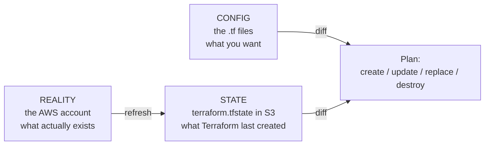
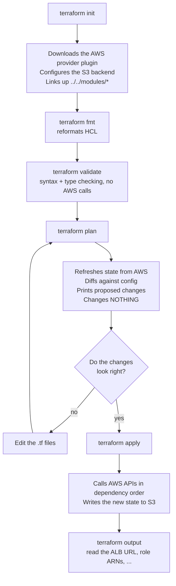
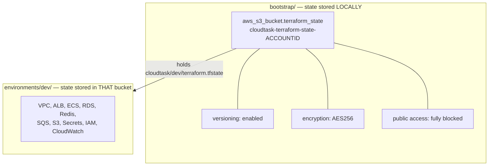

# 01 — The Terraform mental model

**What you'll learn:** what Terraform actually does when you run it, the three-way
comparison that drives every decision it makes, and why this repo has two separate stacks.

---

## Terraform is a reconciler, not a script

If you have used shell scripts or the AWS CLI, you are used to writing **instructions**:
"create a VPC", "then create a subnet in it". You have to know what already exists, and
running the script twice creates everything twice.

Terraform works the other way round. You write a **description of the end state you want**:

```hcl
resource "aws_db_instance" "this" {
  identifier     = "cloudtask-dev-postgres"
  engine         = "postgres"
  engine_version = "16"
  instance_class = "db.t4g.micro"
}
```

That says _"there should be a Postgres 16 database called `cloudtask-dev-postgres` on a
`db.t4g.micro`"_. It does not say "create it". Terraform figures out whether to create it,
change it, or leave it alone — and running it twice changes nothing the second time. That
property has a name: **idempotence**.

The consequence for you as a beginner: **you never write "create" or "delete" anywhere.**
You edit the description and Terraform derives the actions.

## The three-way comparison

Every `terraform plan` compares three things:



- **Config** — the `.tf` files in git. Your intent.
- **State** — a JSON file recording every resource Terraform created, its AWS ID, and all
  its attribute values. In this repo it lives in S3 at
  `cloudtask/dev/terraform.tfstate`. **State is not optional** — without it, Terraform has
  no idea that the VPC in your config is the same VPC that already exists in AWS, and would
  try to create a second one.
- **Reality** — the AWS account. At the start of a plan, Terraform re-reads each tracked
  resource from AWS ("refresh") so it notices changes someone made by hand in the console.
  That difference between state and reality is called **drift**.

Three important consequences:

| Situation                              | What Terraform does                                            |
| -------------------------------------- | -------------------------------------------------------------- |
| In config, not in state                | Creates it                                                     |
| In state, not in config                | Destroys it                                                    |
| In both, but attributes differ         | Updates in place, or destroys and recreates if AWS requires it |
| Changed by hand in the console (drift) | Changes it back, to match config                               |

That last row is why you should not click things in the console for resources Terraform
manages — your change gets reverted on the next apply.

## The lifecycle: init, plan, apply



The four commands you will use constantly:

- **`terraform init`** — once per directory, and again whenever you add a provider or
  change the backend. Creates a local `.terraform/` folder.
- **`terraform plan`** — read-only. Safe to run as often as you like. Always run it before
  apply.
- **`terraform apply`** — makes the changes. Shows the plan again and asks for confirmation.
- **`terraform destroy`** — deletes everything in this stack's state.

Exact commands for this repo are in [11 — Operations](./11-operations.md).

## Providers: how Terraform knows about AWS

Terraform itself knows nothing about AWS. All the AWS knowledge lives in a plugin called a
**provider**, downloaded during `init`. This repo pins three:

```hcl
# infrastructure/terraform/environments/dev/versions.tf
terraform {
  required_version = ">= 1.11.0"

  required_providers {
    aws = {
      source  = "hashicorp/aws"
      version = "~> 5.0"
    }
    random = {
      source  = "hashicorp/random"
      version = "~> 3.6"
    }
    tls = {
      source  = "hashicorp/tls"
      version = "~> 4.0"
    }
  }
}
```

- **`aws`** — every `aws_*` resource.
- **`random`** — used twice, to generate the RDS master password and the JWT secret.
- **`tls`** — used once, to fetch GitHub's OIDC certificate thumbprint.

The resolved versions are recorded in `.terraform.lock.hcl`, which **is committed** so
everyone gets identical provider versions. (State files are gitignored; the lock file is
not — see `.gitignore` lines 36–44.)

## Why this repo has two stacks

A "stack" (Terraform calls it a **root module**) is a directory you run `terraform` in. It
has its own state file. This repo has two:



The reason is a chicken-and-egg problem. `environments/dev` stores its state in an S3
bucket — but something has to create that bucket first, and it cannot store _its_ state in
the bucket it hasn't created yet. So `bootstrap/` exists purely to create the bucket, and
keeps its own state in a local file on your laptop. From `bootstrap/main.tf`:

```hcl
# Terraform state backend: S3 bucket with native lockfile locking (use_lockfile).
# This stack uses LOCAL state on purpose — it holds no secrets and exists only
# so environments/dev can use the S3 backend.
```

You run `bootstrap` once, ever. After that you only ever work in `environments/dev`.

## Modules: the third kind of directory

`modules/*` are **not** stacks. You never run `terraform` inside them. They are reusable
parameterised bundles of resources, called from `environments/dev/main.tf` like this:

```hcl
module "networking" {
  source = "../../modules/networking"

  name_prefix        = local.name_prefix
  enable_nat_gateway = var.enable_nat_gateway
}
```

Think of a module as a function: `variables.tf` is its parameter list, `main.tf` is its
body, `outputs.tf` is its return value. The payoff shows up in this repo with
`modules/ecs-service`, which is called **three times** — once each for api, worker, and web
— instead of copying ~100 lines of task-definition HCL three times.

There is exactly one environment (`dev`) today. The module split is what would let you add
`environments/prod` later by writing a new `main.tf` with different variable values,
without touching a single module.

---

Next: **[02 — HCL primer](./02-hcl-primer.md)** — the language itself.
