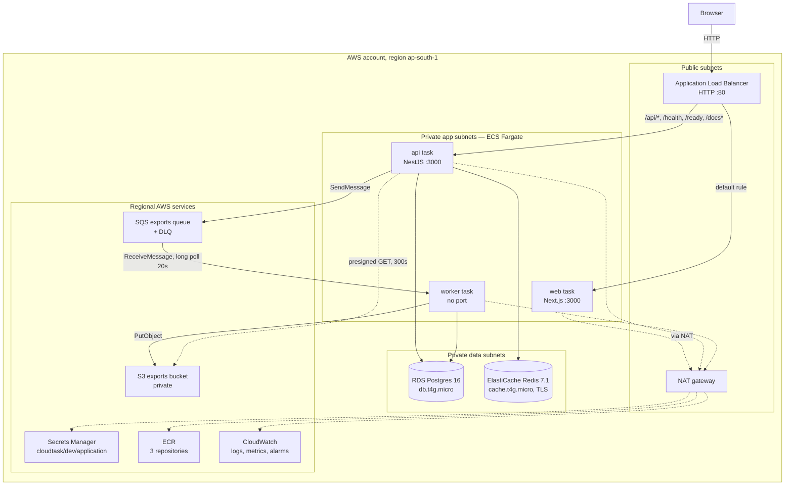
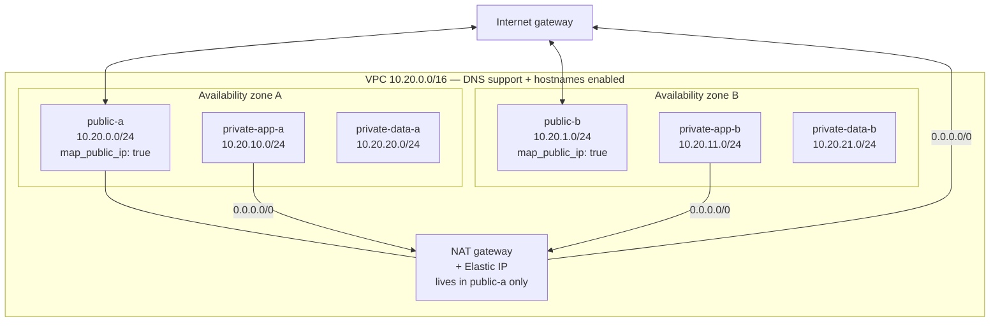
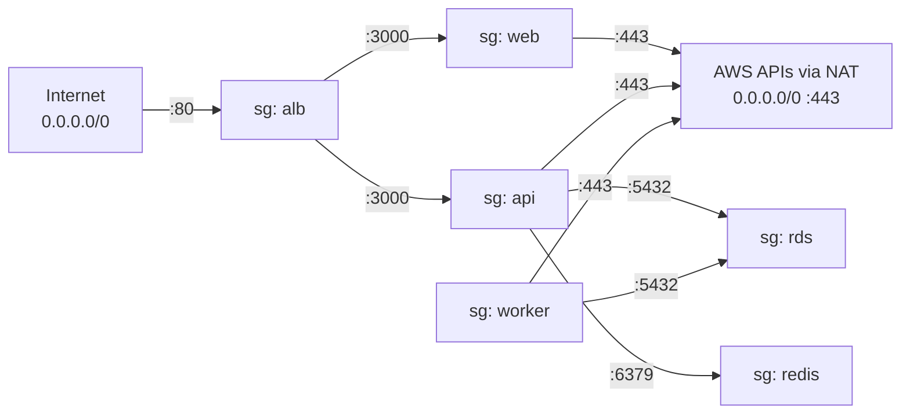
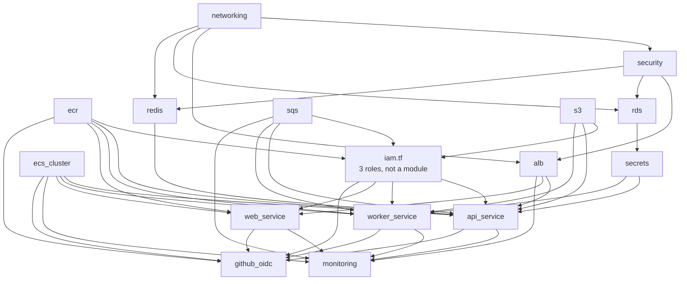
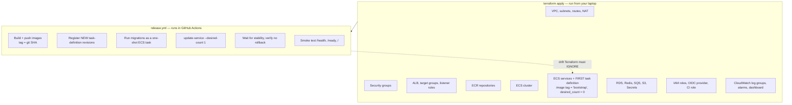
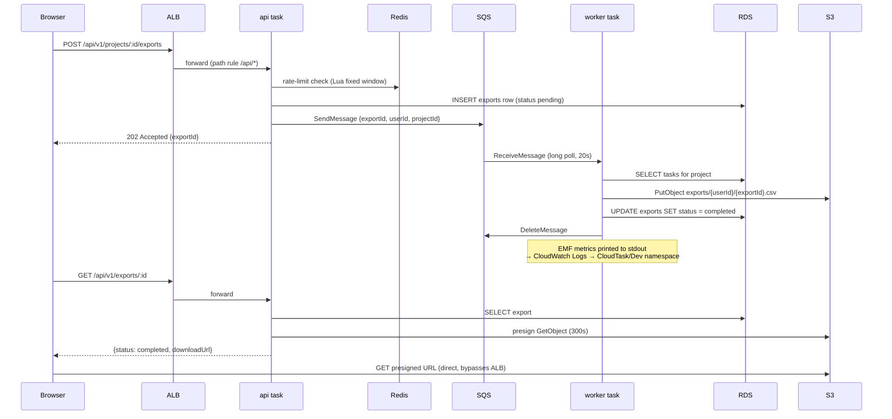

# 03 — Architecture overview

**What you'll learn:** what the stack actually looks like once applied, in six diagrams —
runtime components, network topology, security groups, the module graph, the
Terraform-vs-CI ownership split, and one end-to-end request flow.

---

## 1. Runtime architecture

Three containers, four backing services, one load balancer.



**Why each box exists** — traced to the application code that requires it:

| Component         | Required by                                                                                                                          |
| ----------------- | ------------------------------------------------------------------------------------------------------------------------------------ |
| ALB               | Only public entry point. Routes by path because api and web are separate services on the same hostname.                              |
| web task          | `apps/web` — Next.js standalone server                                                                                               |
| api task          | `apps/api` — NestJS HTTP API, prefix `api/v1`, plus `/health`, `/ready`, `/docs`                                                     |
| worker task       | `apps/worker` — a NestJS **standalone context**, no HTTP server, so it needs no port and no load balancer                            |
| RDS Postgres      | `DATABASE_URL`; TypeORM entities + 4 migrations in `apps/api/src/database/migrations/`                                               |
| ElastiCache Redis | api only: 60s project-summary cache and the Lua rate limiter (`apps/api/src/ratelimit/redis-rate-limiter.ts`)                        |
| SQS + DLQ         | api enqueues export jobs, worker consumes them; poison messages land in the DLQ after 3 failed receives                              |
| S3                | worker writes `exports/{userId}/{exportId}.csv`; api hands out presigned download URLs                                               |
| Secrets Manager   | the only two values marked secret: `DATABASE_URL`, `JWT_SECRET`                                                                      |
| ECR               | `.github/workflows/release.yml` pushes Git-SHA-tagged images here; ECS pulls from here                                               |
| CloudWatch        | container stdout goes here via the `awslogs` driver; the worker's EMF metrics ride the same stream                                   |
| NAT gateway       | tasks are in private subnets with no public IP, but still need outbound HTTPS to reach ECR, Secrets Manager, SQS, S3, and CloudWatch |

Note the dotted **presigned URL** arrow: the browser downloads the CSV directly from S3
using a URL the api signs. That is why the bucket can stay completely private — see
[08](./08-module-data-layer.md#s3--the-exports-bucket).

## 2. Network topology

Two availability zones, six subnets, three route tables. Built by
[`modules/networking`](../modules/networking/main.tf).



The three route tables, and the one that matters most:

| Route table       | Attached to        | Default route `0.0.0.0/0`          |
| ----------------- | ------------------ | ---------------------------------- |
| `public-rt`       | public-a, public-b | → internet gateway                 |
| `private-app-rt`  | private-app-a, -b  | → NAT gateway                      |
| `private-data-rt` | private-data-a, -b | **none — no default route at all** |

That empty route table is a deliberate security control, not an oversight:

```hcl
# modules/networking/main.tf:122
# No default route: private-data subnets are reachable only from inside the VPC.
resource "aws_route_table" "private_data" {
  vpc_id = aws_vpc.this.id

  tags = { Name = "${var.name_prefix}-private-data-rt" }
}
```

The database and cache have no path to the internet in either direction. Even if their
security groups were misconfigured, there is no route for traffic to take.

Three things to notice:

- **The NAT gateway is single, in AZ A.** Production would use one per AZ so an AZ failure
  can't cut off the other AZ's outbound traffic. One is cheaper, and this is a lab.
- **Tasks get `assign_public_ip = false`** (`modules/ecs-service/main.tf:83`) and sit in the
  private-app subnets. NAT is the only way out, which is why `enable_nat_gateway = true` is
  required in `terraform.tfvars` — with it off, tasks cannot even pull their own image.
- **AZs are discovered, not hardcoded** — `slice(data.aws_availability_zones.available.names, 0, 2)`
  takes whichever first two AZs the region offers.

## 3. Security groups

Six groups, 14 rules. Built by [`modules/security`](../modules/security/main.tf). Arrows
point in the direction traffic flows.



Three design decisions worth understanding:

**1. Rules reference security groups, not IP ranges.** `sg: rds` allows port 5432 from
`sg: api` — not from `10.20.10.0/24`. Any task launched into the api security group is
allowed automatically, wherever its IP lands; nothing else is, even in the same subnet.

```hcl
# modules/security/main.tf:162
resource "aws_vpc_security_group_ingress_rule" "rds_from_api" {
  security_group_id            = aws_security_group.rds.id
  description                  = "PostgreSQL from api"
  referenced_security_group_id = aws_security_group.api.id
  from_port                    = 5432
  to_port                      = 5432
  ip_protocol                  = "tcp"
}
```

**2. Rules are separate resources, not inline blocks.** The module declares six bare
`aws_security_group` resources with no rules, then 14 separate rule resources. From the
file header:

```hcl
# modules/security/main.tf:1
# Security groups per spec §13. All service-to-service rules reference SGs,
# never CIDRs. Rules live in separate resources so the ALB↔api/web and
# api/worker↔rds/redis reference cycles don't trip Terraform's graph.
```

If the rules were inline, `sg: alb` would reference `sg: api` (egress) while `sg: api`
referenced `sg: alb` (ingress) — a cycle, and Terraform refuses to build a graph with
cycles. Splitting the rules out breaks it: the two groups are created first, then the rules
that connect them.

**3. Redis has no password.** The security group _is_ the authentication:

```hcl
# modules/redis/main.tf:1
# ... No AUTH token — the app has no auth config; access
# control is SG-only (api SG ingress).
```

Also note the worker has **no ingress rules at all**. Nothing ever connects _to_ it; it only
makes outbound calls. And the web task has no database or Redis egress — it only needs
outbound HTTPS to pull its image and ship logs.

## 4. Module dependency graph

15 `module` blocks in [`environments/dev/main.tf`](../environments/dev/main.tf), plus the
IAM roles in `iam.tf`. Arrows mean "reads an output of", which is exactly what determines
apply order.



Reading it:

- **`networking` is the root.** Nothing can be created before the VPC.
- **`ecr`, `ecs_cluster`, `sqs`, `s3` have no dependencies** — Terraform creates them in
  parallel with the VPC.
- **The three `*_service` modules are the convergence point.** They need the cluster, an
  image URL, subnets, a security group, IAM roles, secrets, and (for api and web) a target
  group. They are the slowest part of an apply.
- **There is a circular-looking relationship between `iam.tf` and the services** which
  Terraform resolves cleanly: `iam.tf` reads the services' **log group ARNs**, while the
  services read the **role ARNs**. Different attributes, so no cycle.
- **`monitoring` and `github_oidc` are leaves** — nothing depends on them.

## 5. Who owns what: Terraform vs CI

This is the single most confusing thing about this stack until you see it laid out.



Terraform creates each ECS service once, with a placeholder image and zero tasks. CI then
takes over the two attributes that change on every deploy:

```hcl
# modules/ecs-service/main.tf:98
# CI (release.yml) registers new task-definition revisions on every deploy
# and scales services up on first deploy; Terraform must never revert either.
lifecycle {
  ignore_changes = [task_definition, desired_count]
}
```

Without that block, every `terraform apply` after the first deploy would revert your
production services to the placeholder image and scale them to zero.

**Why `desired_count = 0` at bootstrap?** Because the `bootstrap` image tag doesn't exist in
ECR yet. A service with `desired_count = 1` would immediately try to pull a nonexistent
image, fail, retry, and never stabilise. At zero, nothing is pulled and `terraform apply`
completes cleanly. From `environments/dev/terraform.tfvars`:

```hcl
# Leave at "bootstrap": services start at desired_count = 0, so the placeholder
# image is never pulled. CI registers real git-SHA revisions and scales up on
# the first release run.
```

The two sides agree on a **naming contract**, asserted in the header of `release.yml` and
honoured by the Terraform modules:

| Thing            | Name                                  | Set in                           |
| ---------------- | ------------------------------------- | -------------------------------- |
| Cluster          | `cloudtask-dev`                       | `modules/ecs-cluster/main.tf`    |
| Service / family | `cloudtask-dev-{api,worker,web}`      | `modules/ecs-service/main.tf:10` |
| Container name   | `api` \| `worker` \| `web`            | `modules/ecs-service/main.tf:34` |
| ECR repository   | `cloudtask-dev-{api,worker,web}`      | `modules/ecr/main.tf:7`          |
| Log group        | `/ecs/cloudtask-dev-{api,worker,web}` | `modules/ecs-service/main.tf:14` |

Rename any of those in Terraform and the release workflow breaks.

## 6. One request end to end: the CSV export

This flow touches almost every component, which makes it the best single example.



Two details in that diagram explain infrastructure choices elsewhere:

- **`DeleteMessage` comes last.** If the worker crashes mid-job the message is never
  deleted, SQS redelivers it after the visibility timeout, and after 3 failed receives it
  moves to the DLQ — which the `exports-dlq-messages` alarm watches. The S3 key is
  deterministic (`exports/{userId}/{exportId}.csv`) so a retry overwrites rather than
  duplicating.
- **The browser fetches from S3 directly.** No traffic through the ALB, no public bucket.

---

Next: **[04 — State and backend](./04-state-and-backend.md)** — where Terraform keeps its
records.
