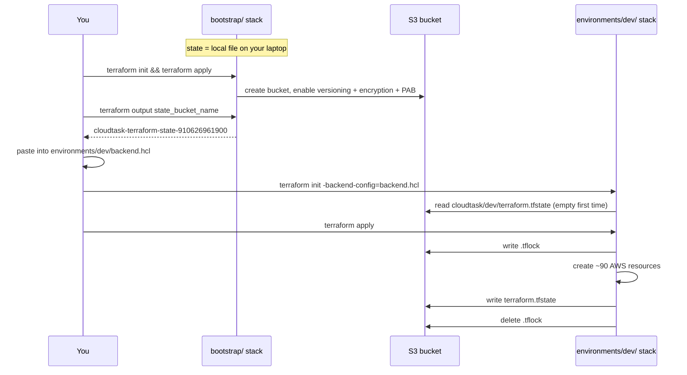

# 04 — State and the backend

**What you'll learn:** what the state file is, why it lives in S3, how the `bootstrap` stack
creates the bucket that holds it, how locking prevents two people corrupting it, and which
files are deliberately kept out of git.

---

## What state is

State is a JSON document recording every resource Terraform has created: its type, its
Terraform address, its real AWS identifier, and every attribute value AWS returned. It is
how Terraform connects `aws_vpc.this` in your config to `vpc-0abc123...` in the account.

Delete the state file and Terraform forgets everything — the next `apply` tries to create a
second copy of the entire stack, and the original resources become orphans nothing manages.
State is the most important artifact in the whole setup.

## The `bootstrap` stack

`infrastructure/terraform/bootstrap/` is a four-resource stack whose only job is to create
the bucket that stores state for everything else.

```hcl
# bootstrap/main.tf:27
resource "aws_s3_bucket" "terraform_state" {
  bucket = "${var.project_name}-terraform-state-${data.aws_caller_identity.current.account_id}"

  # Lab environment: allow destroy even with state objects present.
  force_destroy = true
}
```

Plus three hardening resources, each a separate AWS API in the provider:

| Resource                                             | Why                                                             |
| ---------------------------------------------------- | --------------------------------------------------------------- |
| `aws_s3_bucket_versioning`                           | Every state write keeps the previous version — your undo button |
| `aws_s3_bucket_server_side_encryption_configuration` | AES256 at rest; state contains the DB password                  |
| `aws_s3_bucket_public_access_block`                  | All four blocks on; state must never be world-readable          |

The bucket name embeds the account ID (from `data.aws_caller_identity.current`) because S3
bucket names are globally unique across all of AWS.

**This stack keeps its own state in a local file** — `bootstrap/terraform.tfstate` on your
laptop. Its own header explains why:

```hcl
# bootstrap/main.tf:1
# Terraform state backend: S3 bucket with native lockfile locking (use_lockfile).
# This stack uses LOCAL state on purpose — it holds no secrets and exists only
# so environments/dev can use the S3 backend.
```

You run it once. Its single output is the bucket name:

```hcl
# bootstrap/outputs.tf
output "state_bucket_name" {
  description = "S3 bucket holding Terraform state for environments"
  value       = aws_s3_bucket.terraform_state.bucket
}
```

Which you then paste into `environments/dev/backend.hcl`.

## The S3 backend, in two files

`environments/dev/backend.tf` declares the backend — but **not** completely:

```hcl
# environments/dev/backend.tf
# State lives in the bucket created by ../../bootstrap. Account-specific
# values (bucket name, deploy role ARN) stay out of git in the gitignored
# backend.hcl — copy backend.hcl.example, fill it in, then initialize with:
#   terraform init -backend-config=backend.hcl
terraform {
  backend "s3" {
    key          = "cloudtask/dev/terraform.tfstate"
    region       = "ap-south-1"
    encrypt      = true
    use_lockfile = true
  }
}
```

Notice what's missing: **`bucket`**. That is called a **partial backend configuration** —
you deliberately leave out some settings and supply them at `init` time:

```hcl
# environments/dev/backend.hcl  (gitignored)
bucket = "cloudtask-terraform-state-910626961900"

assume_role = {
  role_arn     = "arn:aws:iam::910626961900:role/cloudtask-terraform-deploy"
  session_name = "terraform"
}
```

```bash
terraform init -backend-config=backend.hcl
```

Why split it? Both missing values embed the AWS account ID, and the repo's policy is that
account-specific values stay out of git. `backend.hcl.example` is committed as a template;
`backend.hcl` is gitignored.

**A backend block cannot use variables.** `bucket = var.state_bucket` is a syntax error —
the backend is configured before variables are evaluated, because Terraform needs state
before it can do anything else. The partial-config + `-backend-config` file pattern exists
precisely to work around that restriction.

### The four settings

| Setting        | Value                             | Meaning                                                                |
| -------------- | --------------------------------- | ---------------------------------------------------------------------- |
| `key`          | `cloudtask/dev/terraform.tfstate` | Path within the bucket. A second environment would use a different key |
| `region`       | `ap-south-1`                      | Where the bucket is                                                    |
| `encrypt`      | `true`                            | Encrypt the object on write                                            |
| `use_lockfile` | `true`                            | Native S3 locking — see below                                          |

### Locking without DynamoDB

Historically, S3 backends needed a companion DynamoDB table to hold a lock so two people
couldn't apply at the same time and interleave writes to the state file. Modern Terraform
(1.10+) supports `use_lockfile = true`, which writes a small `.tflock` object next to the
state file and uses S3's conditional writes instead. Same protection, one less resource to
create and pay for — which is why you won't find a DynamoDB table anywhere in this repo.

If a run is interrupted (Ctrl-C at the wrong moment, laptop sleeps), the lock object can be
left behind and the next run fails with "Error acquiring the state lock". Recovery is in
[11 — Operations](./11-operations.md#common-errors).

## Putting it together



## Files that stay out of git

From `.gitignore` lines 36–44:

```gitignore
# terraform — state and per-operator config stay local; the provider lock
# file (.terraform.lock.hcl) IS committed for reproducible provider versions.
*.tfstate
*.tfstate.*
.terraform/
terraform.tfvars
backend.hcl
tfplan
terraform-outputs.json
```

| Ignored            | Why                                                                     |
| ------------------ | ----------------------------------------------------------------------- |
| `*.tfstate`        | Contains the RDS password and JWT secret in plain text                  |
| `.terraform/`      | Downloaded provider binaries and backend cache — machine-local, ~500 MB |
| `terraform.tfvars` | Holds `deploy_role_arn`, which embeds the account ID                    |
| `backend.hcl`      | Holds the state bucket name and role ARN, both embedding the account ID |
| `tfplan`           | A saved binary plan; can contain secret values                          |

**Committed on purpose:** `.terraform.lock.hcl`. That is the provider _dependency_ lock (aws
5.100.0, random 3.9.0, tls 4.3.0 for this stack), not a state lock. Committing it means
everyone and CI resolve identical provider versions.

Both gitignored files have committed `.example` twins, so a fresh clone knows exactly what
to fill in:

```bash
cp terraform.tfvars.example terraform.tfvars
cp backend.hcl.example backend.hcl
```

## Secrets in state

Terraform generates two secrets itself:

```hcl
# modules/rds/main.tf:4
resource "random_password" "master" {
  length  = 32
  special = false
}

# modules/secrets/main.tf:5
resource "random_password" "jwt_secret" {
  length  = 48
  special = false
}
```

Both values end up in the state file, as does the composed `DATABASE_URL`. Marking a
variable or output `sensitive = true` hides it from terminal output — it does **not** encrypt
it in state.

This is a known, documented trade-off. From `DEVIATIONS.md`:

> **Secret values live in Terraform state** (encrypted S3): Terraform composes
> `DATABASE_URL` and generates `JWT_SECRET`/DB password. Accepted for the lab.

The mitigations in place are the bucket controls from `bootstrap`: private, encrypted,
versioned, and reachable only by the deploy role. If this were production you would generate
the secrets outside Terraform and have it reference them rather than create them.

---

Next: **[05 — The dev environment, file by file](./05-dev-environment-files.md)**.
