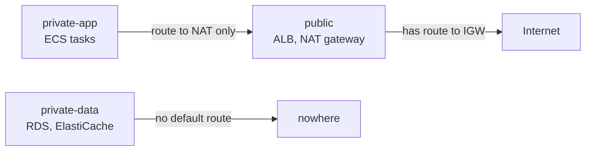
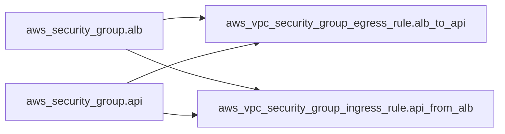
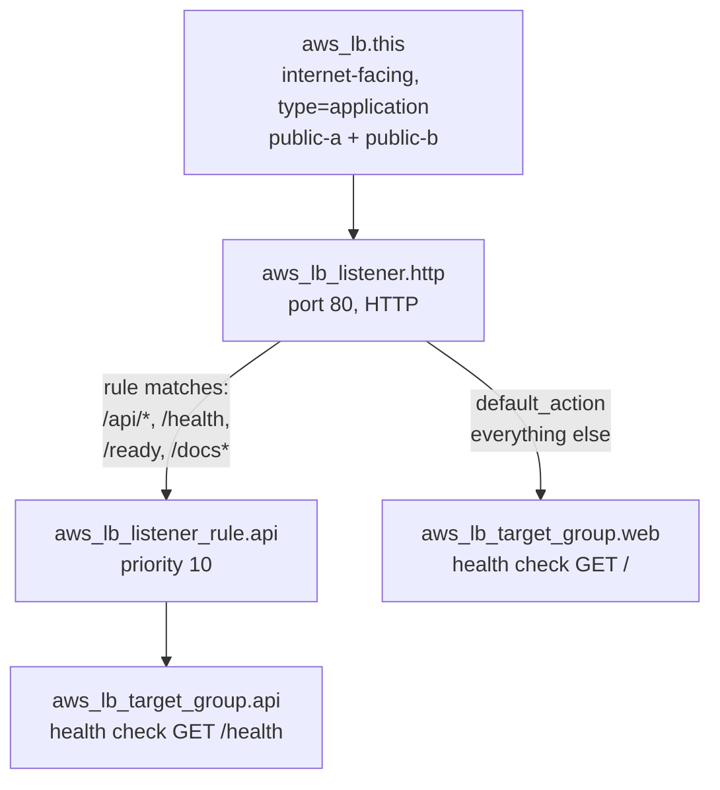

# 06 — Network edge modules

**What you'll learn:** what `networking`, `security`, and `alb` create, why each piece exists,
and which settings are lab-cost compromises.

These three modules build everything between the internet and the application containers.

---

## `networking` — the VPC

**Files:** [`modules/networking/`](../modules/networking/) — `main.tf` (134 lines),
`variables.tf`, `outputs.tf`

### What it creates

| Resource                        | Count  | Notes                                      |
| ------------------------------- | ------ | ------------------------------------------ |
| `aws_vpc.this`                  | 1      | `10.20.0.0/16`, DNS support + hostnames on |
| `aws_internet_gateway.this`     | 1      | The VPC's door to the internet             |
| `aws_subnet.public`             | 2      | `10.20.0.0/24`, `10.20.1.0/24`             |
| `aws_subnet.private_app`        | 2      | `10.20.10.0/24`, `10.20.11.0/24`           |
| `aws_subnet.private_data`       | 2      | `10.20.20.0/24`, `10.20.21.0/24`           |
| `aws_eip.nat`                   | 0 or 1 | Static public IP for the NAT gateway       |
| `aws_nat_gateway.this`          | 0 or 1 | Lives in `public[0]` only                  |
| `aws_route_table.*`             | 3      | public, private-app, private-data          |
| `aws_route.private_app_nat`     | 0 or 1 | The `0.0.0.0/0` → NAT route                |
| `aws_route_table_association.*` | 6      | 2 per route table                          |

**Inputs:** `name_prefix`, `vpc_cidr` (default `10.20.0.0/16`), `enable_nat_gateway`.
**Outputs:** `vpc_id`, `vpc_cidr`, and the three subnet-ID lists plus `nat_gateway_id`.

### Why three subnet tiers



Each tier answers a different question:

- **public** — "can the internet reach this, and can it reach the internet?" Yes to both.
  Only the ALB and the NAT gateway belong here.
- **private-app** — "can it reach out, but not be reached?" Tasks need outbound HTTPS to pull
  images from ECR, read the secret, poll SQS, write to S3, and ship logs. They must never be
  addressable from outside.
- **private-data** — "should it talk to the internet at all?" No. Postgres and Redis only ever
  receive connections from inside the VPC.

That last tier is enforced by a route table with **no default route**:

```hcl
# modules/networking/main.tf:122
# No default route: private-data subnets are reachable only from inside the VPC.
resource "aws_route_table" "private_data" {
  vpc_id = aws_vpc.this.id

  tags = { Name = "${var.name_prefix}-private-data-rt" }
}
```

A route table with no `route` blocks still has the implicit local route for the VPC CIDR, so
in-VPC traffic works fine. There is simply no path off the VPC. Belt and braces alongside the
security groups.

### Why two availability zones

RDS subnet groups and ElastiCache subnet groups **require** subnets in at least two AZs, even
for a single-AZ instance. So do ALBs. Two is the minimum AWS will accept, and this stack takes
the minimum.

The AZs are discovered rather than hardcoded:

```hcl
# modules/networking/main.tf:5
data "aws_availability_zones" "available" {
  state = "available"
}

locals {
  azs = slice(data.aws_availability_zones.available.names, 0, 2)
  # ...
}
```

`slice(list, 0, 2)` takes the first two. Move the stack to another region and it still works.

The subnet `Name` tag uses a small trick to get a readable suffix:

```hcl
tags = { Name = "${var.name_prefix}-public-${substr(local.azs[count.index], -1, 1)}" }
```

`substr("ap-south-1a", -1, 1)` is the last character, `a`. So you get
`cloudtask-dev-public-a` and `cloudtask-dev-public-b`.

### The NAT gateway: the expensive, essential piece

```hcl
# modules/networking/main.tf:62
resource "aws_eip" "nat" {
  count = var.enable_nat_gateway ? 1 : 0

  domain = "vpc"

  tags = { Name = "${var.name_prefix}-nat-eip" }

  depends_on = [aws_internet_gateway.this]
}

resource "aws_nat_gateway" "this" {
  count = var.enable_nat_gateway ? 1 : 0

  allocation_id = aws_eip.nat[0].id
  subnet_id     = aws_subnet.public[0].id

  tags = { Name = "${var.name_prefix}-nat" }

  depends_on = [aws_internet_gateway.this]
}
```

**Why it's required.** ECS tasks run with `assign_public_ip = false` in private subnets. Every
outbound call they make — pulling the container image from ECR, fetching the secret,
long-polling SQS, uploading to S3, writing logs — is an HTTPS call to a public AWS endpoint.
With no NAT gateway, a task cannot even start, because the ECS agent can't pull the image.
Hence the comment in `terraform.tfvars`:

```hcl
# Required for tasks to reach ECR/Secrets Manager/SQS/S3 from private subnets.
enable_nat_gateway = true
```

**Why `depends_on` here.** Nothing in either block references the internet gateway, but AWS
requires the IGW to be attached to the VPC before a VPC-domain EIP can be allocated. This is
the one place in the repo where an invisible ordering constraint has to be stated by hand.

**Cost.** A NAT gateway bills per hour plus per GB processed, and the EIP bills whenever it is
allocated. This is typically the largest line item in the stack when the app is idle. The
`enable_nat_gateway` flag exists so you can turn it off to save money — but the trade-off is
that no task can start.

The alternative a production account would use is **VPC endpoints** (PrivateLink) for ECR,
S3, Secrets Manager, SQS, and CloudWatch Logs, which keep the traffic on the AWS network and
avoid NAT data-processing charges. That is more resources to manage, and this stack chose the
simpler shape.

### Cost note: one NAT, not two

Production would put a NAT gateway in each AZ, so an AZ outage doesn't take out the other
AZ's outbound path. Here both private-app subnets route through the single NAT in
`public[0]` — a documented single point of failure, deliberately traded for cost.

---

## `security` — the six security groups

**Files:** [`modules/security/`](../modules/security/) — `main.tf` (189 lines)

**Inputs:** `name_prefix`, `vpc_id`, `container_port`.
**Outputs:** the six security-group IDs.

### What it creates

Six empty groups, then 14 rules as separate resources:

| Group    | Ingress                                     | Egress                                                     |
| -------- | ------------------------------------------- | ---------------------------------------------------------- |
| `alb`    | `:80` from `0.0.0.0/0`                      | `:3000` → api SG, `:3000` → web SG                         |
| `api`    | `:3000` from alb SG                         | `:5432` → rds SG, `:6379` → redis SG, `:443` → `0.0.0.0/0` |
| `worker` | **none**                                    | `:5432` → rds SG, `:443` → `0.0.0.0/0`                     |
| `web`    | `:3000` from alb SG                         | `:443` → `0.0.0.0/0`                                       |
| `rds`    | `:5432` from api SG, `:5432` from worker SG | none                                                       |
| `redis`  | `:6379` from api SG                         | none                                                       |

Read that table as the app's actual dependency list. The worker has no ingress because
nothing ever connects to it. The web task has no database access because it never touches
one — all its data comes from the api via the browser. Redis is reachable only from the api,
matching the fact that only `apps/api` imports a Redis client.

### Why rules are separate resources

The module header says it plainly:

```hcl
# modules/security/main.tf:1
# Security groups per spec §13. All service-to-service rules reference SGs,
# never CIDRs. Rules live in separate resources so the ALB↔api/web and
# api/worker↔rds/redis reference cycles don't trip Terraform's graph.
```

Terraform's dependency graph must be acyclic. If rules were written inline:

```hcl
# NOT what this repo does — this would be a cycle
resource "aws_security_group" "alb" {
  egress { security_groups = [aws_security_group.api.id] }   # alb needs api
}
resource "aws_security_group" "api" {
  ingress { security_groups = [aws_security_group.alb.id] }  # api needs alb
}
```

Terraform would refuse to plan. Splitting the rules out gives three layers instead of a
cycle: create both groups → then create the rules that reference them.



Note the resource types: `aws_vpc_security_group_ingress_rule` and
`aws_vpc_security_group_egress_rule` (singular, one rule each) rather than the older
`aws_security_group_rule`. The newer resources support tags and give each rule a stable
identity, so editing one rule doesn't churn the others.

### Why SG references, not CIDR blocks

```hcl
# modules/security/main.tf:162
resource "aws_vpc_security_group_ingress_rule" "rds_from_api" {
  security_group_id            = aws_security_group.rds.id
  description                  = "PostgreSQL from api"
  referenced_security_group_id = aws_security_group.api.id
  from_port                    = 5432
  to_port                      = 5432
  ip_protocol                  = "tcp"
}
```

`referenced_security_group_id` means "allow anything wearing the api security group". If it
were `cidr_ipv4 = "10.20.10.0/24"` instead, every task in the private-app subnet could reach
the database — including the web task, which has no business doing so. Identity-based rules
survive IP changes and express intent.

The two rules that _do_ use CIDRs are the two that genuinely mean "the internet": the ALB's
`:80` ingress from `0.0.0.0/0`, and the tasks' `:443` egress to `0.0.0.0/0` for AWS API
calls.

### Redis has no password

```hcl
# modules/redis/main.tf:1
# ... No AUTH token — the app has no auth config; access
# control is SG-only (api SG ingress).
```

`apps/api/src/redis/redis.module.ts` builds its client from `REDIS_HOST`, `REDIS_PORT`, and
`REDIS_TLS_ENABLED` — there is no password setting. So the security group is the entire
access-control story for the cache. Acceptable given the cache holds only 60-second summary
snapshots and rate-limit counters, in a subnet with no internet route.

---

## `alb` — the public entry point

**Files:** [`modules/alb/`](../modules/alb/) — `main.tf` (77 lines)

**Inputs:** `name_prefix`, `vpc_id`, `public_subnet_ids`, `security_group_id`,
`container_port`.
**Outputs:** `alb_dns_name`, `alb_arn_suffix`, and the two target-group ARNs plus their
suffixes.

### What it creates



### Why the path rules are exactly these four patterns

```hcl
# modules/alb/main.tf:63
resource "aws_lb_listener_rule" "api" {
  listener_arn = aws_lb_listener.http.arn
  priority     = 10

  condition {
    path_pattern {
      values = ["/api/*", "/health", "/ready", "/docs*"]
    }
  }

  action {
    type             = "forward"
    target_group_arn = aws_lb_target_group.api.arn
  }
}
```

Each pattern maps to something in `apps/api/src/main.ts`:

| Pattern   | Why                                                                                   |
| --------- | ------------------------------------------------------------------------------------- |
| `/api/*`  | The API sets a global prefix of `api/v1`, so every business route starts with `/api/` |
| `/health` | Liveness endpoint, explicitly **excluded** from the global prefix                     |
| `/ready`  | Readiness endpoint, also excluded from the prefix                                     |
| `/docs*`  | Swagger UI, mounted outside the prefix                                                |

The health and readiness paths must be routable through the ALB because `release.yml`'s
smoke-test job curls them from GitHub Actions after every deploy.

Everything not matching goes to web via the listener's `default_action`. That inversion —
api gets an explicit allow-list, web gets the fallback — is why adding a new API route
prefix needs no ALB change as long as it lives under `/api/`.

**Single listener, HTTP only.** No HTTPS, no ACM certificate, no domain name:

```hcl
# modules/alb/main.tf:1
# Internet-facing ALB, HTTP :80 (spec: no domain/TLS for this lab).
```

You reach the app at `http://cloudtask-dev-alb-1234567890.ap-south-1.elb.amazonaws.com`.
Adding TLS would mean a registered domain, an ACM certificate, a `:443` listener, and a
`:80` → `:443` redirect — out of scope here.

### The two target groups and their health checks

```hcl
resource "aws_lb_target_group" "api" {
  name        = "${var.name_prefix}-api"
  port        = var.container_port
  protocol    = "HTTP"
  vpc_id      = var.vpc_id
  target_type = "ip"

  # Faster drain during deploys and destroy (default is 300s).
  deregistration_delay = 30

  health_check {
    path                = "/health"
    matcher             = "200"
    interval            = 30
    timeout             = 5
    healthy_threshold   = 2
    unhealthy_threshold = 3
  }
}
```

- **`target_type = "ip"`** is mandatory for Fargate. Tasks use `awsvpc` networking and get
  their own ENI and private IP; there is no EC2 instance to register.
- **`deregistration_delay = 30`** instead of the 300-second default. During a deploy the ALB
  waits this long for in-flight requests to finish before removing an old task. Five minutes
  of waiting per deploy — and per `terraform destroy` — is painful in a lab.
- **`path = "/health"`** for api, **`path = "/healthz"`** for web.

The health-check choice reflects a deliberate split in the application:

| Endpoint   | Served by | Postgres down | Redis down     | Used by                              |
| ---------- | --------- | ------------- | -------------- | ------------------------------------ |
| `/health`  | api       | still 200     | still 200      | **api target group** — pure liveness |
| `/ready`   | api       | 503           | 200 `degraded` | Smoke tests, humans                  |
| `/healthz` | web       | n/a           | n/a            | **web target group** — pure liveness |

The web probe is `/healthz`, not `/` and not `/api/health`:

- `/` is a client component that redirects in `useEffect`, so probing it asserted little
  beyond "Next.js served some HTML."
- `/api/health` would be the idiomatic Next.js location, but the listener rule below sends
  `/api/*` to the api service. The target-group probe would still work (health checks go
  straight to the task IP and never traverse the listener), yet
  `curl http://$ALB/api/health` would hit the api and 404 — a confusing thing to debug.
  `/healthz` matches no api path pattern, so it falls through to the web target group and
  behaves the same whether you reach it via the ALB or the container.

The ALB health-checks `/health`, which does no I/O, so a database blip does **not** cause the
ALB to kill and replace every api task — which would turn a short outage into a restart
storm. `/ready` carries the real dependency status and is checked by the release workflow
instead.

---

Next: **[07 — Compute modules](./07-module-compute.md)**.
