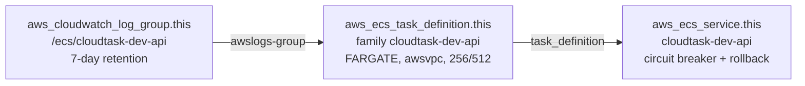

# 07 — Compute modules

**What you'll learn:** how container images get stored, where they run, and how one 103-line
module produces three quite different ECS services.

---

## `ecr` — the image registry

**Files:** [`modules/ecr/`](../modules/ecr/) — `main.tf` (37 lines)

**Inputs:** `name_prefix`, `repository_names` (`set(string)`, default
`["api", "worker", "web"]`).
**Outputs:** `repository_urls` and `repository_arns`, both maps keyed by app name.

```hcl
# modules/ecr/main.tf:1
# Repo names <name_prefix>-{api,worker,web} are a hard contract with
# .github/workflows/release.yml — it pushes to exactly these names.

resource "aws_ecr_repository" "this" {
  for_each = var.repository_names

  name                 = "${var.name_prefix}-${each.key}"
  image_tag_mutability = "IMMUTABLE"

  # Lab environment: allow destroy with images still present.
  force_delete = true

  image_scanning_configuration {
    scan_on_push = true
  }
}
```

### Why ECR at all

ECS Fargate pulls images from a registry. It could be Docker Hub, but then you would need
credentials in the task definition and you would hit rate limits. ECR is in the same account
and region, so the pull is fast, private, and authorised by the execution role's IAM
permissions rather than a stored password.

### The three settings that matter

**`image_tag_mutability = "IMMUTABLE"`.** Once `cloudtask-dev-api:abc1234` is pushed, that tag
can never point at different bytes. `release.yml` tags every image with the Git SHA, so the
running image is provably the build of a specific commit. Attempting to re-push the same tag
fails — which is a feature: it means "redeploy this SHA" can never silently ship different
code.

**`scan_on_push = true`.** ECR runs a basic CVE scan on each push. Results are advisory; the
pipeline does not gate on them (the CI Trivy job similarly runs with `--exit-code 0`).

**`force_delete = true`.** By default AWS refuses to delete a repository that still contains
images, which would make `terraform destroy` fail halfway. In a lab you want teardown to just
work. Never set this in production.

### One lifecycle policy per repository

```hcl
# modules/ecr/main.tf:18
resource "aws_ecr_lifecycle_policy" "this" {
  for_each = aws_ecr_repository.this

  repository = each.value.name

  policy = jsonencode({
    rules = [
      {
        rulePriority = 1
        description  = "Keep only the 10 most recent images"
        selection = {
          tagStatus   = "any"
          countType   = "imageCountMoreThan"
          countNumber = 10
        }
        action = { type = "expire" }
      }
    ]
  })
}
```

Two HCL points on display. First, `for_each` over **another resource** — `each.value` is a
whole repository object, so `each.value.name` is its name. Three repositories in, three
lifecycle policies out, automatically.

Second, since every merge to `main` pushes three new images, storage grows forever without a
policy. Ten images per repo is roughly the last ten deploys — enough to roll back to, small
enough that storage cost stays negligible.

### The outputs

```hcl
# modules/ecr/outputs.tf
output "repository_urls" {
  value = { for k, r in aws_ecr_repository.this : k => r.repository_url }
}
```

A map, not a list, so the environment can address them by name:

```hcl
# environments/dev/main.tf:93
image = "${module.ecr.repository_urls["api"]}:${var.api_image_tag}"
```

And where the caller only needs "all three ARNs" without caring which is which,
`values()` flattens the map (`environments/dev/iam.tf:39`,
`environments/dev/main.tf:196`).

---

## `ecs-cluster` — nine lines that matter

**Files:** [`modules/ecs-cluster/`](../modules/ecs-cluster/) — `main.tf` (9 lines)

```hcl
resource "aws_ecs_cluster" "this" {
  name = var.name_prefix

  # Container Insights feeds the RunningTaskCount alarm in the monitoring module.
  setting {
    name  = "containerInsights"
    value = "enabled"
  }
}
```

A cluster is just a namespace for Fargate — it provisions no compute and costs nothing. Note
the name is `var.name_prefix` with no suffix, so the cluster is `cloudtask-dev`, matching
`ECS_CLUSTER: cloudtask-dev` in `release.yml`.

The one real decision is **Container Insights**. Without it, ECS publishes only basic
`AWS/ECS` CPU and memory metrics. With it, you additionally get the
`ECS/ContainerInsights` namespace, which includes `RunningTaskCount` — and that is precisely
the metric the "API service has no running tasks" alarm watches
(`modules/monitoring/main.tf:28`). Turn Container Insights off and that alarm silently sits in
`INSUFFICIENT_DATA` forever.

Container Insights is not free — it charges per metric ingested. For three small services the
cost is minor, and losing the alarm is not worth the saving.

---

## `ecs-service` — the interesting one

**Files:** [`modules/ecs-service/`](../modules/ecs-service/) — `main.tf` (103 lines),
`variables.tf` (93 lines, 17 inputs)

This module is instantiated **three times** from `environments/dev/main.tf` — `api_service`,
`worker_service`, `web_service`. Understanding it is most of understanding the stack.

### The contract it upholds

```hcl
# modules/ecs-service/main.tf:1
# One Fargate service: log group + task definition + service.
# Contract with .github/workflows/release.yml:
#   - task definition family + service name: <name_prefix>-<service_name>
#   - container name: <service_name> (render action and run-task overrides key on it)
#   - log group: /ecs/<name_prefix>-<service_name>
# CI registers new task-definition revisions and owns desired_count, so both
# are excluded from Terraform drift via lifecycle ignore_changes.

locals {
  qualified_name = "${var.name_prefix}-${var.service_name}"
}
```

One local, used for all three names, so they cannot drift apart.

### Three resources



**1. The log group.**

```hcl
resource "aws_cloudwatch_log_group" "this" {
  name              = "/ecs/${local.qualified_name}"
  retention_in_days = var.log_retention_days   # default 7
}
```

Declaring it explicitly rather than letting ECS auto-create it buys two things: a retention
policy (auto-created groups keep logs forever and bill forever), and a real ARN that
`iam.tf` can scope the execution role's `logs:PutLogEvents` permission to.

The name is `/ecs/cloudtask-dev-api`, which differs from the spec's `/cloudtask/dev/api`. That
is a deliberate deviation so `release.yml`'s `aws logs tail /ecs/cloudtask-dev-api` works —
see [12 — Gotchas](./12-gotchas.md).

**2. The task definition** — the blueprint for a container.

```hcl
resource "aws_ecs_task_definition" "this" {
  family                   = local.qualified_name
  requires_compatibilities = ["FARGATE"]
  network_mode             = "awsvpc"
  cpu                      = var.cpu      # 256 = 0.25 vCPU
  memory                   = var.memory   # 512 MiB
  execution_role_arn       = var.execution_role_arn
  task_role_arn            = var.task_role_arn

  runtime_platform {
    operating_system_family = "LINUX"
    cpu_architecture        = "X86_64"
  }

  container_definitions = jsonencode([...])
}
```

- **`network_mode = "awsvpc"`** is mandatory on Fargate. Each task gets its own ENI and
  private IP — which is what makes security groups work per task and target groups use
  `target_type = "ip"`.
- **`cpu = 256`, `memory = 512`** is the smallest valid Fargate combination.
- **`cpu_architecture = "X86_64"`** matters because the images are built by
  `docker/build-push-action` on GitHub's x86 runners. An ARM64 task would fail to start with
  an exec-format error.
- **Two different roles.** `execution_role_arn` is used by the ECS agent (pull image, write
  logs, read the secret) **before** your code runs. `task_role_arn` is what your application
  code uses for its own AWS SDK calls. Different lifetimes, different permissions — see
  [09](./09-iam-and-github-oidc.md).

### Container definitions: the JSON-shaping part

```hcl
container_definitions = jsonencode([
  {
    name      = var.service_name
    image     = var.image
    essential = true

    portMappings = var.container_port == null ? [] : [
      {
        containerPort = var.container_port
        protocol      = "tcp"
      }
    ]

    environment = [
      for k, v in var.environment_variables : { name = k, value = v }
    ]

    secrets = [
      for k, v in var.secrets : { name = k, valueFrom = v }
    ]

    logConfiguration = {
      logDriver = "awslogs"
      options = {
        "awslogs-group"         = aws_cloudwatch_log_group.this.name
        "awslogs-region"        = var.aws_region
        "awslogs-stream-prefix" = var.service_name
      }
    }
  }
])
```

Four things happening here:

- **`name = var.service_name`** — the container is called `api`, not `cloudtask-dev-api`.
  This is load-bearing: `release.yml`'s render step and the migration `run-task` override both
  key on the container name.
- **`portMappings` ternary** — the worker passes `container_port = null`, producing `[]`. A
  container with no port mapping is exactly right for a queue consumer.
- **The two `for` expressions** convert HCL maps into the arrays of `{name, value}` objects
  the ECS API expects. Writing maps in `main.tf` is far more readable than writing arrays.
- **`logDriver = "awslogs"`** ships container stdout/stderr to the log group. This is also
  the metrics path: the worker prints EMF-formatted JSON to stdout, and CloudWatch Logs
  extracts metrics from it. No `PutMetricData` call is ever made — see
  [10 — Monitoring](./10-monitoring.md).

**3. The service** — keeps N copies of the task running.

```hcl
resource "aws_ecs_service" "this" {
  name            = local.qualified_name
  cluster         = var.cluster_arn
  task_definition = aws_ecs_task_definition.this.arn
  desired_count   = var.desired_count
  launch_type     = "FARGATE"

  deployment_minimum_healthy_percent = 100
  deployment_maximum_percent         = 200

  deployment_circuit_breaker {
    enable   = true
    rollback = true
  }

  network_configuration {
    subnets          = var.subnet_ids
    security_groups  = [var.security_group_id]
    assign_public_ip = false
  }

  dynamic "load_balancer" {
    for_each = var.target_group_arn == null ? [] : [var.target_group_arn]

    content {
      target_group_arn = load_balancer.value
      container_name   = var.service_name
      container_port   = var.container_port
    }
  }

  health_check_grace_period_seconds = var.target_group_arn == null ? null : 60

  lifecycle {
    ignore_changes = [task_definition, desired_count]
  }
}
```

**`100` / `200` percent** describes a rolling deploy: never drop below the current task count,
allow up to double during the roll. With `desired_count = 1` that means "start the new task,
wait for it to be healthy, then stop the old one" — no downtime.

**The deployment circuit breaker** is the most valuable safety feature here. If the new tasks
keep failing to reach a steady state — bad image tag, missing env var, failing health check —
ECS gives up and rolls back to the previous task definition automatically, instead of
retrying forever.

There is a subtlety this creates for CI: after a rollback the service is once again "stable",
so `aws ecs wait services-stable` **succeeds**. That is why `release.yml` has an extra
rollback-detector step asserting the PRIMARY deployment's task-definition ARN is the new one
and `rolloutState == COMPLETED`. Without it, a failed deploy would report green.

**`assign_public_ip = false`** is what puts these tasks behind the NAT gateway.

**`health_check_grace_period_seconds`** — for load-balanced services, ignore ALB health checks
for the first 60 seconds while Node.js boots. Must be `null` when there is no load balancer,
or AWS rejects the request; hence the ternary.

**`ignore_changes`** — the CI hand-off, explained in
[03 §5](./03-architecture-overview.md#5-who-owns-what-terraform-vs-ci).

### Two layers of health check

`health_check_grace_period_seconds` above concerns the **ALB** check. There is a second,
independent one: the container-level `healthCheck` inside the task definition, driven by the
optional `container_health_check` variable.

```hcl
container_definitions = jsonencode([
  merge(
    { name = var.service_name, ... },

    var.container_health_check == null ? {} : {
      healthCheck = {
        command     = var.container_health_check.command
        interval    = var.container_health_check.interval
        timeout     = var.container_health_check.timeout
        retries     = var.container_health_check.retries
        startPeriod = var.container_health_check.start_period
      }
    }
  )
])
```

The two layers do different things, which is why both are worth having:

| Layer               | Runs from        | On failure                                  |
| ------------------- | ---------------- | ------------------------------------------- |
| ALB target group    | the load balancer | stops routing traffic to the task           |
| Container `healthCheck` | inside the task | ECS marks it unhealthy and **replaces** it |

Without the container-level check, a wedged process that still accepts TCP connections can sit
in the service indefinitely — the ALB stops sending it traffic but nothing ever restarts it.

Two implementation notes:

- **`merge` rather than a `null` field.** Setting `healthCheck = null` makes ECS diff the
  rendered definition against the registered revision on every apply; omitting the key
  entirely does not.
- **The probe runs through `node`, not `curl`.** Both prod images are built on
  `node:24-bookworm-slim`, which ships neither `curl` nor `wget`. Node's global `fetch` is
  already there, and the exec form (`CMD`, not `CMD-SHELL`) avoids shell-quoting hazards:

  ```hcl
  ["CMD", "node", "-e",
   "fetch('http://127.0.0.1:3000/health').then(r=>process.exit(r.ok?0:1)).catch(()=>process.exit(1))"]
  ```

The worker gets no container health check — it has no port to probe. A hung worker surfaces
through the exports queue-lag and DLQ alarms instead (see [10 — Monitoring](./10-monitoring.md)).

### How three services come out of one module

| Input                    | api                          | worker         | web              |
| ------------------------ | ---------------------------- | -------------- | ---------------- |
| `container_port`         | `3000`                       | `null`         | `3000`           |
| `target_group_arn`       | api target group             | `null`         | web target group |
| `task_role_arn`          | `api_task`                   | `worker_task`  | `null`           |
| `security_group_id`      | api SG                       | worker SG      | web SG           |
| `secrets`                | `DATABASE_URL`, `JWT_SECRET` | `DATABASE_URL` | none             |
| `container_health_check` | `/health`, 60s start period  | `null`         | `/healthz`       |
| Env vars                 | 10                           | 7              | 2                |

The three `null` defaults in `variables.tf` do all the work:

```hcl
variable "container_port" {
  description = "Container port; null for services without one (worker)"
  type        = number
  default     = null
}

variable "task_role_arn" {
  description = "Task role for app AWS calls; null for services that make none (web)"
  type        = string
  default     = null
}

variable "target_group_arn" {
  description = "ALB target group to register with; null for services not behind the ALB (worker)"
  type        = string
  default     = null
}
```

`null` is not the same as `""` — Terraform treats `null` as "argument not set", so
`task_role_arn = null` produces a task definition with no task role at all rather than one
with an empty string.

### Outputs

```hcl
output "service_name"           # for release.yml and the monitoring dimensions
output "service_arn"            # scopes the CI role's ecs:UpdateService
output "task_definition_family" # scopes the CI role's ecs:RunTask
output "log_group_name"
output "log_group_arn"          # scopes the execution role's logs:PutLogEvents
```

Every one of these exists to be fed into an IAM policy or a CloudWatch dimension. That is the
recurring shape of this codebase: modules expose exactly the identifiers other modules need to
write least-privilege policies.

---

Next: **[08 — Data layer modules](./08-module-data-layer.md)**.
