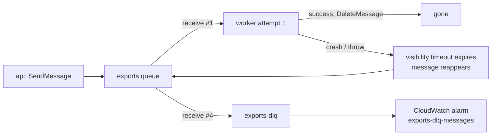
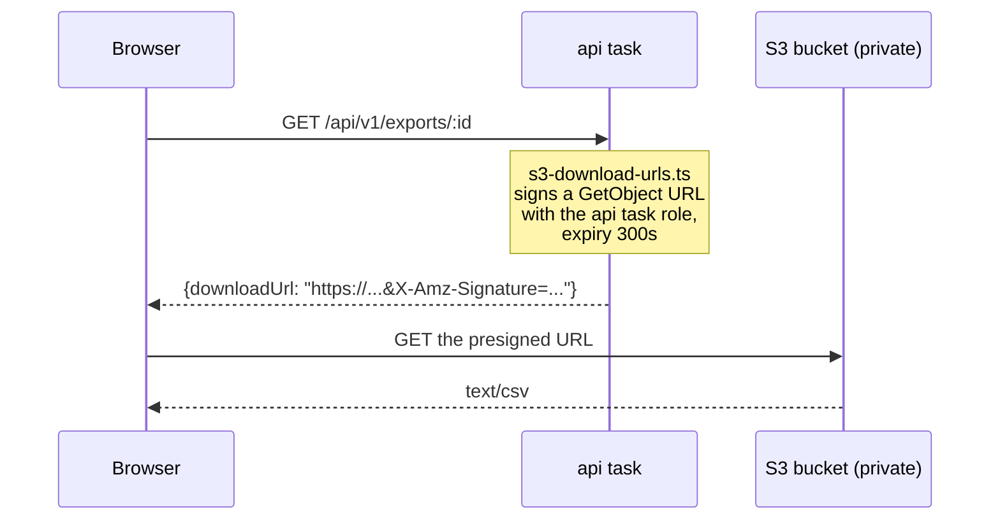
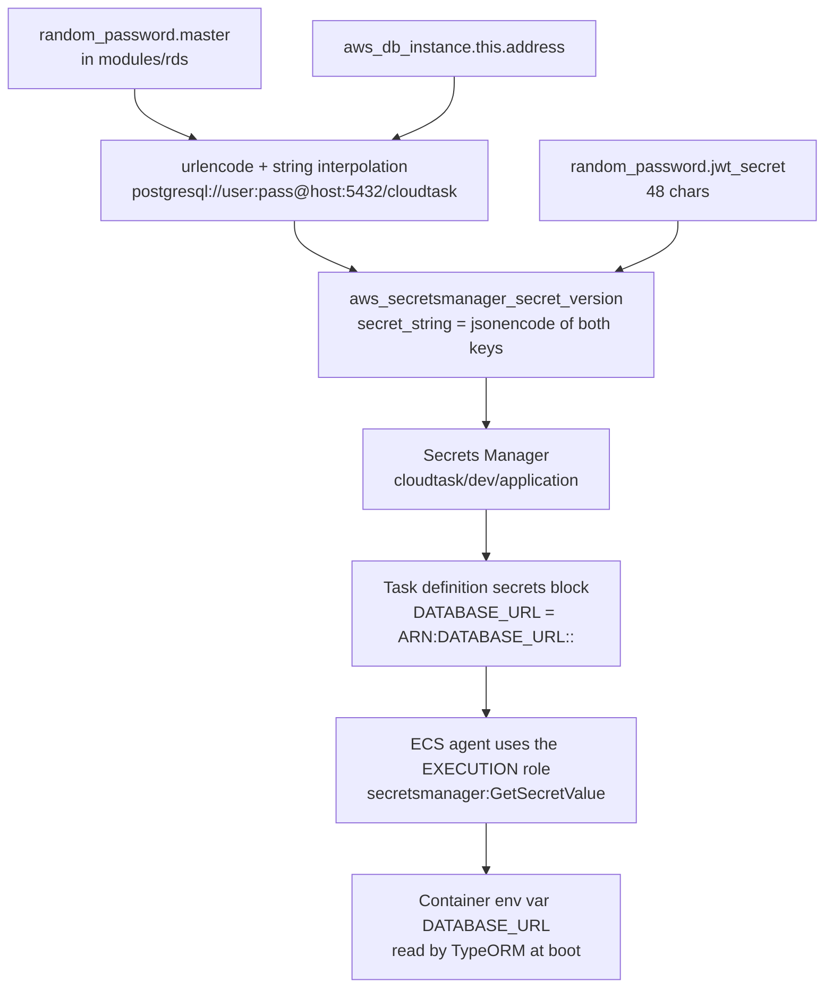

# 08 — Data layer modules

**What you'll learn:** the five modules that hold state — `rds`, `redis`, `sqs`, `s3`,
`secrets` — what application code requires each one, and which settings are lab compromises
you would change in production.

---

## `rds` — Postgres 16

**Files:** [`modules/rds/`](../modules/rds/) — `main.tf` (55 lines)

**Inputs:** `name_prefix`, `private_data_subnet_ids`, `security_group_id`, `instance_class`,
`allocated_storage` (20), `database_name` (`cloudtask`), `master_username` (`cloudtask`).
**Outputs:** `address`, `port`, `database_name`, `master_username`, `master_password`
(sensitive), `endpoint` (sensitive).

### Why the app needs it

`apps/api` uses TypeORM over `pg` and reads a single `DATABASE_URL`. The schema is defined by
four migrations in `apps/api/src/database/migrations/` — `users`, `projects`, `tasks`,
`exports` — all with UUID primary keys generated by `gen_random_uuid()`. The worker also
connects, reading `tasks` and writing `exports` with raw SQL.

Note `synchronize: false` in `apps/api/src/database/database.module.ts`: the schema is never
auto-created. Migrations run as a **one-shot ECS task** from `release.yml` before the services
roll, which is why that workflow needs `ecs:RunTask` on the api task-definition family.

### What it creates

**The generated password:**

```hcl
resource "random_password" "master" {
  length  = 32
  special = false
}
```

`special = false` avoids characters that would need escaping when the password is embedded in
a connection URL. The `secrets` module additionally runs it through `urlencode()` — belt and
braces.

**A subnet group** — the list of subnets RDS may place the instance in:

```hcl
resource "aws_db_subnet_group" "this" {
  name       = "${var.name_prefix}-db"
  subnet_ids = var.private_data_subnet_ids
}
```

RDS requires at least two AZs here even for a single-AZ instance. This is one of the reasons
`networking` builds two of every subnet.

**A custom parameter group** — the most-discussed line in the whole stack:

```hcl
# modules/rds/main.tf:14
# PG16's default parameter group sets rds.force_ssl=1, but the app's TypeORM
# data source configures no TLS option — connections would be rejected.
# Disabling force_ssl needs zero app changes; traffic never leaves the
# private-data subnets. (Recorded in DEVIATIONS.md.)
resource "aws_db_parameter_group" "this" {
  name   = "${var.name_prefix}-pg16"
  family = "postgres16"

  parameter {
    name  = "rds.force_ssl"
    value = "0"
  }
}
```

Be clear about what this is: **encryption in transit to the database is off.** The reasoning
given is that `apps/api/src/database/data-source.options.ts` sets no `ssl` option, so with
`force_ssl = 1` every connection would be refused, and the traffic never leaves the
private-data subnets — which have no internet route at all.

The alternative, which a production system should prefer, is to set
`ssl: { rejectUnauthorized: false }` (or bundle the RDS CA and verify properly) in the
TypeORM data source and leave `force_ssl = 1`. That is an application change, and this stack
chose the infrastructure-only path. It is honestly recorded in `DEVIATIONS.md` rather than
hidden.

**The instance:**

```hcl
resource "aws_db_instance" "this" {
  identifier = "${var.name_prefix}-postgres"

  engine         = "postgres"
  engine_version = "16"
  instance_class = var.instance_class

  allocated_storage = var.allocated_storage
  storage_type      = "gp3"
  storage_encrypted = true

  db_name  = var.database_name
  username = var.master_username
  password = random_password.master.result
  port     = 5432

  db_subnet_group_name   = aws_db_subnet_group.this.name
  vpc_security_group_ids = [var.security_group_id]
  parameter_group_name   = aws_db_parameter_group.this.name
  publicly_accessible    = false
  multi_az               = false

  backup_retention_period = 1

  deletion_protection = false
  skip_final_snapshot = true
  apply_immediately   = true
}
```

| Setting                   | Lab value      | Production would want                               |
| ------------------------- | -------------- | --------------------------------------------------- |
| `multi_az`                | `false`        | `true` — automatic failover to a standby            |
| `backup_retention_period` | `1` day        | 7–35 days                                           |
| `deletion_protection`     | `false`        | `true` — refuse accidental deletion                 |
| `skip_final_snapshot`     | `true`         | `false` — snapshot before destroy                   |
| `apply_immediately`       | `true`         | `false` — batch changes into the maintenance window |
| `instance_class`          | `db.t4g.micro` | sized to load                                       |

The four destroy-related flags exist so `scripts/aws-teardown.sh` works in one pass — with
`deletion_protection = true` and `skip_final_snapshot = false`, teardown would fail and leave
a paid-for snapshot behind. In production every one of those defaults should be inverted.

Two settings that are right regardless: `storage_encrypted = true` and
`publicly_accessible = false`.

---

## `redis` — ElastiCache 7.1

**Files:** [`modules/redis/`](../modules/redis/) — `main.tf` (29 lines)

**Inputs:** `name_prefix`, `private_data_subnet_ids`, `security_group_id`, `node_type`.
**Outputs:** `primary_endpoint_address`, `port`.

### Why the app needs it — and only the api does

Two consumers, both in `apps/api`:

1. **Project-summary cache**, 60-second TTL, key
   `project-summary:{userId}:{projectId}` — `apps/api/src/tasks/project-summary.service.ts`.
2. **Rate limiting** — an atomic fixed-window counter implemented in Redis Lua
   (`apps/api/src/ratelimit/redis-rate-limiter.ts`). 120 requests per 60s per user on
   projects/tasks/exports; 10 per 300s per IP on login.

The worker never imports a Redis client, which is why only the api security group has Redis
egress and only the api task definition carries `REDIS_*` variables.

Redis is deliberately **non-fatal**: `apps/api/src/redis/redis.service.ts` degrades and logs
once if the cache is unreachable, and the rate limiter falls back to a per-process in-memory
counter. That is also why `/ready` reports Redis failure as `degraded` with HTTP 200 rather
than 503.

### Why a replication group, not a cluster

```hcl
# modules/redis/main.tf:1
# Single-node Redis 7. A replication group (not aws_elasticache_cluster) is
# required for in-transit encryption, which the API expects via
# REDIS_TLS_ENABLED=true. No AUTH token — the app has no auth config; access
# control is SG-only (api SG ingress).

resource "aws_elasticache_replication_group" "this" {
  replication_group_id = "${var.name_prefix}-redis"
  description          = "${var.name_prefix} application cache"

  engine         = "redis"
  engine_version = "7.1"
  node_type      = var.node_type

  num_cache_clusters         = 1
  automatic_failover_enabled = false

  subnet_group_name  = aws_elasticache_subnet_group.this.name
  security_group_ids = [var.security_group_id]

  transit_encryption_enabled = true
  at_rest_encryption_enabled = true

  apply_immediately = true
}
```

The AWS provider offers two ways to make a Redis: `aws_elasticache_cluster` (simpler) and
`aws_elasticache_replication_group` (supports replicas, failover, and — crucially —
`transit_encryption_enabled`). Since `apps/api/src/redis/redis.module.ts` sets `tls: {}` on
the client whenever `REDIS_TLS_ENABLED` is true, the server has to speak TLS. That forces the
replication-group resource, even though there is only one node.

`num_cache_clusters = 1` with `automatic_failover_enabled = false` is a single node with no
replica — cheapest option, no high availability. A cache is the safest thing to run without HA
here, because the app treats a cache outage as degraded rather than fatal.

### A small wart

```hcl
# modules/redis/outputs.tf
output "port" {
  value = 6379
}
```

Hardcoded rather than read from the resource. It happens to be correct, but see
[12 — Gotchas](./12-gotchas.md#known-rough-edges).

---

## `sqs` — the export queue and its dead-letter queue

**Files:** [`modules/sqs/`](../modules/sqs/) — `main.tf` (16 lines)

**Inputs:** `name_prefix`, `visibility_timeout_seconds` (60), `max_receive_count` (3).
**Outputs:** `queue_url`, `queue_arn`, `queue_name`, `dlq_url`, `dlq_arn`, `dlq_name`.

```hcl
resource "aws_sqs_queue" "dlq" {
  name = "${var.name_prefix}-exports-dlq"

  message_retention_seconds = 345600 # 4 days
}

resource "aws_sqs_queue" "exports" {
  name = "${var.name_prefix}-exports"

  visibility_timeout_seconds = var.visibility_timeout_seconds

  redrive_policy = jsonencode({
    deadLetterTargetArn = aws_sqs_queue.dlq.arn
    maxReceiveCount     = var.max_receive_count
  })
}
```

Note the DLQ is declared **first** — the main queue's `redrive_policy` references its ARN, so
Terraform creates it first regardless of file order, but reading order matches creation order
here.

### Why a queue at all

Generating a CSV export can take longer than an HTTP request should. The api enqueues a job
and returns `202 Accepted` immediately
(`apps/api/src/exports/aws/sqs-export-publisher.ts`, `SendMessage` only); the worker picks it
up and processes it (`apps/worker/src/exports/sqs-consumer.service.ts`). The queue decouples
the two, absorbs bursts, and survives a worker restart.

### The retry mechanic, and why the DLQ matters



The worker deletes a message **only after the job succeeds**
(`apps/worker/src/exports/sqs-consumer.service.ts`). So:

- A transient failure — worker restarts mid-job — means the message reappears after the
  visibility timeout and is retried. The S3 key is deterministic
  (`exports/{userId}/{exportId}.csv`), so a retry overwrites rather than creating a duplicate.
- A **poison message** — one that will never succeed, e.g. malformed payload — would otherwise
  loop forever, burning worker capacity. `maxReceiveCount = 3` moves it to the DLQ on the
  fourth receive, where it stops consuming resources and triggers an alarm for a human to
  look at.

Without a DLQ, a single bad message can starve the whole queue. This is the single most
important queue setting.

### Timeouts that must agree

| Setting            | Terraform                         | Application                             |
| ------------------ | --------------------------------- | --------------------------------------- |
| Visibility timeout | `visibility_timeout_seconds = 60` | `SQS_VISIBILITY_TIMEOUT_SECONDS = "60"` |
| Long-poll wait     | (client-side only)                | `SQS_WAIT_TIME_SECONDS = "20"`          |

The worker passes its own `VisibilityTimeout` on each `ReceiveMessage` call, so the two values
are set in two places and must match — the module's variable description says so explicitly.
If the queue's timeout were shorter than a job's runtime, SQS would hand the same message to a
second worker while the first was still working on it.

`WaitTimeSeconds = 20` is **long polling**, the maximum SQS allows. Instead of returning
immediately with an empty response and being called again in a tight loop, the API call holds
open for up to 20 seconds waiting for a message. Fewer API calls, lower cost, and near-instant
pickup when a message does arrive.

The DLQ's 4-day retention gives you a long weekend to notice and investigate.

---

## `s3` — the exports bucket

**Files:** [`modules/s3/`](../modules/s3/) — `main.tf` (46 lines)

**Inputs:** `name_prefix`, `expiry_days` (7).
**Outputs:** `bucket_name`, `bucket_arn`.

```hcl
# modules/s3/main.tf:1
# Private exports bucket. Downloads go through API-generated presigned URLs,
# so public access stays fully blocked.

data "aws_caller_identity" "current" {}

resource "aws_s3_bucket" "exports" {
  # Account id suffix for global uniqueness.
  bucket = "${var.name_prefix}-exports-${data.aws_caller_identity.current.account_id}"

  # Lab environment: allow destroy with objects present.
  force_destroy = true
}
```

S3 bucket names are unique across **all of AWS**, not just your account — so
`cloudtask-dev-exports` would very likely be taken. Appending the account ID (read from a data
source, not hardcoded) makes it unique without embedding the number in git.

### Four resources for one bucket

Modern AWS providers split bucket configuration into separate resources rather than inline
blocks, because each maps to a distinct S3 API:

**Public access block** — all four switches on:

```hcl
resource "aws_s3_bucket_public_access_block" "exports" {
  bucket = aws_s3_bucket.exports.id

  block_public_acls       = true
  block_public_policy     = true
  ignore_public_acls      = true
  restrict_public_buckets = true
}
```

**Encryption at rest:**

```hcl
resource "aws_s3_bucket_server_side_encryption_configuration" "exports" {
  bucket = aws_s3_bucket.exports.id

  rule {
    apply_server_side_encryption_by_default {
      sse_algorithm = "AES256"
    }
  }
}
```

**Lifecycle expiry** — exports are disposable:

```hcl
resource "aws_s3_bucket_lifecycle_configuration" "exports" {
  bucket = aws_s3_bucket.exports.id

  rule {
    id     = "expire-exports"
    status = "Enabled"

    filter {}

    expiration {
      days = var.expiry_days
    }
  }
}
```

The empty `filter {}` means "every object in the bucket". It looks like a mistake but is
required — a lifecycle rule must have a filter, and an empty one is how you say "no
restriction".

### Why a fully private bucket still serves downloads



A **presigned URL** is a normal S3 URL with a signature and expiry in the query string. S3
accepts it because the signature proves it was created by a principal allowed to
`s3:GetObject` — here the api task role. The URL is valid for 300 seconds
(`apps/api/src/exports/aws/s3-download-urls.ts`), after which it is worthless.

That is why nothing about this bucket needs to be public. Making a bucket public to serve
downloads is a classic misconfiguration; presigned URLs are the correct answer, and this stack
uses them.

`force_destroy = true` is again a lab-only convenience: without it, `terraform destroy` fails
if any CSV files are still present.

---

## `secrets` — the one secret, assembled

**Files:** [`modules/secrets/`](../modules/secrets/) — `main.tf` (25 lines)

**Inputs:** `project_name`, `environment`, `database_host`, `database_port`, `database_name`,
`database_username`, `database_password` (sensitive).
**Outputs:** `secret_arn`, `secret_name`.

```hcl
# modules/secrets/main.tf:1
# Application secret cloudtask/dev/application holding {DATABASE_URL, JWT_SECRET}.
# ECS task definitions reference individual JSON keys via
# "<secret_arn>:KEY::" valueFrom entries — values never appear in task defs.

resource "random_password" "jwt_secret" {
  length  = 48
  special = false
}

resource "aws_secretsmanager_secret" "application" {
  name = "${var.project_name}/${var.environment}/application"

  # Immediate deletion so destroy/recreate cycles don't collide with the
  # default 30-day recovery window.
  recovery_window_in_days = 0
}

resource "aws_secretsmanager_secret_version" "application" {
  secret_id = aws_secretsmanager_secret.application.id

  secret_string = jsonencode({
    DATABASE_URL = "postgresql://${var.database_username}:${urlencode(var.database_password)}@${var.database_host}:${var.database_port}/${var.database_name}"
    JWT_SECRET   = random_password.jwt_secret.result
  })
}
```

### Only two values are secret

Everything else the app reads — Redis host, queue URL, bucket name, log level — is a plain
environment variable. Only these two are marked secret in `.env.example` and injected from
Secrets Manager. Deciding that boundary deliberately keeps the secret small and the task
definition readable.

### How the value flows



Two important properties of that chain:

- **The task definition contains only a reference, never a value.** Anyone with
  `ecs:DescribeTaskDefinition` sees `arn:aws:secretsmanager:...:DATABASE_URL::`, not the
  password. Contrast a plain env var, which is visible to anyone who can read the task
  definition.
- **The JSON-key suffix is what makes one secret serve two variables.** The `valueFrom`
  format is `<secret-arn>:<json-key>:<version-stage>:<version-id>`; the last two are left
  empty so ECS uses the current version. Drop `:DATABASE_URL::` and ECS would inject the
  entire JSON blob as the variable's value.

### `recovery_window_in_days = 0`

By default, deleting a Secrets Manager secret schedules it for deletion 30 days later, and the
name stays reserved for that whole window. In a lab where you destroy and re-apply repeatedly,
the second `terraform apply` would fail with "a secret with this name is scheduled for
deletion". Setting `0` deletes immediately.

Never do this in production — that 30-day window is your recovery path after an accidental
delete.

### No rotation

There is no `aws_secretsmanager_secret_rotation` resource. Rotating `DATABASE_URL` would
require changing the RDS password and restarting tasks in a coordinated way; that machinery is
out of scope for a lab.

---

Next: **[09 — IAM and GitHub OIDC](./09-iam-and-github-oidc.md)**.
