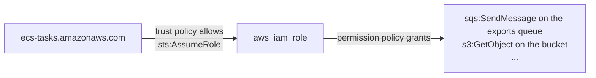
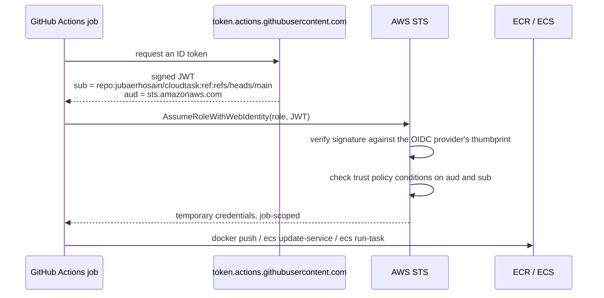

# 09 — IAM and GitHub OIDC

**What you'll learn:** the three IAM roles the containers use and why they are split that way,
how `aws_iam_policy_document` works, and how GitHub Actions gets AWS credentials without any
stored secret.

---

## Four roles in total

| Role                         | Who assumes it                         | Created in                               |
| ---------------------------- | -------------------------------------- | ---------------------------------------- |
| `cloudtask-terraform-deploy` | Your IAM user, when running Terraform  | **the console, by hand** — not Terraform |
| `cloudtask-dev-ecs-exec`     | The ECS agent, before your code starts | `environments/dev/iam.tf`                |
| `cloudtask-dev-api-task`     | The api container's AWS SDK            | `environments/dev/iam.tf`                |
| `cloudtask-dev-worker-task`  | The worker container's AWS SDK         | `environments/dev/iam.tf`                |
| `cloudtask-dev-github-ci`    | GitHub Actions, via OIDC               | `modules/github-oidc`                    |

The web container gets **no** task role, because it makes no AWS API calls.

The deploy role is deliberately outside Terraform's control — a stack cannot create the role
it needs in order to run. `DEVIATIONS.md` records it:

> **Deploy role is console-managed.** Every local Terraform run (provider and S3 backend)
> assumes `cloudtask-terraform-deploy`, an AdministratorAccess role created manually in the
> console whose trust policy allows the owner's IAM user — it lives outside every stack, so no
> Terraform state tracks it.

---

## `aws_iam_policy_document`: policies as HCL

Before the roles, the tool used to build them. An IAM policy is JSON. You _could_ write it as
a string, but you'd lose interpolation and type checking. So the AWS provider offers a data
source that renders JSON from HCL blocks:

```hcl
# environments/dev/iam.tf:7
data "aws_iam_policy_document" "ecs_tasks_assume" {
  statement {
    actions = ["sts:AssumeRole"]

    principals {
      type        = "Service"
      identifiers = ["ecs-tasks.amazonaws.com"]
    }
  }
}
```

That renders to:

```json
{
  "Version": "2012-10-17",
  "Statement": [
    {
      "Effect": "Allow",
      "Action": "sts:AssumeRole",
      "Principal": { "Service": "ecs-tasks.amazonaws.com" }
    }
  ]
}
```

You then hand `.json` to whatever needs it:

```hcl
resource "aws_iam_role" "ecs_execution" {
  name               = "${local.name_prefix}-ecs-exec"
  assume_role_policy = data.aws_iam_policy_document.ecs_tasks_assume.json
}
```

Two things this buys you. **Reuse** — that one document is the trust policy for all three
roles, so they cannot drift apart. And **references** — statements can interpolate real ARNs
from other modules, which is the whole reason `iam.tf` lives at the environment level:

```hcl
# environments/dev/iam.tf:1
# ECS execution role + per-service task roles (spec §15, least privilege).
# Lives at the environment level because the policies reference ARNs from
# several modules.
```

### Trust policy vs permission policy

Every role has exactly two kinds of policy, and mixing them up is the most common IAM
confusion:

- **Trust policy** (`assume_role_policy`) — _who is allowed to become this role_. Here:
  the ECS tasks service.
- **Permission policy** (`aws_iam_role_policy`) — _what the role may do once assumed_.



---

## The execution role — used before your code runs

```hcl
resource "aws_iam_role" "ecs_execution" {
  name               = "${local.name_prefix}-ecs-exec"
  assume_role_policy = data.aws_iam_policy_document.ecs_tasks_assume.json
}
```

This role belongs to the **ECS agent**, not your application. It is used during task startup
to do four things:

```hcl
# environments/dev/iam.tf:25
data "aws_iam_policy_document" "ecs_execution" {
  statement {
    sid       = "EcrAuth"
    actions   = ["ecr:GetAuthorizationToken"]
    resources = ["*"]
  }

  statement {
    sid = "EcrPull"
    actions = [
      "ecr:BatchCheckLayerAvailability",
      "ecr:GetDownloadUrlForLayer",
      "ecr:BatchGetImage",
    ]
    resources = values(module.ecr.repository_arns)
  }

  statement {
    sid = "Logs"
    actions = [
      "logs:CreateLogStream",
      "logs:PutLogEvents",
    ]
    resources = [
      "${module.api_service.log_group_arn}:*",
      "${module.worker_service.log_group_arn}:*",
      "${module.web_service.log_group_arn}:*",
    ]
  }

  statement {
    sid       = "SecretInjection"
    actions   = ["secretsmanager:GetSecretValue"]
    resources = [module.secrets.secret_arn]
  }
}
```

Notice the scoping discipline:

- **`ecr:GetAuthorizationToken` must be `"*"`** — it is an account-level operation with no
  resource to scope to. AWS gives you no choice.
- **The pull actions ARE scoped**, to exactly the three repository ARNs from the `ecr` module.
  This role cannot pull from any other repository in the account.
- **Logs are scoped to the three log group ARNs**, with `:*` appended so the role can write to
  log _streams_ inside those groups.
- **`GetSecretValue` is scoped to the one secret.** Not `secretsmanager:*`, not all secrets.

`sid` is a human-readable statement label — optional, but it makes the rendered policy far
easier to read in the console.

This is the role that reads the secret; the application never calls Secrets Manager itself. It
just finds `DATABASE_URL` in its environment.

---

## The two task roles — used by your code

```hcl
# environments/dev/iam.tf:75 — API
data "aws_iam_policy_document" "api_task" {
  statement {
    sid       = "EnqueueExports"
    actions   = ["sqs:SendMessage"]
    resources = [module.sqs.queue_arn]
  }

  statement {
    sid       = "PresignExportDownloads"
    actions   = ["s3:GetObject"]
    resources = ["${module.s3.bucket_arn}/*"]
  }

  statement {
    sid       = "Metrics"
    actions   = ["cloudwatch:PutMetricData"]
    resources = ["*"]

    condition {
      test     = "StringEquals"
      variable = "cloudwatch:namespace"
      values   = [local.emf_namespace]
    }
  }
}
```

```hcl
# environments/dev/iam.tf:114 — worker
data "aws_iam_policy_document" "worker_task" {
  statement {
    sid = "ConsumeExports"
    actions = [
      "sqs:ReceiveMessage",
      "sqs:DeleteMessage",
      "sqs:ChangeMessageVisibility",
      "sqs:GetQueueAttributes",
      "sqs:GetQueueUrl",
    ]
    resources = [module.sqs.queue_arn]
  }

  statement {
    sid = "WriteExportResults"
    actions = [
      "s3:PutObject",
      "s3:GetObject",
    ]
    resources = ["${module.s3.bucket_arn}/*"]
  }

  # ... same namespace-scoped Metrics statement
}
```

The two policies are near-mirror images, and that is the point:

| Permission | api                | worker                    |
| ---------- | ------------------ | ------------------------- |
| SQS        | `SendMessage` only | receive / delete / extend |
| S3         | `GetObject` only   | `PutObject` + `GetObject` |
| Metrics    | namespace-scoped   | namespace-scoped          |

**Why split them at all?** A compromised api container cannot delete queue messages or
overwrite export files. A compromised worker cannot enqueue fake jobs. This is what "least
privilege" actually looks like in practice: two roles instead of one shared role with the
union of both permissions.

`.../*` on the bucket ARN is worth noting: `module.s3.bucket_arn` is the **bucket** (used for
bucket-level actions like `ListBucket`), while `"${...}/*"` is the **objects inside it** (used
for `GetObject`/`PutObject`). Mixing them up is the most common S3 policy bug. Neither role
gets `ListBucket`, because neither app ever lists the bucket.

### The condition block

```hcl
statement {
  sid       = "Metrics"
  actions   = ["cloudwatch:PutMetricData"]
  resources = ["*"]

  condition {
    test     = "StringEquals"
    variable = "cloudwatch:namespace"
    values   = [local.emf_namespace]
  }
}
```

`cloudwatch:PutMetricData` has no resource-level permissions — you can only write `"*"`. So
the scoping has to come from a **condition**: this role may publish metrics, but only into the
`CloudTask/Dev` namespace. It cannot pollute `AWS/ECS` or anyone else's namespace.

`local.emf_namespace` is defined once in `main.tf` and used both here and as the
`monitoring` module's input, so the permission and the dashboard cannot disagree.

(In practice the app publishes metrics via EMF on stdout rather than calling `PutMetricData`
directly — see [10 — Monitoring](./10-monitoring.md) — so this statement is a safety net for
if it ever does.)

---

## `github-oidc` — CI credentials without secrets

**Files:** [`modules/github-oidc/`](../modules/github-oidc/) — `main.tf` (161 lines)

### The problem it solves

The naive way to let GitHub Actions deploy to AWS is to create an IAM user, generate an access
key, and paste it into GitHub secrets. That key is long-lived, invisible in CloudTrail as
"some IAM user", and a leak means an attacker has standing account access until someone
notices and rotates it.

OIDC federation replaces it: GitHub signs a short-lived JSON Web Token describing _which repo,
which branch, which workflow_ is running. AWS verifies that signature and hands back
credentials valid for the length of the job. **No secret is stored anywhere.**



### Registering the provider

```hcl
data "tls_certificate" "github" {
  count = var.create_oidc_provider ? 1 : 0

  url = "https://token.actions.githubusercontent.com/.well-known/openid-configuration"
}

resource "aws_iam_openid_connect_provider" "github" {
  count = var.create_oidc_provider ? 1 : 0

  url             = "https://token.actions.githubusercontent.com"
  client_id_list  = ["sts.amazonaws.com"]
  thumbprint_list = [data.tls_certificate.github[0].certificates[0].sha1_fingerprint]
}
```

The `tls` provider fetches GitHub's certificate at apply time and derives the thumbprint, so
you don't hardcode a fingerprint that GitHub will eventually rotate.

An AWS account can have **only one** OIDC provider per URL. If the account already federates
another repository, creating a second one fails. Hence the flag — and the neat conditional
local that handles both cases:

```hcl
locals {
  oidc_provider_arn = var.create_oidc_provider ? aws_iam_openid_connect_provider.github[0].arn : "arn:aws:iam::${data.aws_caller_identity.current.account_id}:oidc-provider/token.actions.githubusercontent.com"
}
```

Either use the ARN of the provider we just created, or construct the ARN of the one that must
already exist. Everything downstream reads `local.oidc_provider_arn` and doesn't care which.

### The trust policy: two conditions doing the real work

```hcl
data "aws_iam_policy_document" "assume" {
  statement {
    actions = ["sts:AssumeRoleWithWebIdentity"]

    principals {
      type        = "Federated"
      identifiers = [local.oidc_provider_arn]
    }

    condition {
      test     = "StringEquals"
      variable = "token.actions.githubusercontent.com:aud"
      values   = ["sts.amazonaws.com"]
    }

    condition {
      test     = "StringLike"
      variable = "token.actions.githubusercontent.com:sub"
      values   = ["repo:${var.github_repository}:ref:${var.allowed_ref}"]
    }
  }
}
```

This is the most security-critical block in the repository.

- **`aud`** must be `sts.amazonaws.com` — the token was minted for AWS, not for some other
  service.
- **`sub`** must match `repo:jubaerhosain/cloudtask:ref:refs/heads/main`.

That second condition is what stops **any GitHub repository in the world** from assuming your
role. GitHub's OIDC issuer is the same for everyone; without a `sub` condition, a workflow in a
stranger's repo could request a token from the same issuer and AWS would accept it. Pinning
`sub` restricts it to this repo, on this branch.

`allowed_ref` defaults to `refs/heads/main`, so a pull-request workflow or a feature branch
cannot deploy — matching `release.yml`, which only runs on pushes to `main` and manual
dispatch.

### What the CI role may do

```hcl
# modules/github-oidc/main.tf:1
# GitHub Actions OIDC federation + the CI role release.yml assumes.
# Deliberately deploy-scoped: ECR push + ECS deploy/run-task only. Terraform
# apply runs locally with operator credentials, never with this role.
```

Two permission policies. **`ecr_push`** — auth plus the pull and push layer operations, scoped
to the three repository ARNs.

**`ecs_deploy`** — six statements, each scoped as tightly as the API allows:

| Statement              | Actions                             | Scope                                                       |
| ---------------------- | ----------------------------------- | ----------------------------------------------------------- |
| `TaskDefinitions`      | `Describe`/`RegisterTaskDefinition` | `"*"` — these APIs have no resource-level support           |
| `Services`             | `DescribeServices`, `UpdateService` | the three service ARNs                                      |
| `MigrationRunTask`     | `ecs:RunTask`                       | the api task-definition family, **and** a cluster condition |
| `MigrationTaskPolling` | `ecs:DescribeTasks`                 | tasks in this cluster only                                  |
| `PassRolesToEcs`       | `iam:PassRole`                      | the three task roles, **and** a service condition           |
| `MigrationLogs`        | log read/tail actions               | `/ecs/cloudtask-dev*` only                                  |

The `"*"` on `RegisterTaskDefinition` is annotated in the code so nobody mistakes it for
laziness:

```hcl
# These two APIs have no resource-level support.
statement {
  sid = "TaskDefinitions"
  actions = [
    "ecs:DescribeTaskDefinition",
    "ecs:RegisterTaskDefinition",
  ]
  resources = ["*"]
}
```

### `iam:PassRole` — the one to understand properly

```hcl
statement {
  sid       = "PassRolesToEcs"
  actions   = ["iam:PassRole"]
  resources = var.passable_role_arns

  condition {
    test     = "StringEquals"
    variable = "iam:PassedToService"
    values   = ["ecs-tasks.amazonaws.com"]
  }
}
```

Registering a task definition means naming an execution role and a task role — you are
_handing a role to a service_. That requires `iam:PassRole`, and it is a privilege-escalation
vector: unrestricted `iam:PassRole` lets the holder attach **any** role in the account,
including an admin role, to something it controls.

This policy allows passing exactly three named roles, and only to `ecs-tasks.amazonaws.com`.
The CI role can hand the api task role to ECS; it cannot hand an admin role to an EC2 instance.

### Note the boundary

**The CI role cannot run Terraform.** It has no permission to create a VPC, an RDS instance, or
an IAM role, and no access to the state bucket. Infrastructure changes are always a deliberate
local `terraform apply` by a human with the deploy role; CI only ever ships code.

The role ARN is the module's single output, and feeding it to GitHub is what activates the
pipeline:

```bash
gh variable set AWS_ROLE_ARN --body "$(terraform output -raw github_ci_role_arn)"
```

`release.yml` is gated on `if: vars.AWS_ROLE_ARN != ''`, so it stays dormant until you do.

---

Next: **[10 — Monitoring](./10-monitoring.md)**.
