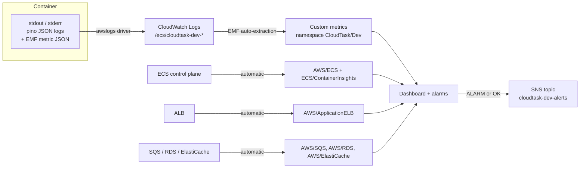

# 10 — Monitoring

**What you'll learn:** how logs and metrics actually reach CloudWatch, what the five alarms
catch, what the dashboard shows, and the one manual step Terraform deliberately leaves to you.

---

## Three signals, two paths



**Path 1 — AWS publishes it for you.** ALB request counts, SQS queue depth, RDS CPU,
ElastiCache connections: all emitted by the services themselves. Nothing in the application or
the task definition is involved. `ECS/ContainerInsights` is the one that needs opting in — see
[07](./07-module-compute.md#ecs-cluster--nine-lines-that-matter).

**Path 2 — the application prints to stdout.** The `awslogs` log driver configured in
`modules/ecs-service/main.tf` ships every line to the log group. Two kinds of line travel
this way:

- **Structured logs** — pino JSON with `service`, `environment`, and a request ID
  (`apps/api/src/logger/logger.module.ts`, which also redacts `authorization`, `cookie`,
  `password*`, `accessToken`, `set-cookie`).
- **EMF metrics** — see below.

### EMF: metrics without an API call

The worker's custom metrics use the **CloudWatch Embedded Metric Format**. Instead of calling
`PutMetricData`, `apps/worker/src/metrics/metrics.service.ts` prints a specially structured
JSON object to stdout. CloudWatch Logs recognises the `_aws` envelope and automatically
extracts metrics from it.

Three metrics arrive this way, in namespace `CloudTask/Dev`:

| Metric                       | Meaning                 |
| ---------------------------- | ----------------------- |
| `ExportsCompleted`           | Successful export jobs  |
| `ExportsFailed`              | Failed export jobs      |
| `ExportProcessingDurationMs` | Per-job processing time |

Why this matters for the infrastructure: **the log driver is the metrics path.** If the log
group is missing, or the execution role loses `logs:PutLogEvents`, you lose both the logs and
these metrics. It also means the worker needs no CloudWatch permissions to publish metrics at
all — the `cloudwatch:PutMetricData` statement in `iam.tf` is a safety net for direct calls
rather than the mechanism in use.

The namespace is defined once and shared, so the IAM condition and the dashboard cannot
disagree:

```hcl
# environments/dev/main.tf:4
# Namespace the worker's EMF metrics land in (metrics.service.ts).
emf_namespace = "CloudTask/Dev"
```

### Log retention

```hcl
# modules/ecs-service/main.tf:13
resource "aws_cloudwatch_log_group" "this" {
  name              = "/ecs/${local.qualified_name}"
  retention_in_days = var.log_retention_days   # default 7
}
```

Terraform declares the log groups explicitly rather than letting ECS auto-create them. An
auto-created group has **no expiry** — it keeps and bills for logs forever. Seven days is
plenty for a lab.

---

## The SNS topic — and the step Terraform won't do

```hcl
# modules/monitoring/main.tf:1
# SNS topic (subscribe manually), five alarms, and the operations dashboard.

resource "aws_sns_topic" "alerts" {
  name = "${var.name_prefix}-alerts"
}
```

There is **no `aws_sns_topic_subscription` resource** anywhere in this repo. That is
deliberate: an email subscription requires the recipient to click a confirmation link, so
Terraform would create a resource stuck in `pending confirmation` forever, and show it as
drift on every plan.

So after your first apply, subscribe by hand:

```bash
aws sns subscribe \
  --topic-arn "$(terraform output -raw sns_topic_arn)" \
  --protocol email \
  --notification-endpoint you@example.com
# then click the link in the confirmation email
```

Until you do, alarms still fire and change state — you just won't be told.

Every alarm wires up **both** actions:

```hcl
alarm_actions = [aws_sns_topic.alerts.arn]
ok_actions    = [aws_sns_topic.alerts.arn]
```

`ok_actions` matters more than people expect: you get told when something recovers, not just
when it breaks, so you are not left wondering whether an incident is still live.

---

## The five alarms

Each one is deliberately paired with a failure experiment from
`aws-deployment-lab-runbook-terraform.md`, so you can prove it works rather than hoping.

| Alarm                                | Metric                                                    | Trips when           | Missing data    | Catches                                            | Runbook |
| ------------------------------------ | --------------------------------------------------------- | -------------------- | --------------- | -------------------------------------------------- | ------- |
| `cloudtask-dev-alb-target-5xx`       | `AWS/ApplicationELB` `HTTPCode_Target_5XX_Count`, Sum     | > 5 in 5 min         | `notBreaching`  | The app is returning server errors                 | E, G, J |
| `cloudtask-dev-api-running-tasks`    | `ECS/ContainerInsights` `RunningTaskCount`, Minimum       | < 1 for 2 × 60 s     | **`breaching`** | The API is entirely down                           | B, C    |
| `cloudtask-dev-exports-queue-lag`    | `AWS/SQS` `ApproximateAgeOfOldestMessage`, Maximum        | > 300 s in 5 min     | `notBreaching`  | Nothing is consuming the queue                     | A, D    |
| `cloudtask-dev-exports-dlq-messages` | `AWS/SQS` `ApproximateNumberOfMessagesVisible` on the DLQ | ≥ 1                  | `notBreaching`  | A message failed 3 times — poison payload or a bug | D, H    |
| `cloudtask-dev-rds-cpu`              | `AWS/RDS` `CPUUtilization`, Average                       | > 80 % for 2 × 300 s | `notBreaching`  | Database saturation                                | —       |

### `treat_missing_data` is the subtle part

```hcl
# modules/monitoring/main.tf:28
resource "aws_cloudwatch_metric_alarm" "api_running_tasks" {
  alarm_name          = "${var.name_prefix}-api-running-tasks"
  alarm_description   = "API service has no running tasks"
  namespace           = "ECS/ContainerInsights"
  metric_name         = "RunningTaskCount"
  statistic           = "Minimum"
  period              = 60
  evaluation_periods  = 2
  threshold           = 1
  comparison_operator = "LessThanThreshold"
  treat_missing_data  = "breaching"

  dimensions = {
    ClusterName = var.cluster_name
    ServiceName = var.api_service_name
  }

  alarm_actions = [aws_sns_topic.alerts.arn]
  ok_actions    = [aws_sns_topic.alerts.arn]
}
```

Four of the five alarms use `notBreaching` — "no data means nothing is wrong". Correct for
error counts: zero 5xx responses means no data point at all, and you don't want a page for
that.

This one uses **`breaching`**, and the reason is important. When a service is scaled to zero or
has crashed completely, ECS stops publishing `RunningTaskCount` entirely — there is no data
point saying "0". With `notBreaching`, a total outage would look identical to a healthy quiet
period and the alarm would never fire. `breaching` inverts it: silence _is_ the failure signal.

The trade-off is that this alarm sits in ALARM whenever the stack is intentionally at
`desired_count = 0` — right after `terraform apply`, before the first CI deploy. Expected, and
resolved by the first release run.

### The DLQ alarm has the lowest threshold on purpose

```hcl
threshold           = 1
comparison_operator = "GreaterThanOrEqualToThreshold"
```

A single message in the dead-letter queue means the pipeline has definitively failed a job
three times. There is no acceptable non-zero level, so the threshold is one.

### The lag alarm catches a silent failure

`ApproximateAgeOfOldestMessage > 300` is what tells you the worker is gone. Nothing errors —
the api keeps accepting export requests and returning `202 Accepted` — but no CSV ever appears.
Queue depth alone would be ambiguous during a burst; _age_ is unambiguous.

Runbook experiments A ("stop the worker") and D ("remove worker SQS permission") both trigger
it, from opposite directions: no consumer at all, versus a consumer that can't read.

---

## The dashboard

```hcl
resource "aws_cloudwatch_dashboard" "this" {
  dashboard_name = var.name_prefix

  dashboard_body = jsonencode({
    widgets = [ ... ]
  })
}
```

One `jsonencode` call producing nine widgets in a 3 × 3 grid. CloudWatch dashboards are
defined by a JSON document, and `jsonencode` lets it be written as HCL with real references
interpolated.

| Row | Widget                         | Metrics                                                                  |
| --- | ------------------------------ | ------------------------------------------------------------------------ |
| 1   | ALB traffic                    | `RequestCount`, `HTTPCode_Target_5XX_Count`, `HTTPCode_Target_4XX_Count` |
| 1   | ALB target response time       | `TargetResponseTime` at **p95**                                          |
| 1   | Running tasks                  | `RunningTaskCount` for all three services                                |
| 2   | ECS CPU utilization            | `AWS/ECS CPUUtilization` × 3 services                                    |
| 2   | ECS memory utilization         | `AWS/ECS MemoryUtilization` × 3 services                                 |
| 2   | Exports queue                  | messages visible, age of oldest, DLQ visible                             |
| 3   | RDS                            | `CPUUtilization`, `DatabaseConnections`                                  |
| 3   | Redis                          | `CPUUtilization`, `CurrConnections`                                      |
| 3   | Export processing (worker EMF) | `ExportsCompleted`, `ExportsFailed`, `ExportProcessingDurationMs`        |

Widgets are placed with explicit `x`, `y`, `width`, `height` on a 24-column grid — `width = 8`
gives three per row.

### Two CloudWatch shorthands you'll see in the JSON

Each metric is an array: `[namespace, metricName, dimensionName, dimensionValue, ...]`. Two
abbreviations keep it readable:

```hcl
metrics = [
  ["AWS/ApplicationELB", "RequestCount", "LoadBalancer", var.alb_arn_suffix],
  [".", "HTTPCode_Target_5XX_Count", ".", "."],
  [".", "HTTPCode_Target_4XX_Count", ".", "."]
]
```

**`"."`** means "same as the row above, in this position". So rows 2 and 3 reuse the namespace
and the LoadBalancer dimension and only change the metric name.

```hcl
metrics = [
  ["ECS/ContainerInsights", "RunningTaskCount", "ClusterName", var.cluster_name, "ServiceName", var.api_service_name],
  ["...", var.worker_service_name],
  ["...", var.web_service_name]
]
```

**`"..."`** means "repeat everything from the previous row, then substitute what follows" — so
each line changes only the service name. Three services in three short lines.

Per-metric overrides go in a trailing object:

```hcl
[".", "ApproximateNumberOfMessagesVisible", ".", var.dlq_name, { label = "DLQ visible" }],
# and
[".", "ExportProcessingDurationMs", { stat = "Average" }]
```

The second one is why the worker EMF widget can show two Sum metrics and one Average on the
same axes: the widget-level `stat = "Sum"` applies to everything except the metric that
overrides it.

### p95, not average

```hcl
title  = "ALB target response time"
stat   = "p95"
```

Average latency hides the problem: 95 fast requests and 5 terrible ones can average out fine.
p95 shows what your slowest 5 % of users actually experience.

### The `-001` suffix

```hcl
["AWS/ElastiCache", "CPUUtilization", "CacheClusterId", "${var.redis_replication_group_id}-001"]
```

ElastiCache publishes metrics per **node**, not per replication group, and nodes are named
`<group-id>-001`, `-002`, and so on. With `num_cache_clusters = 1` there is exactly one node,
`cloudtask-dev-redis-001`. Add a replica and this widget would need a second entry.

---

## What is not monitored

Worth knowing the gaps:

- **No metric filters or Logs Insights queries** are defined in Terraform — log searching is
  ad-hoc.
- **No alarm on `ExportsFailed`.** The metric is on the dashboard but has no threshold; the
  DLQ alarm is the backstop.
- **No alarms for the web or worker service task counts** — only api has a `RunningTaskCount`
  alarm.
- **No alarms on Redis, ALB latency, or RDS storage/connections** — dashboard only.
- **No composite alarms or anomaly detection.**

For a learning lab that is a reasonable line: five alarms that each map to a reproducible
failure, rather than fifty that nobody reads.

---

Next: **[11 — Operations](./11-operations.md)**.
