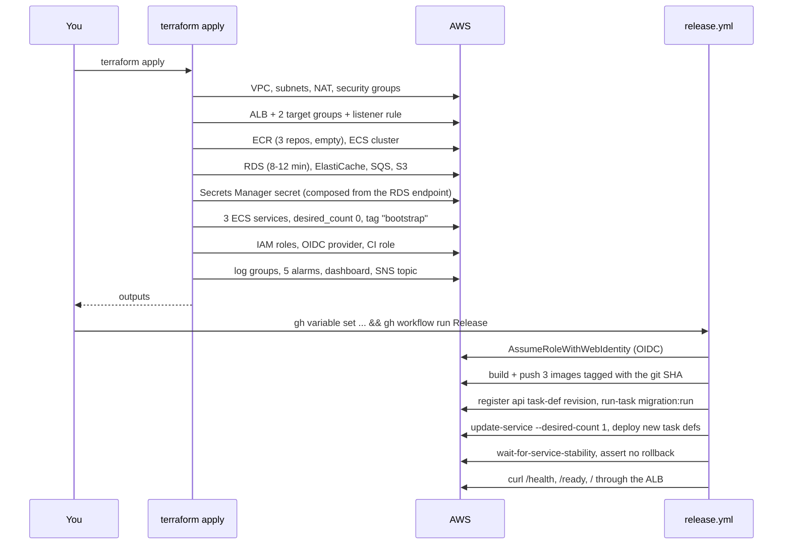

# 11 — Operations

**What you'll learn:** the exact commands to stand this stack up and tear it down, how to read
a plan, how to add a resource, and what the common errors mean.

> Every command below is one **you** run. Terraform applies against a real AWS account and
> costs real money; nothing here should be run on your behalf without you seeing the plan.

---

## First-time setup

### Prerequisites

- Terraform ≥ 1.11 (`required_version` in `versions.tf`; `use_lockfile` needs ≥ 1.10)
- AWS CLI v2, configured with credentials for your IAM user
- The `cloudtask-terraform-deploy` role already created in the console, with a trust policy
  allowing your IAM user
- `gh` CLI, authenticated, for the last step

### Step 1 — the state backend

```bash
cd infrastructure/terraform/bootstrap
terraform init
terraform apply                       # prompts for deploy_role_arn (no default)
terraform output state_bucket_name    # copy this
```

Run once, ever. Its state stays in a local `terraform.tfstate` here — see
[04](./04-state-and-backend.md).

### Step 2 — fill in the two gitignored files

```bash
cd ../environments/dev
cp terraform.tfvars.example terraform.tfvars   # set deploy_role_arn
cp backend.hcl.example backend.hcl             # set bucket (from step 1) + role_arn
```

### Step 3 — the environment

```bash
terraform init -backend-config=backend.hcl
terraform fmt -check -recursive ../..          # same check CI runs
terraform validate
terraform plan
terraform apply
```

Expect roughly **12–18 minutes** on the first apply. RDS is the slow part (8–12 min) and
ElastiCache is not far behind; the ALB and the ECS services are quick. Everything that can run
in parallel does.

Nothing serves traffic yet: all three services exist at `desired_count = 0` with a `bootstrap`
image tag that isn't in ECR.

### Step 4 — wire up CI

```bash
gh variable set AWS_ROLE_ARN  --body "$(terraform output -raw github_ci_role_arn)"
gh variable set AWS_REGION    --body "ap-south-1"
gh variable set NEXT_PUBLIC_API_BASE_URL \
  --body "http://$(terraform output -raw alb_dns_name)/api/v1"
```

`release.yml` is gated on `if: vars.AWS_ROLE_ARN != ''`, so setting these is what activates
it. `NEXT_PUBLIC_API_BASE_URL` is a Docker **build arg** for the web image, not a runtime
variable — Next.js inlines `NEXT_PUBLIC_*` at build time. Change the ALB URL and you must
rebuild the web image.

### Step 5 — first deploy

```bash
gh workflow run Release --ref main
```

### Step 6 — subscribe to alarms

```bash
aws sns subscribe \
  --topic-arn "$(terraform output -raw sns_topic_arn)" \
  --protocol email \
  --notification-endpoint you@example.com
```

Then click the confirmation link. Terraform deliberately doesn't do this — see
[10](./10-monitoring.md#the-sns-topic--and-the-step-terraform-wont-do).

### Who creates what, in order



The database schema is created by CI, not Terraform — a one-shot Fargate task running
`typeorm migration:run`. It works while services are at `desired_count = 0` because
`run-task` reuses the api service's network configuration rather than needing a running
service.

---

## Everyday commands

```bash
cd infrastructure/terraform/environments/dev

terraform plan                          # what would change
terraform apply                         # change it
terraform output                        # all non-sensitive outputs
terraform output -raw alb_dns_name      # one value, unquoted, for scripting
terraform state list                    # every resource Terraform tracks
terraform state show module.rds.aws_db_instance.this
terraform fmt -recursive ../..          # reformat all HCL
```

`terraform plan -target=module.monitoring` limits the plan to one module. Useful when
iterating on alarms; avoid as a habit, since it skips the rest of the graph.

## Reading a plan

Terraform prefixes every resource with a symbol:

| Symbol | Meaning                                       | Risk                           |
| ------ | --------------------------------------------- | ------------------------------ |
| `+`    | create                                        | low                            |
| `~`    | update in place                               | low                            |
| `-/+`  | **destroy then create** (replacement)         | **high** — read carefully      |
| `+/-`  | create then destroy (`create_before_destroy`) | lower, but still a replacement |
| `-`    | destroy                                       | high                           |

The line to always read is the summary at the end:

```text
Plan: 2 to add, 1 to change, 0 to destroy.
```

**`-/+` is the one that bites.** Some attributes cannot be changed in place, and Terraform will
happily replace the resource. On `aws_db_instance` that means a new empty database. Terraform
annotates the reason:

```text
~ availability_zone = "ap-south-1a" -> "ap-south-1b" # forces replacement
```

If you see `forces replacement` on RDS, the S3 bucket, or the ElastiCache group, stop and
think before typing `yes`.

**`(known after apply)`** is normal, not a problem. It means the value is assigned by AWS —
an ARN, a generated DNS name, an ID — so Terraform cannot know it until the resource exists.
The first plan on an empty account is full of them.

**`# (5 unchanged attributes hidden)`** is just noise reduction. `terraform plan` accepts no
flag to expand it; `terraform show` on a saved plan file does.

---

## How to add something

Say you want to alarm on Redis CPU. Four edits, each in the layer that owns it.

**1. Add a variable to the module** (`modules/monitoring/variables.tf`):

```hcl
variable "redis_cpu_threshold" {
  description = "Redis CPU percentage that triggers the alarm"
  type        = number
  default     = 75
}
```

**2. Add the resource** (`modules/monitoring/main.tf`) — copy an existing alarm and adjust:

```hcl
resource "aws_cloudwatch_metric_alarm" "redis_cpu" {
  alarm_name          = "${var.name_prefix}-redis-cpu"
  alarm_description   = "Redis CPU above threshold for 10 minutes"
  namespace           = "AWS/ElastiCache"
  metric_name         = "CPUUtilization"
  statistic           = "Average"
  period              = 300
  evaluation_periods  = 2
  threshold           = var.redis_cpu_threshold
  comparison_operator = "GreaterThanThreshold"
  treat_missing_data  = "notBreaching"

  dimensions = {
    CacheClusterId = "${var.redis_replication_group_id}-001"
  }

  alarm_actions = [aws_sns_topic.alerts.arn]
  ok_actions    = [aws_sns_topic.alerts.arn]
}
```

**3. Expose anything the parent needs** (`modules/monitoring/outputs.tf`) — nothing needed
here, but this is where an `output "redis_cpu_alarm_arn"` would go.

**4. Pass the value from the environment** (`environments/dev/main.tf`) — only if you want a
non-default:

```hcl
module "monitoring" {
  # ...
  redis_cpu_threshold = 60
}
```

**5. Verify:**

```bash
terraform fmt -recursive ../..
terraform validate
terraform plan            # expect: 1 to add, 0 to change, 0 to destroy
terraform apply
```

The general shape is always the same: **variable → resource → output → wire it up in the
environment.** If you find yourself hardcoding an ARN inside a module, that's a sign it should
be a variable.

### Adding a whole module

Create `modules/<name>/{main.tf,variables.tf,outputs.tf}`, then add a `module` block in
`environments/dev/main.tf`. New local modules require a re-init:

```bash
terraform init
```

---

## Tearing it down

```bash
scripts/aws-teardown.sh                  # destroy the dev env, then verify
scripts/aws-teardown.sh --auto-approve   # skip the confirmation prompt
scripts/aws-teardown.sh --verify-only    # only run the leftover checks
scripts/aws-teardown.sh --with-bootstrap # also destroy the state bucket (do this last)
```

The script runs `terraform destroy` and then performs 12 independent checks with the AWS CLI,
because `destroy` reporting success is not proof that nothing is still billing:

1. NAT gateways · 2. unassociated Elastic IPs · 3. load balancers · 4. ECS clusters ·
2. RDS instances · 6. ElastiCache replication groups · 7. SQS queues · 8. S3 buckets ·
3. ECR repositories · 10. CloudWatch log groups · 11. secrets **including ones scheduled for
   deletion** · 12. stray ENIs in `10.20.*`

The two easy-to-miss ones are worth calling out. An **unassociated Elastic IP still bills** —
if the NAT gateway is deleted but the EIP is orphaned, you keep paying for nothing. And
**stray ENIs** block VPC deletion: a leftover network interface from an ECS task keeps the
whole VPC alive, which is why the check filters on the VPC's IP range.

`--with-bootstrap` last, and only when you're done with the project entirely: destroying the
state bucket makes the dev stack's state unrecoverable.

Expect destroy to take 5–10 minutes. RDS and ElastiCache dominate.

---

## Common errors

### `Backend initialization required` / `Error: Initialization required`

You changed `backend.tf`, or you're in a fresh clone.

```bash
terraform init -backend-config=backend.hcl
```

The `-backend-config` flag is required every time you init this directory — `backend.tf`
deliberately omits the bucket name.

### `Error acquiring the state lock`

A previous run was interrupted and left a `.tflock` object in S3. First make sure nobody else
is actually applying. Then:

```bash
terraform force-unlock <LOCK_ID>    # the ID is printed in the error
```

Never `force-unlock` while another apply is genuinely running — you will corrupt state.

### `DependencyViolation` on destroy

Almost always a security group or subnet that something outside Terraform is still using —
typically an ENI from a task that hasn't finished stopping. Wait a minute and re-run
`terraform destroy`. If it persists, check `scripts/aws-teardown.sh` check 12 for stray ENIs.

### `InvalidRequestException: You can't create this secret because a secret with this name is already scheduled for deletion`

You destroyed and are re-applying. This is exactly what
`recovery_window_in_days = 0` in `modules/secrets/main.tf` prevents — if you hit it, the
secret was created before that setting existed:

```bash
aws secretsmanager delete-secret --secret-id cloudtask/dev/application \
  --force-delete-without-recovery
```

### `Cannot use the same tag with an immutable repository` / `tag invalid`

ECR repositories are `IMMUTABLE`. Re-running a release for a SHA whose images already exist
fails on push. Either commit something new, or delete the existing image first. This is a
guardrail, not a bug.

### The service reverted to `desired_count = 0` after apply

It shouldn't — `lifecycle { ignore_changes = [task_definition, desired_count] }` in
`modules/ecs-service/main.tf` prevents exactly this. If it happened, check that block is
intact. Removing it is the single most damaging edit you can make to this stack.

### `ResourceInitializationError: unable to pull secrets or registry auth`

The task can't reach ECR or Secrets Manager. Almost always networking:

- `enable_nat_gateway = false`, or the NAT gateway was deleted
- the `0.0.0.0/0` → NAT route missing from `private-app-rt`
- the task's security group has no `:443` egress

This is runbook Experiment K, reproduced deliberately.

### Tasks start, then die immediately

Check the log group (`/ecs/cloudtask-dev-api`). The most common cause is config validation:
`apps/api/src/config/config.module.ts` validates every env var with zod at boot, prints all
issues, and calls `process.exit(1)`. The message tells you exactly which variable is wrong.

### `terraform validate` passes but `apply` fails with an AWS error

Expected. There are no `validation {}` blocks in this repo, so value-level mistakes
(a nonexistent instance class, a name that's too long) surface only when AWS rejects them.
`validate` checks syntax and types, not AWS's rules.

### An ALB target group name is too long

ALB target group names max out at 32 characters. `${var.name_prefix}-api` is fine at
`cloudtask-dev-api`, but a longer `project_name` or `environment` would break it. Something to
remember if you add `environments/staging`.

---

## What CI checks

`.github/workflows/ci.yml` has a `terraform-checks` job on every PR:

```bash
terraform fmt -check -recursive -diff infrastructure/terraform
# then, for both bootstrap/ and environments/dev/:
terraform init -backend=false
terraform validate
```

`-backend=false` means no AWS credentials and no state access — it's purely a syntax and type
check. Validating `environments/dev` transitively validates all 13 modules, since it
references every one.

**CI never runs `plan` or `apply`.** Infrastructure changes are always a deliberate local
apply. Run `fmt` and `validate` yourself before pushing and you'll never see this job fail.

---

Next: **[12 — Gotchas](./12-gotchas.md)**.
