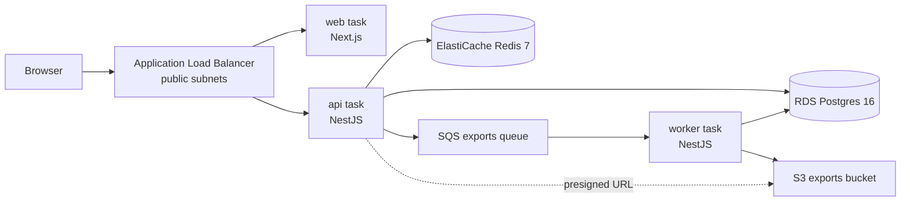

# CloudTask infrastructure docs

A guide to the Terraform under `infrastructure/terraform/`, written for someone who has
**never used Terraform and does not know HCL**. Every code example in these documents is
copied from this repository — nothing is invented.

## Read in this order

| #   | File                                                               | What you'll learn                                                        |
| --- | ------------------------------------------------------------------ | ------------------------------------------------------------------------ |
| 01  | [Terraform mental model](./01-terraform-mental-model.md)           | What Terraform actually does; config vs state vs reality; why two stacks |
| 02  | [HCL primer](./02-hcl-primer.md)                                   | The whole language, taught with this repo's own code                     |
| 03  | [Architecture overview](./03-architecture-overview.md)             | The diagrams: runtime, network, security groups, module graph, ownership |
| 04  | [State and backend](./04-state-and-backend.md)                     | The `bootstrap` stack, the S3 backend, locking, gitignored files         |
| 05  | [The dev environment, file by file](./05-dev-environment-files.md) | Every file in `environments/dev/`, block by block                        |
| 06  | [Network edge modules](./06-module-network-edge.md)                | `networking`, `security`, `alb` — and why each exists                    |
| 07  | [Compute modules](./07-module-compute.md)                          | `ecr`, `ecs-cluster`, `ecs-service`                                      |
| 08  | [Data layer modules](./08-module-data-layer.md)                    | `rds`, `redis`, `sqs`, `s3`, `secrets`                                   |
| 09  | [IAM and GitHub OIDC](./09-iam-and-github-oidc.md)                 | The three task roles, and how CI gets credentials without secrets        |
| 10  | [Monitoring](./10-monitoring.md)                                   | SNS, the five alarms, the dashboard, and how metrics actually get there  |
| 11  | [Operations](./11-operations.md)                                   | init / plan / apply / destroy, reading a plan, adding a resource, errors |
| 12  | [Gotchas](./12-gotchas.md)                                         | Deliberate deviations and known rough edges                              |

If you are in a hurry: read **01**, skim **02**, then read **03**. That's enough to follow
any conversation about this stack.

## The 60-second summary

This Terraform provisions one **dev environment** in AWS for the CloudTask application (a
Next.js web app, a NestJS HTTP API, and a NestJS SQS worker).



Everything runs on **ECS Fargate** in private subnets. Nothing except the load balancer is
reachable from the internet.

**Shape of the code:**

```text
infrastructure/terraform/
├── bootstrap/          # tiny stack: creates the S3 bucket that stores state
├── environments/dev/   # the environment you actually apply
└── modules/            # 13 reusable building blocks, called by environments/dev
```

**Two rules that explain most of the surprises in this codebase:**

1. **Terraform creates the infrastructure; GitHub Actions deploys the code.** Terraform
   deliberately ignores ECS task-definition revisions and `desired_count` — CI owns those.
   See [03](./03-architecture-overview.md#5-who-owns-what-terraform-vs-ci).
2. **Terraform runs from your laptop, never in CI.** CI has a separate, narrow role that
   can only push images and roll ECS services. See [09](./09-iam-and-github-oidc.md).

## What it costs

The stack is sized for a learning lab — smallest instance classes everywhere
(`db.t4g.micro`, `cache.t4g.micro`, 256 CPU / 512 MiB Fargate tasks). The meters that keep
running whether or not you use the app are:

| Resource                         | Why it costs even when idle                             |
| -------------------------------- | ------------------------------------------------------- |
| NAT gateway + Elastic IP         | Hourly charge plus per-GB data processing               |
| Application Load Balancer        | Hourly charge plus LCU-hours                            |
| RDS instance + 20 GB gp3 storage | Hourly charge, single-AZ                                |
| ElastiCache node                 | Hourly charge                                           |
| Fargate tasks                    | Per-vCPU-second — only while `desired_count` is above 0 |

Tear everything down with `scripts/aws-teardown.sh` when you are done for the day; see
[11 — Operations](./11-operations.md#tearing-it-down).

---

Related documents outside this folder:

- [`application-spec.md`](../../../application-spec.md) — the specification this stack implements
- [`DEVIATIONS.md`](../../../DEVIATIONS.md) — where the implementation knowingly differs
- [`aws-deployment-lab-runbook-terraform.md`](../../../aws-deployment-lab-runbook-terraform.md) —
  the day-by-day lab runbook, including the failure experiments
